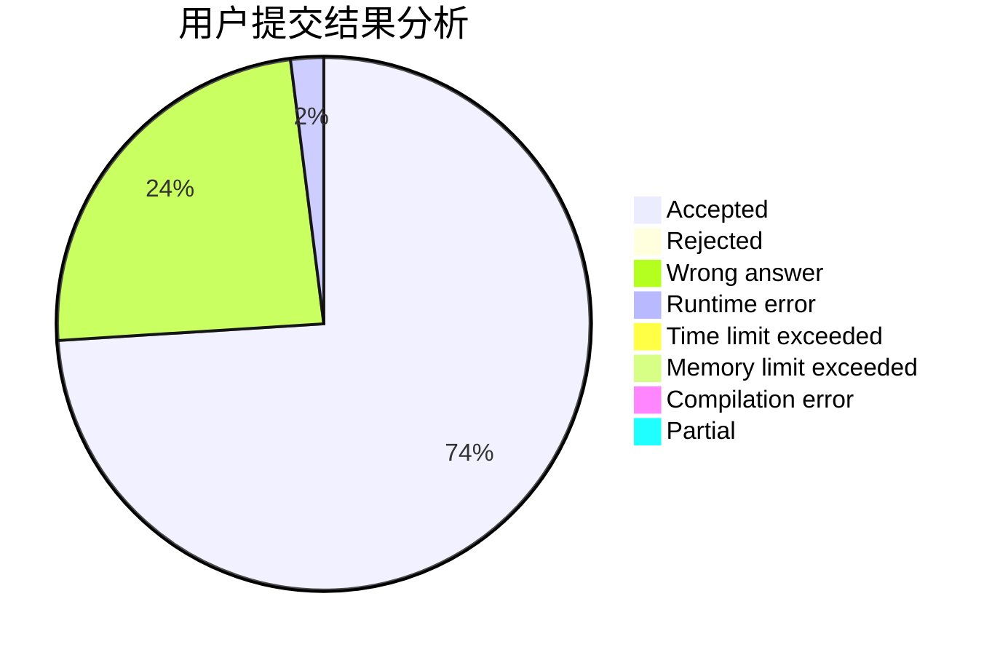
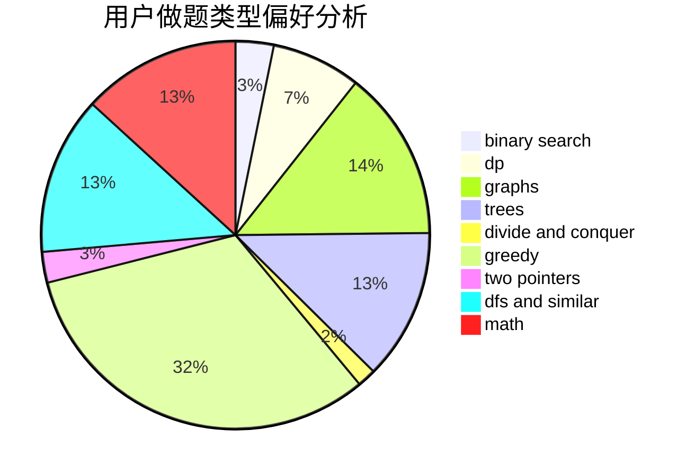

# WSJwsj_

<!-- tabs:start -->

#### **用户提交结果分析**

#### **用户做题类型偏好分析**

<!-- tabs:end -->
# 推荐题目
[997E](https://codeforces.com/contest/997/problem/E)
[300E](https://codeforces.com/contest/300/problem/E)
[11291](https://codeforces.com/contest/1129/problem/1)
[497B](https://codeforces.com/contest/497/problem/B)
[1278A](https://codeforces.com/contest/1278/problem/A)
[801C](https://codeforces.com/contest/801/problem/C)
[39D](https://codeforces.com/contest/39/problem/D)
[659B](https://codeforces.com/contest/659/problem/B)
[1034E](https://codeforces.com/contest/1034/problem/E)
[1210D](https://codeforces.com/contest/1210/problem/D)
