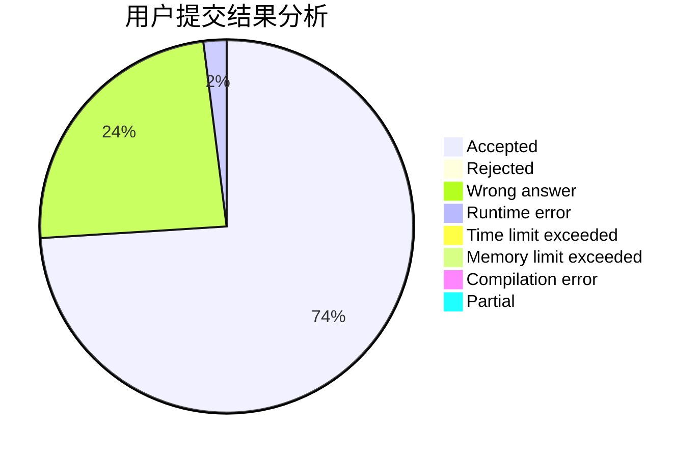
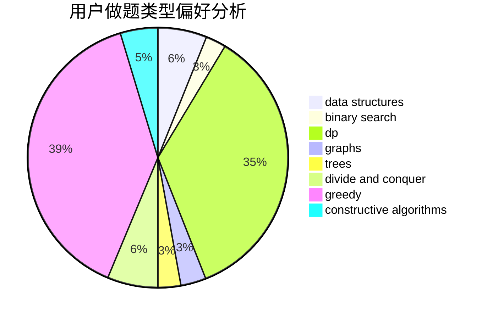
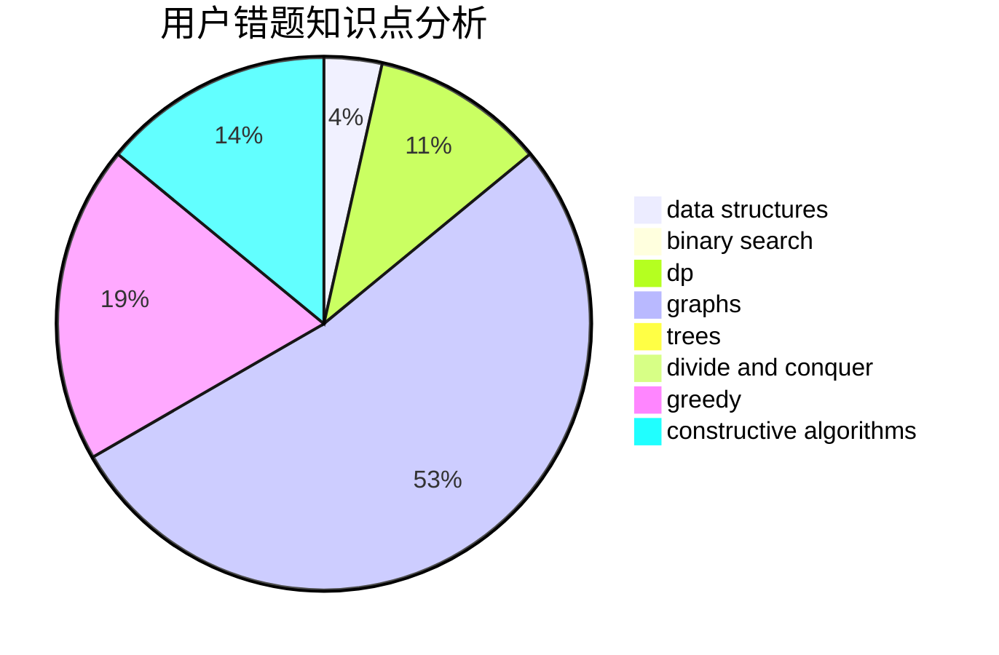

# WSJwsj_

<!-- tabs:start -->

#### **用户提交结果分析**

#### **用户做题类型偏好分析**

#### **用户错题知识点分析**

<!-- tabs:end -->
# 推荐题目
[982B](https://codeforces.com/contest/982/problem/B)		data structures,
                        greedy,
                        implementation		  
[286D](https://codeforces.com/contest/286/problem/D)		data structures,
                        sortings		  
[1119D](https://codeforces.com/contest/1119/problem/D)		binary search,
                        sortings		  
[477B](https://codeforces.com/contest/477/problem/B)		dsu,graphs,sortings,trees		  
[1269A](https://codeforces.com/contest/1269/problem/A)		brute force,
                        math		  
[784C](https://codeforces.com/contest/784/problem/C)		*special problem,
                        implementation		  
[369B](https://codeforces.com/contest/369/problem/B)		constructive algorithms,
                        implementation,
                        math		  
[629C](https://codeforces.com/contest/629/problem/C)		dp,
                        strings		  
[1034B](https://codeforces.com/contest/1034/problem/B)		brute force,
                        constructive algorithms,
                        flows,
                        graph matchings		  
[1206C](https://codeforces.com/contest/1206/problem/C)		dsu,graphs,sortings,trees		  
