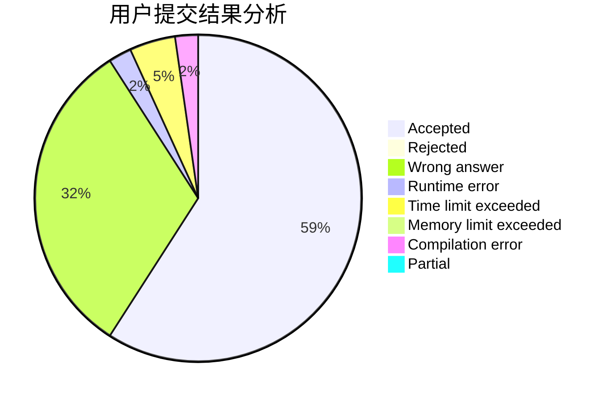
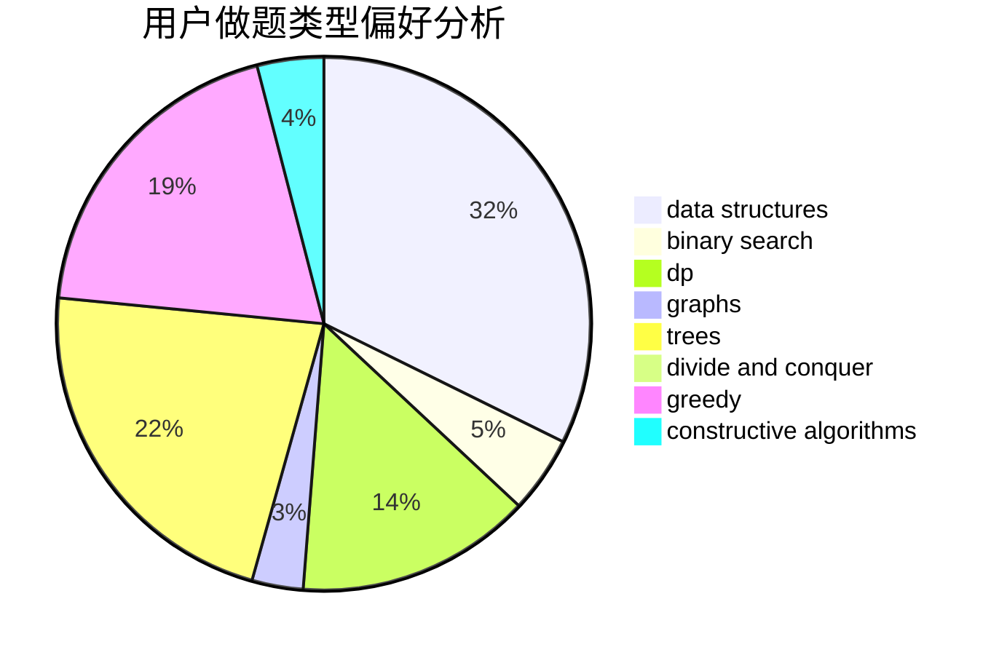
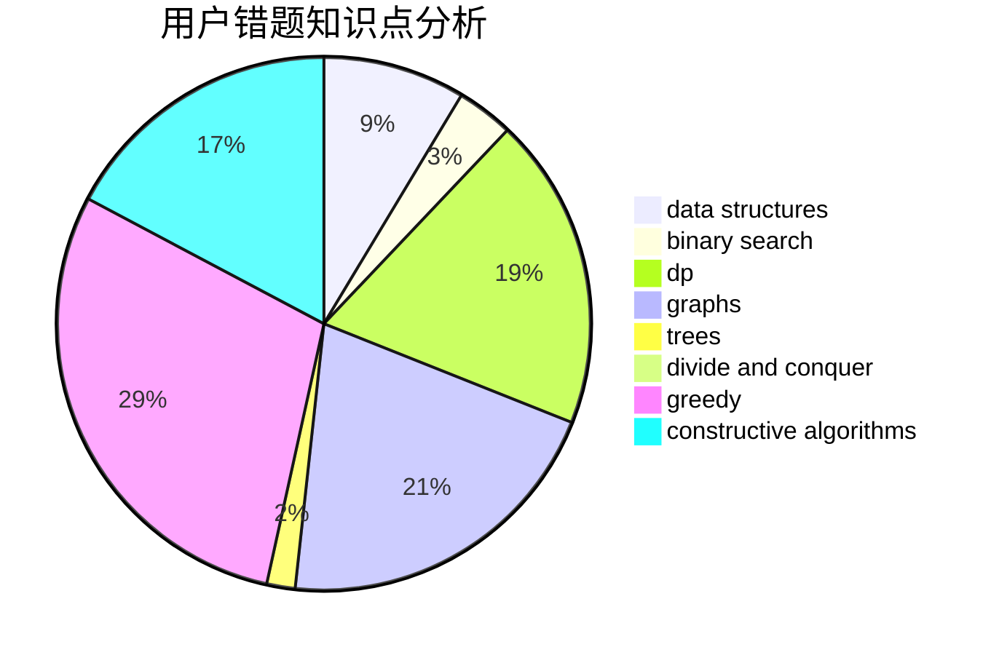

# WYHtakesme

<!-- tabs:start -->

#### **用户提交结果分析**

#### **用户做题类型偏好分析**

#### **用户错题知识点分析**

<!-- tabs:end -->
# 推荐题目
[555D](https://codeforces.com/contest/555/problem/D)		binary search,
                        implementation,
                        math		  
[837B](https://codeforces.com/contest/837/problem/B)		brute force,
                        implementation		  
[1003B](https://codeforces.com/contest/1003/problem/B)		constructive algorithms		  
[690D1](https://codeforces.com/contest/690D/problem/1)		nan		  
[520A](https://codeforces.com/contest/520/problem/A)		implementation,
                        strings		  
[362C](https://codeforces.com/contest/362/problem/C)		data structures,
                        dp,
                        implementation,
                        math		  
[1321D](https://codeforces.com/contest/1321/problem/D)		dsu,graphs,sortings,trees		  
[441D](https://codeforces.com/contest/441/problem/D)		constructive algorithms,
                        dsu,
                        graphs,
                        implementation,
                        math,
                        string suffix structures		  
[1216C](https://codeforces.com/contest/1216/problem/C)		geometry,
                        math		  
[710F](https://codeforces.com/contest/710/problem/F)		brute force,
                        data structures,
                        hashing,
                        interactive,
                        string suffix structures,
                        strings		  
