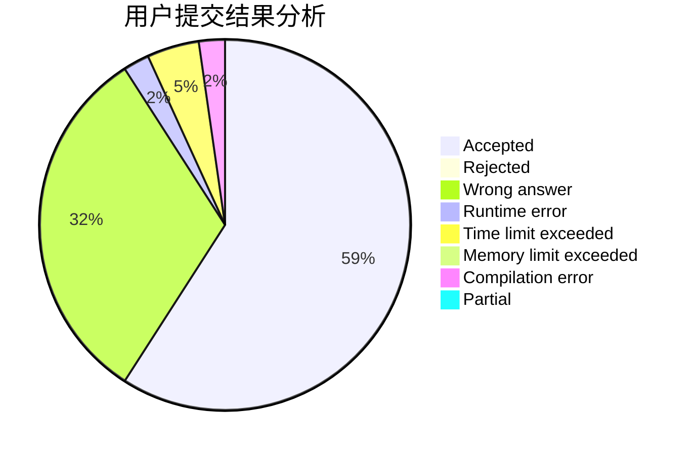
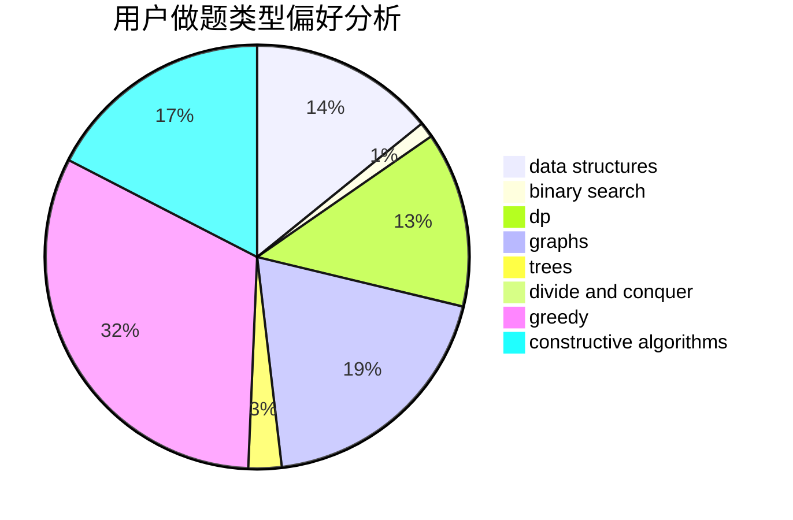
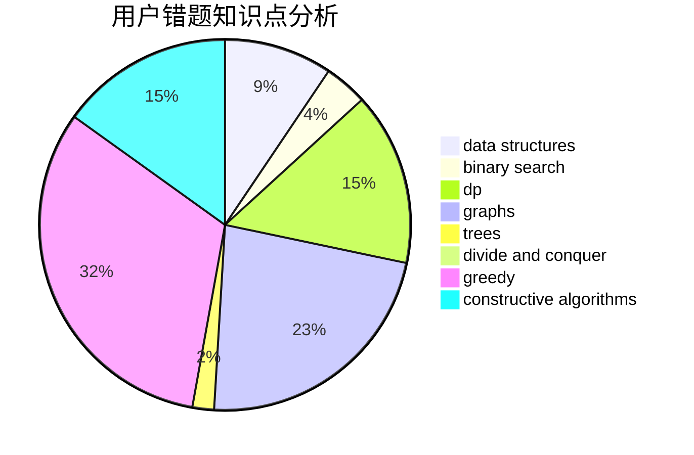

# WYHtakesme

<!-- tabs:start -->

#### **用户提交结果分析**

#### **用户做题类型偏好分析**

#### **用户错题知识点分析**

<!-- tabs:end -->
# 推荐题目
[580A](https://codeforces.com/contest/580/problem/A)		brute force,
                        dp,
                        implementation		  
[854B](https://codeforces.com/contest/854/problem/B)		constructive algorithms,
                        math		  
[1003E](https://codeforces.com/contest/1003/problem/E)		constructive algorithms,
                        graphs		  
[710D](https://codeforces.com/contest/710/problem/D)		math,
                        number theory		  
[545E](https://codeforces.com/contest/545/problem/E)		graphs,
                        greedy,
                        shortest paths		  
[389B](https://codeforces.com/contest/389/problem/B)		greedy,
                        implementation		  
[1328C](https://codeforces.com/contest/1328/problem/C)		greedy,
                        implementation		  
[462B](https://codeforces.com/contest/462/problem/B)		greedy		  
[1221G](https://codeforces.com/contest/1221/problem/G)		bitmasks,
                        brute force,
                        combinatorics,
                        dp,
                        meet-in-the-middle		  
[730J](https://codeforces.com/contest/730/problem/J)		dp		  
