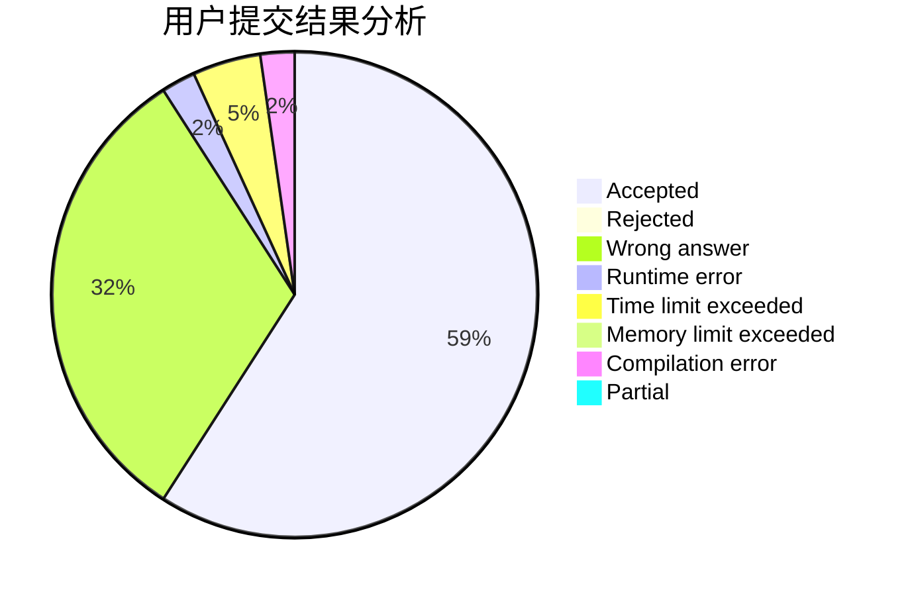
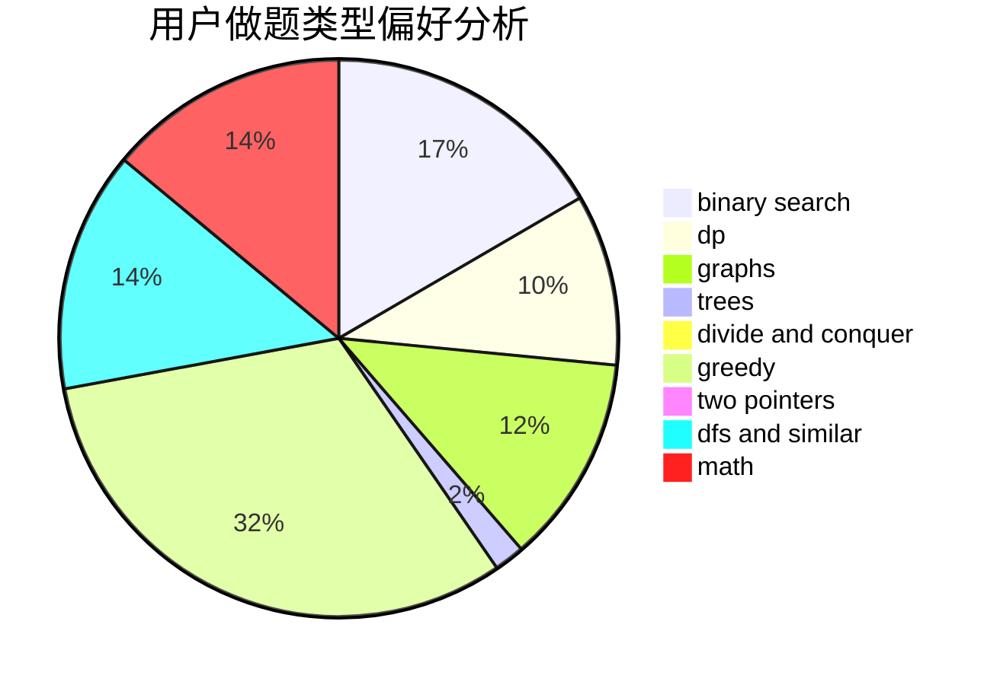

# WYHtakesme

<!-- tabs:start -->

#### **用户提交结果分析**

#### **用户做题类型偏好分析**

<!-- tabs:end -->
# 推荐题目
[580A](https://codeforces.com/contest/580/problem/A)
[854B](https://codeforces.com/contest/854/problem/B)
[1003E](https://codeforces.com/contest/1003/problem/E)
[710D](https://codeforces.com/contest/710/problem/D)
[545E](https://codeforces.com/contest/545/problem/E)
[389B](https://codeforces.com/contest/389/problem/B)
[1328C](https://codeforces.com/contest/1328/problem/C)
[462B](https://codeforces.com/contest/462/problem/B)
[1221G](https://codeforces.com/contest/1221/problem/G)
[730J](https://codeforces.com/contest/730/problem/J)
