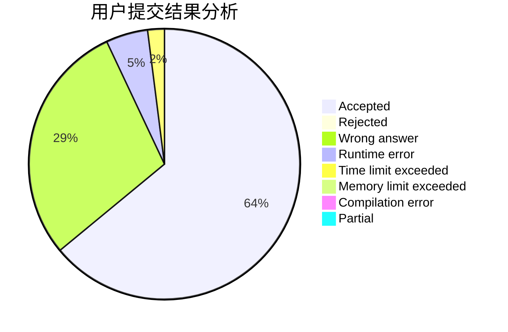
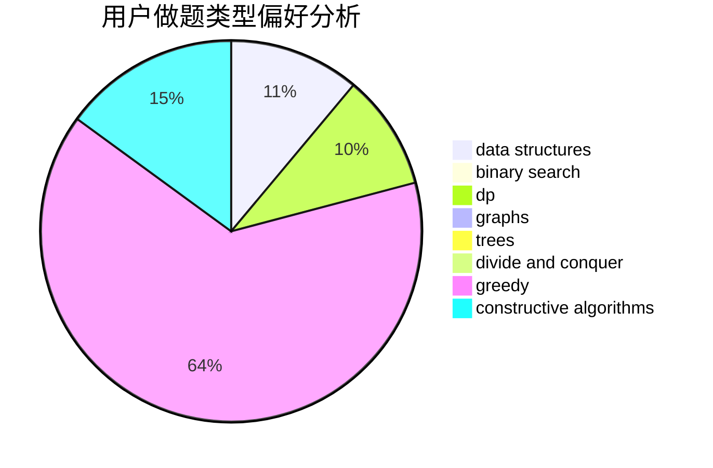

# WYXkk

<!-- tabs:start -->

#### **用户提交结果分析**

#### **用户做题类型偏好分析**

#### **用户错题知识点分析**

<!-- tabs:end -->
# 推荐题目
[603A](https://codeforces.com/contest/603/problem/A)		dp,
                        greedy,
                        math		  
[1292D](https://codeforces.com/contest/1292/problem/D)		dp,
                        graphs,
                        greedy,
                        math,
                        number theory,
                        trees		  
[459C](https://codeforces.com/contest/459/problem/C)		combinatorics,
                        constructive algorithms,
                        math		  
[260A](https://codeforces.com/contest/260/problem/A)		implementation,
                        math		  
[989A](https://codeforces.com/contest/989/problem/A)		implementation,
                        strings		  
[297C](https://codeforces.com/contest/297/problem/C)		constructive algorithms		  
[1057B](https://codeforces.com/contest/1057/problem/B)		*special problem,
                        brute force		  
[1114C](https://codeforces.com/contest/1114/problem/C)		brute force,
                        implementation,
                        math,
                        number theory		  
[617B](https://codeforces.com/contest/617/problem/B)		combinatorics		  
[212A](https://codeforces.com/contest/212/problem/A)		flows,
                        graphs		  
