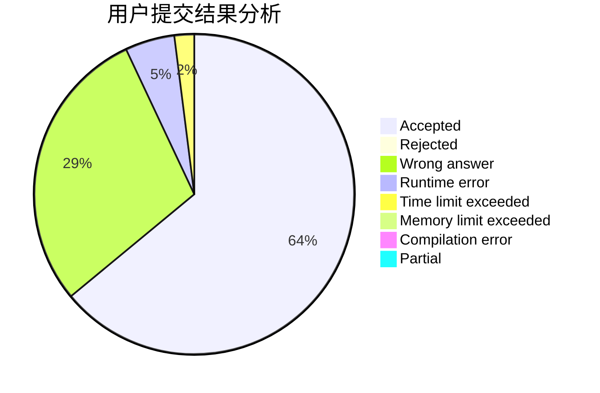
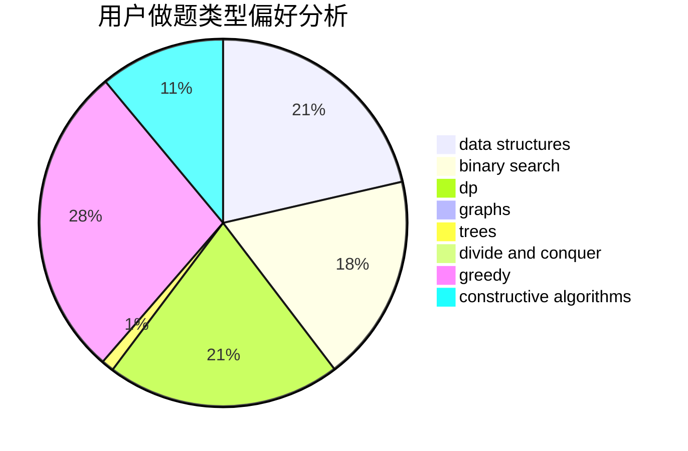

# WYXkk

<!-- tabs:start -->

#### **用户提交结果分析**

#### **用户做题类型偏好分析**

#### **用户错题知识点分析**

<!-- tabs:end -->
# 推荐题目
[582A](https://codeforces.com/contest/582/problem/A)		constructive algorithms,
                        greedy,
                        number theory		  
[1285C](https://codeforces.com/contest/1285/problem/C)		brute force,
                        math,
                        number theory		  
[437A](https://codeforces.com/contest/437/problem/A)		implementation		  
[238D](https://codeforces.com/contest/238/problem/D)		data structures,
                        implementation		  
[967D](https://codeforces.com/contest/967/problem/D)		dsu,graphs,sortings,trees		  
[281A](https://codeforces.com/contest/281/problem/A)		implementation,
                        strings		  
[1056F](https://codeforces.com/contest/1056/problem/F)		binary search,
                        dp,
                        math		  
[1113F](https://codeforces.com/contest/1113/problem/F)		dsu,graphs,sortings,trees		  
[599C](https://codeforces.com/contest/599/problem/C)		sortings		  
[186C](https://codeforces.com/contest/186/problem/C)		dsu,graphs,sortings,trees		  
