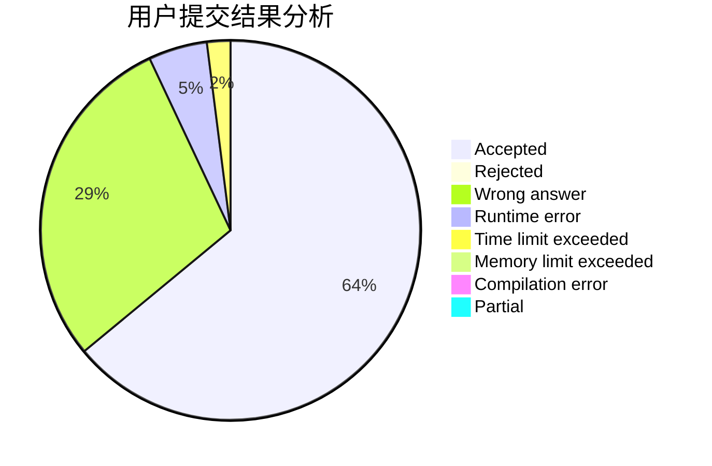
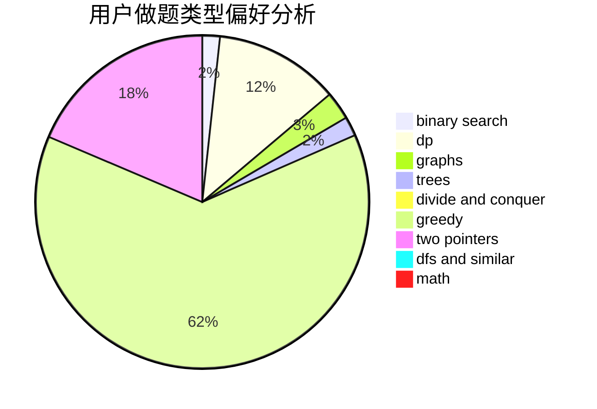

# WYXkk

<!-- tabs:start -->

#### **用户提交结果分析**

#### **用户做题类型偏好分析**

<!-- tabs:end -->
# 推荐题目
[603A](https://codeforces.com/contest/603/problem/A)
[1292D](https://codeforces.com/contest/1292/problem/D)
[459C](https://codeforces.com/contest/459/problem/C)
[260A](https://codeforces.com/contest/260/problem/A)
[989A](https://codeforces.com/contest/989/problem/A)
[297C](https://codeforces.com/contest/297/problem/C)
[1057B](https://codeforces.com/contest/1057/problem/B)
[1114C](https://codeforces.com/contest/1114/problem/C)
[617B](https://codeforces.com/contest/617/problem/B)
[212A](https://codeforces.com/contest/212/problem/A)
