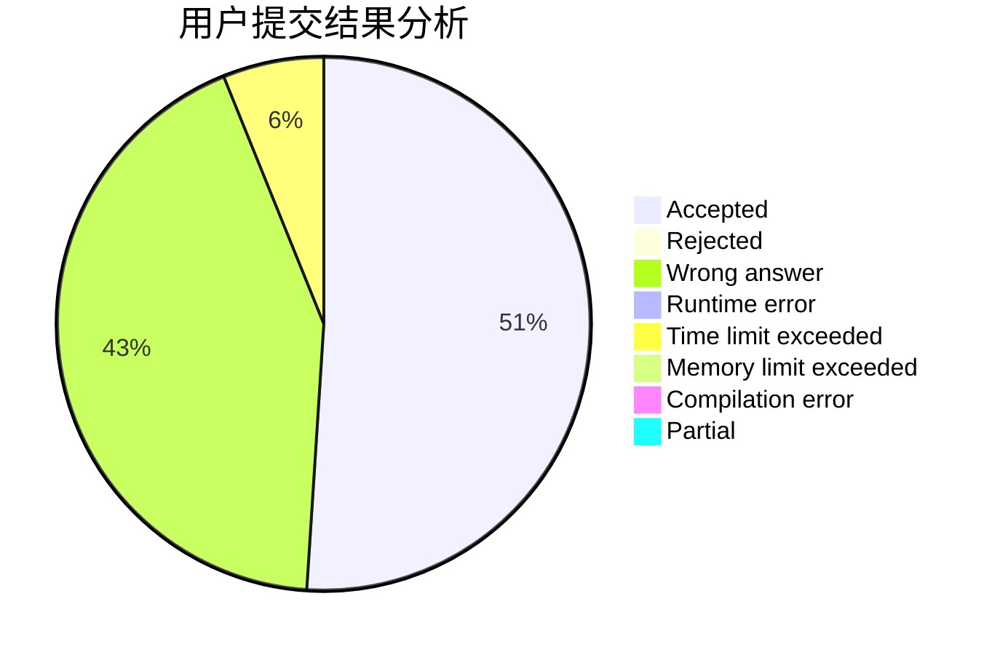
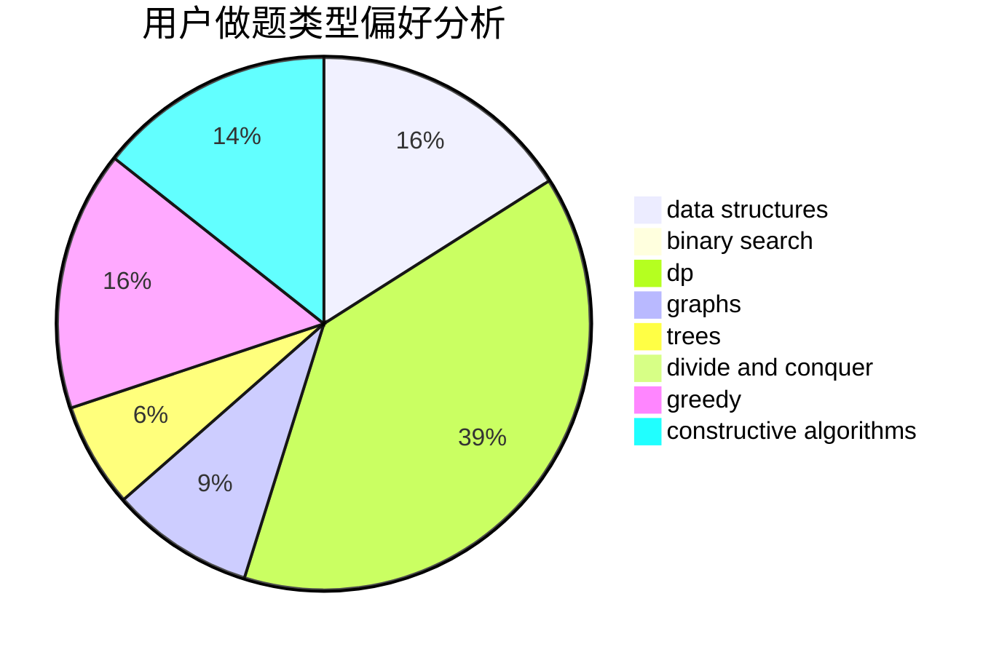
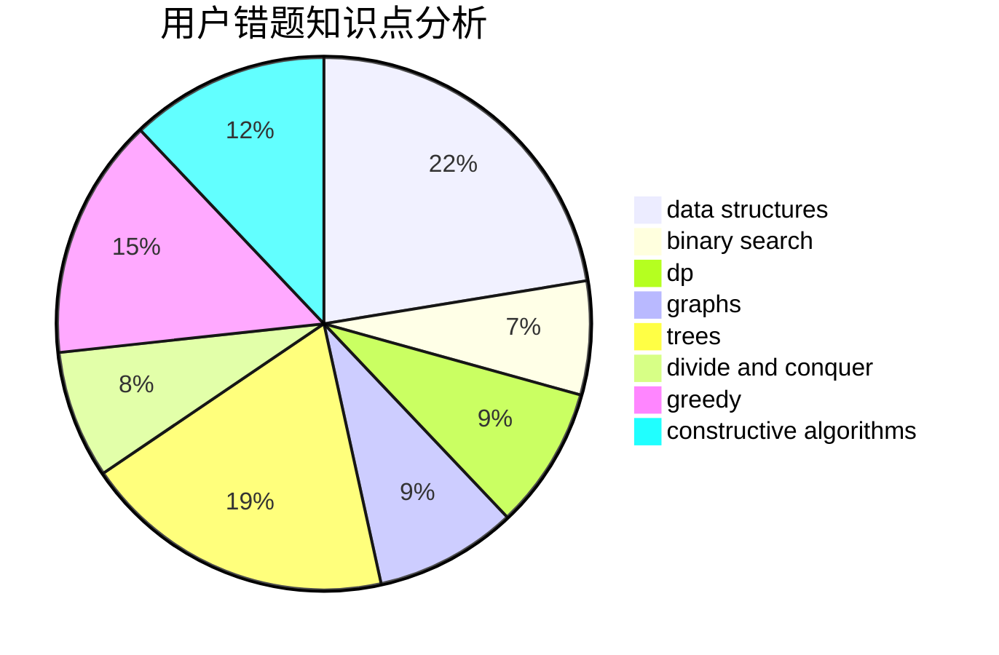

# W_34

<!-- tabs:start -->

#### **用户提交结果分析**

#### **用户做题类型偏好分析**

#### **用户错题知识点分析**

<!-- tabs:end -->
# 推荐题目
[294D](https://codeforces.com/contest/294/problem/D)		brute force,
                        implementation,
                        number theory		  
[257D](https://codeforces.com/contest/257/problem/D)		greedy,
                        math		  
[215B](https://codeforces.com/contest/215/problem/B)		greedy,
                        math		  
[518F](https://codeforces.com/contest/518/problem/F)		binary search,
                        brute force,
                        combinatorics,
                        dp,
                        implementation		  
[156D](https://codeforces.com/contest/156/problem/D)		combinatorics,
                        graphs		  
[476A](https://codeforces.com/contest/476/problem/A)		implementation,
                        math		  
[1175B](https://codeforces.com/contest/1175/problem/B)		data structures,
                        expression parsing,
                        implementation		  
[1200B](https://codeforces.com/contest/1200/problem/B)		dp,
                        greedy		  
[47B](https://codeforces.com/contest/47/problem/B)		implementation		  
[485D](https://codeforces.com/contest/485/problem/D)		dsu,graphs,sortings,trees		  
