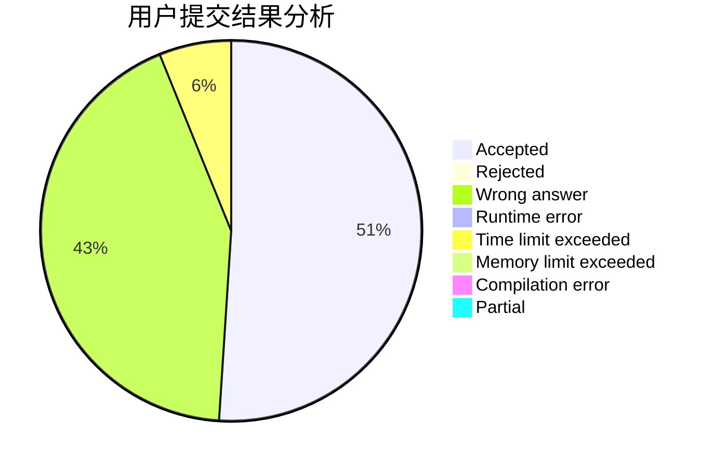
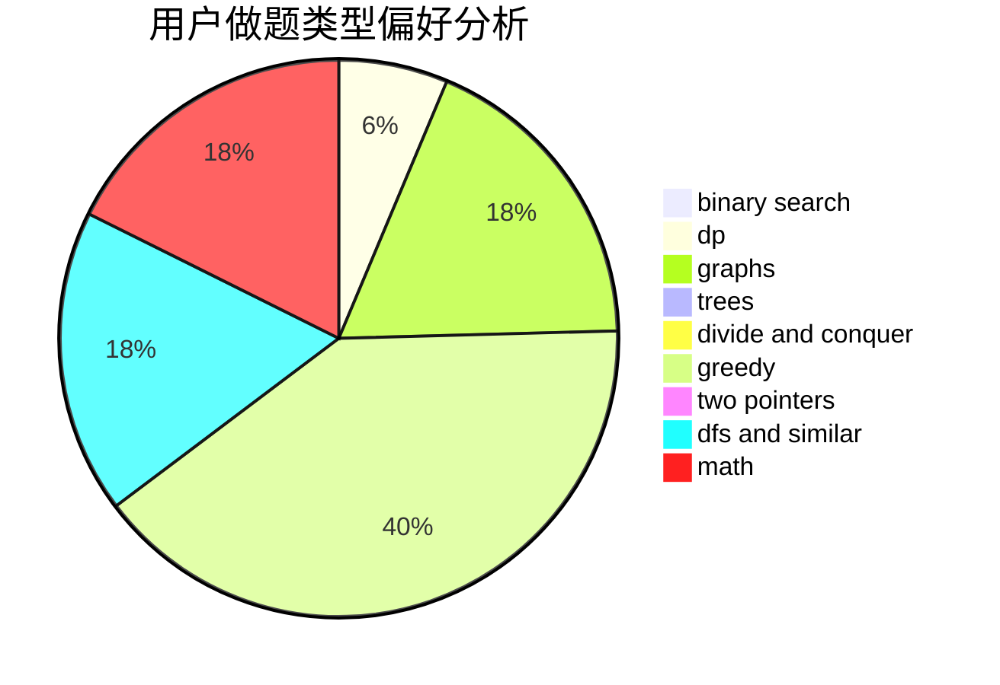

# W_34

<!-- tabs:start -->

#### **用户提交结果分析**

#### **用户做题类型偏好分析**

<!-- tabs:end -->
# 推荐题目
[311A](https://codeforces.com/contest/311/problem/A)
[274D](https://codeforces.com/contest/274/problem/D)
[234A](https://codeforces.com/contest/234/problem/A)
[544C](https://codeforces.com/contest/544/problem/C)
[1772](https://codeforces.com/contest/177/problem/2)
[494E](https://codeforces.com/contest/494/problem/E)
[1178B](https://codeforces.com/contest/1178/problem/B)
[1205A](https://codeforces.com/contest/1205/problem/A)
[4C](https://codeforces.com/contest/4/problem/C)
[506C](https://codeforces.com/contest/506/problem/C)
