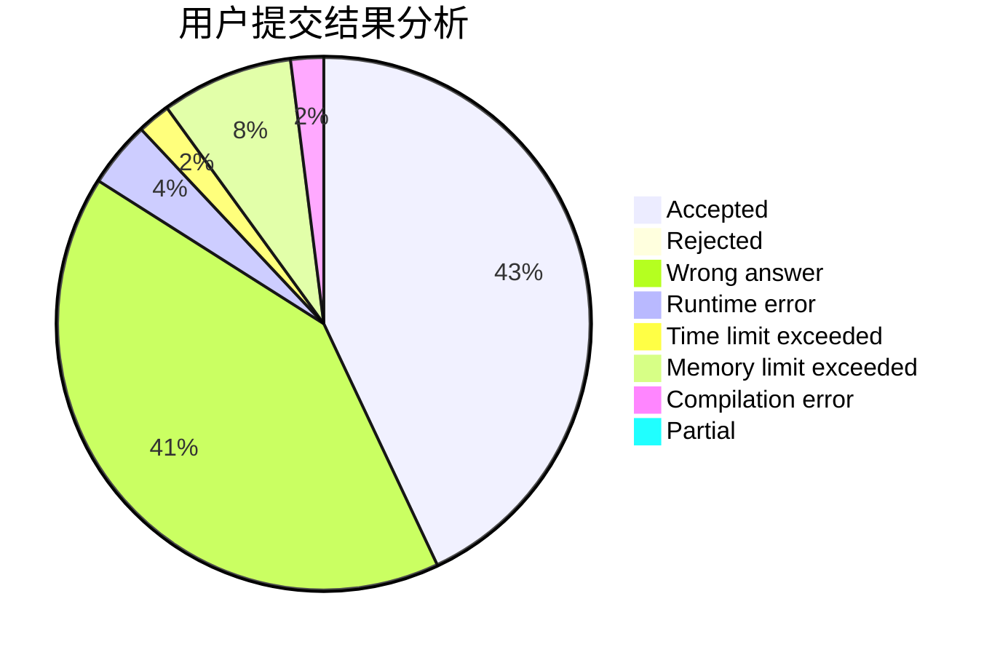
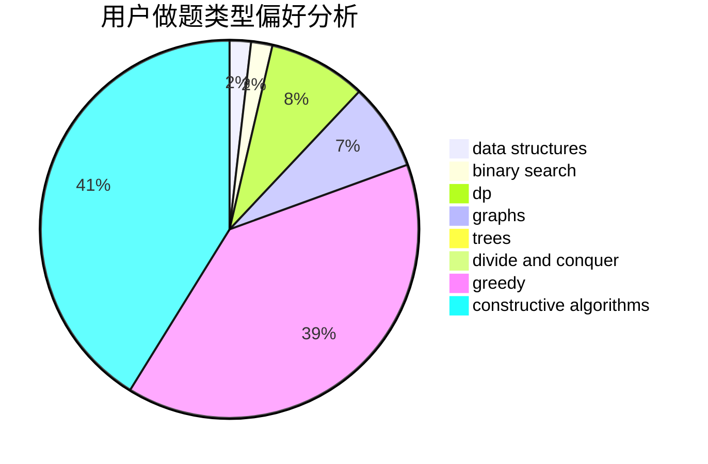
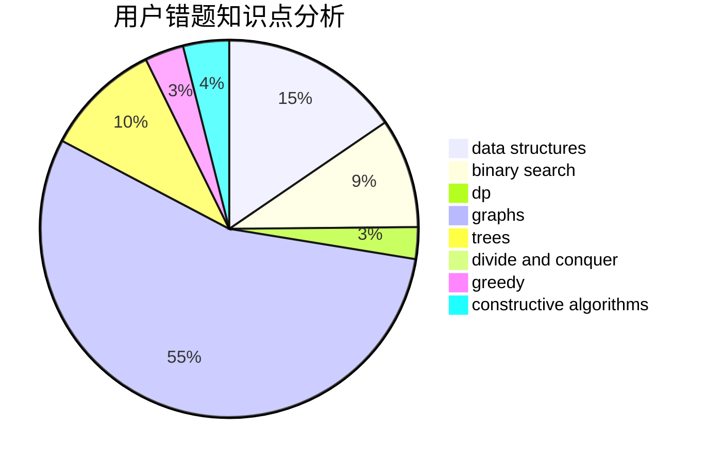

# Wall_breaker

<!-- tabs:start -->

#### **用户提交结果分析**

#### **用户做题类型偏好分析**

#### **用户错题知识点分析**

<!-- tabs:end -->
# 推荐题目
[1463D](https://codeforces.com/contest/1463/problem/D)		binary search,
                        constructive algorithms,
                        greedy,
                        two pointers		  
[1384A](https://codeforces.com/contest/1384/problem/A)		constructive algorithms,
                        greedy,
                        strings		  
[20A](https://codeforces.com/contest/20/problem/A)		implementation		  
[1031D](https://codeforces.com/contest/1031/problem/D)		greedy		  
[1081A](https://codeforces.com/contest/1081/problem/A)		constructive algorithms,
                        math		  
[643D](https://codeforces.com/contest/643/problem/D)		nan		  
[1070C](https://codeforces.com/contest/1070/problem/C)		data structures,
                        greedy		  
[1146D](https://codeforces.com/contest/1146/problem/D)		dfs and similar,
                        math,
                        number theory		  
[1205E](https://codeforces.com/contest/1205/problem/E)		combinatorics,
                        strings		  
[237C](https://codeforces.com/contest/237/problem/C)		binary search,
                        number theory,
                        two pointers		  
