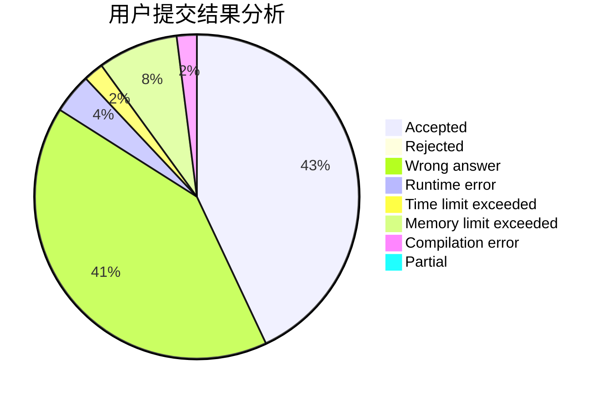
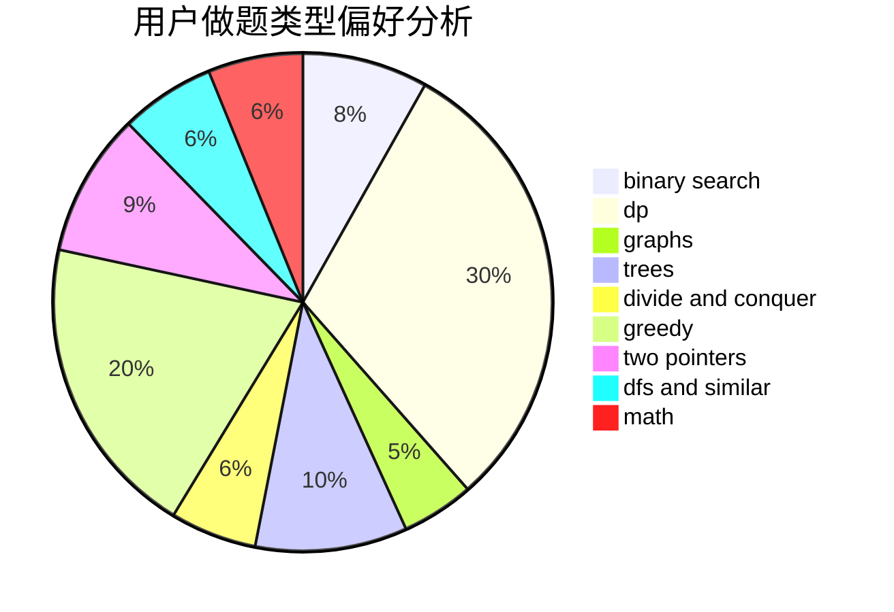

# Wall_breaker

<!-- tabs:start -->

#### **用户提交结果分析**

#### **用户做题类型偏好分析**

<!-- tabs:end -->
# 推荐题目
[1470E](https://codeforces.com/contest/1470/problem/E)
[1393D](https://codeforces.com/contest/1393/problem/D)
[231C](https://codeforces.com/contest/231/problem/C)
[1032F](https://codeforces.com/contest/1032/problem/F)
[1081D](https://codeforces.com/contest/1081/problem/D)
[670B](https://codeforces.com/contest/670/problem/B)
[1070F](https://codeforces.com/contest/1070/problem/F)
[1148D](https://codeforces.com/contest/1148/problem/D)
[120H](https://codeforces.com/contest/120/problem/H)
[25C](https://codeforces.com/contest/25/problem/C)
