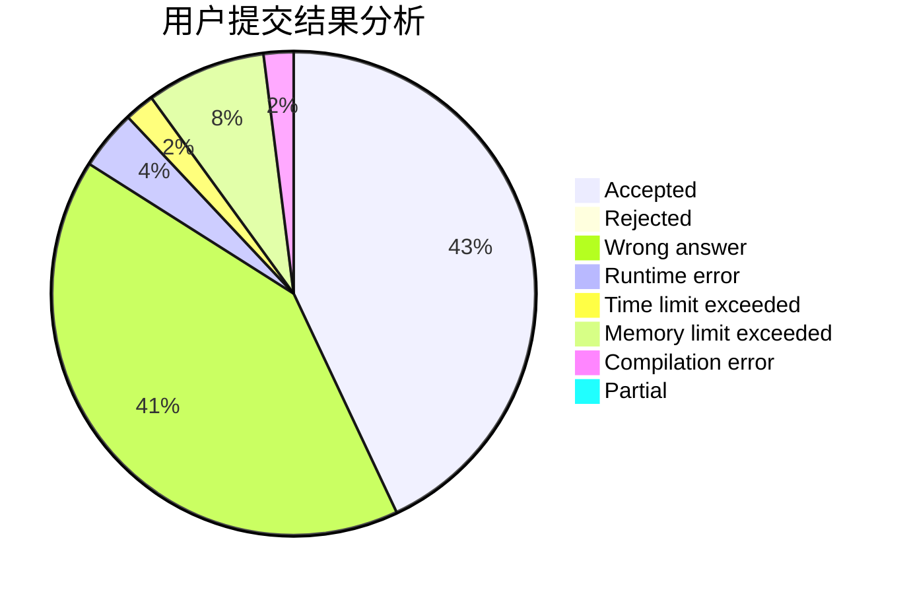
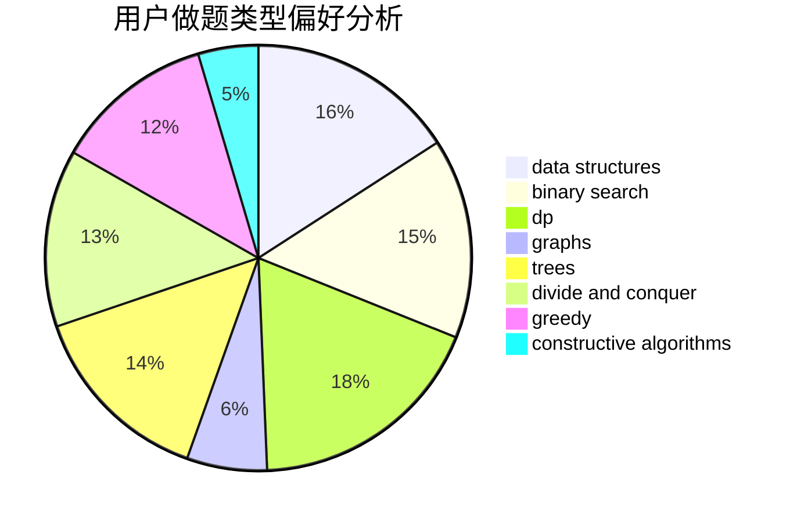
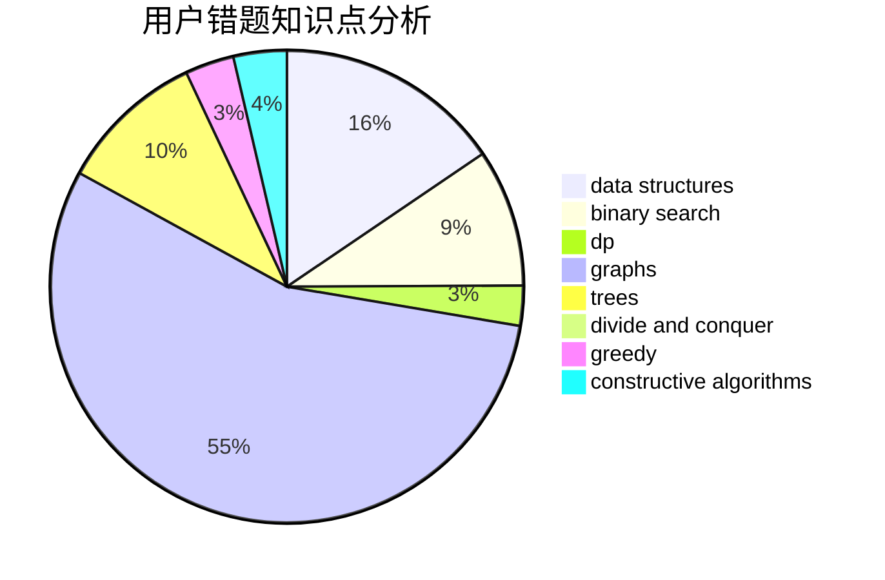

# Wall_breaker

<!-- tabs:start -->

#### **用户提交结果分析**

#### **用户做题类型偏好分析**

#### **用户错题知识点分析**

<!-- tabs:end -->
# 推荐题目
[1470E](https://codeforces.com/contest/1470/problem/E)		binary search,
                        combinatorics,
                        data structures,
                        dp,
                        graphs,
                        implementation,
                        two pointers		  
[1393D](https://codeforces.com/contest/1393/problem/D)		dfs and similar,
                        dp,
                        implementation,
                        shortest paths		  
[231C](https://codeforces.com/contest/231/problem/C)		binary search,
                        sortings,
                        two pointers		  
[1032F](https://codeforces.com/contest/1032/problem/F)		dp,
                        trees		  
[1081D](https://codeforces.com/contest/1081/problem/D)		dsu,
                        graphs,
                        shortest paths,
                        sortings		  
[670B](https://codeforces.com/contest/670/problem/B)		implementation		  
[1070F](https://codeforces.com/contest/1070/problem/F)		greedy		  
[1148D](https://codeforces.com/contest/1148/problem/D)		greedy,
                        sortings		  
[120H](https://codeforces.com/contest/120/problem/H)		graph matchings		  
[25C](https://codeforces.com/contest/25/problem/C)		graphs,
                        shortest paths		  
