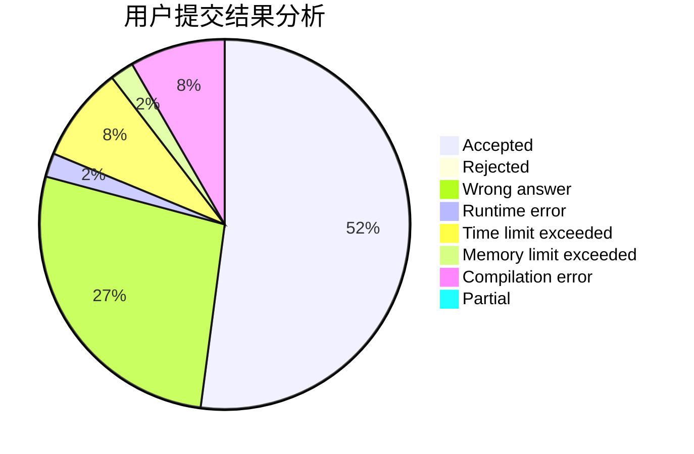
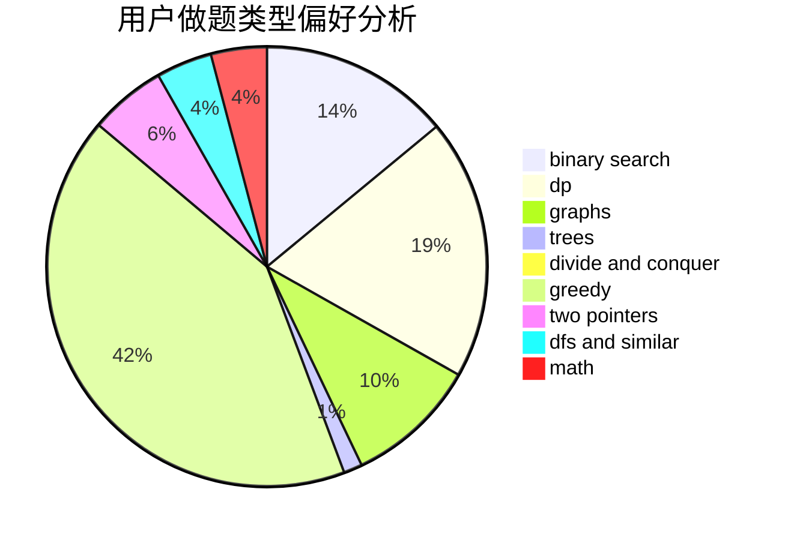

# Aima

<!-- tabs:start -->

#### **用户提交结果分析**

#### **用户做题类型偏好分析**

<!-- tabs:end -->
# 推荐题目
[1467A](https://codeforces.com/contest/1467/problem/A)
[23B](https://codeforces.com/contest/23/problem/B)
[243D](https://codeforces.com/contest/243/problem/D)
[238E](https://codeforces.com/contest/238/problem/E)
[164C](https://codeforces.com/contest/164/problem/C)
[240E](https://codeforces.com/contest/240/problem/E)
[244C](https://codeforces.com/contest/244/problem/C)
[1288B](https://codeforces.com/contest/1288/problem/B)
[1159C](https://codeforces.com/contest/1159/problem/C)
[243B](https://codeforces.com/contest/243/problem/B)
