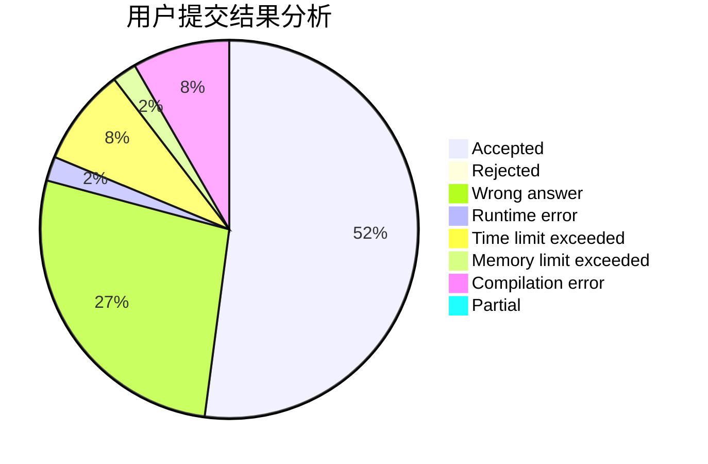
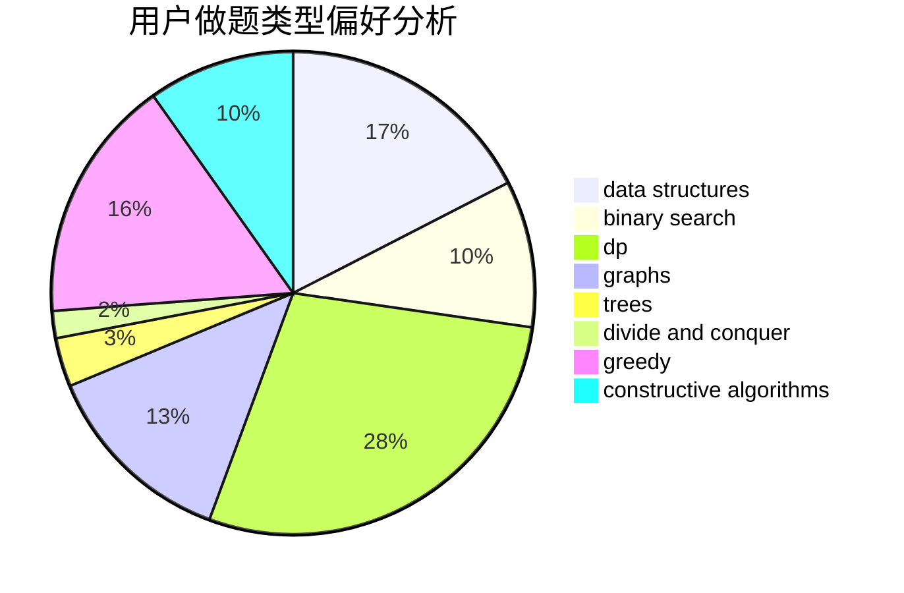
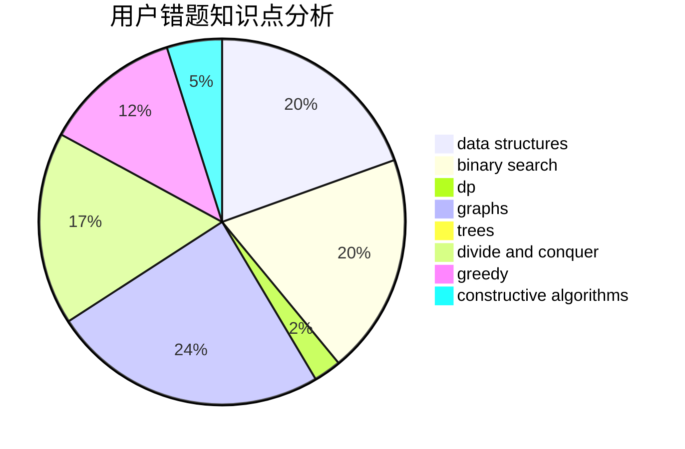

# Aima

<!-- tabs:start -->

#### **用户提交结果分析**

#### **用户做题类型偏好分析**

#### **用户错题知识点分析**

<!-- tabs:end -->
# 推荐题目
[1467A](https://codeforces.com/contest/1467/problem/A)		constructive algorithms,
                        greedy,
                        math		  
[23B](https://codeforces.com/contest/23/problem/B)		constructive algorithms,
                        graphs,
                        math		  
[243D](https://codeforces.com/contest/243/problem/D)		data structures,
                        dp,
                        geometry,
                        two pointers		  
[238E](https://codeforces.com/contest/238/problem/E)		dp,
                        graphs,
                        shortest paths		  
[164C](https://codeforces.com/contest/164/problem/C)		flows,
                        graphs		  
[240E](https://codeforces.com/contest/240/problem/E)		dfs and similar,
                        graphs,
                        greedy		  
[244C](https://codeforces.com/contest/244/problem/C)		dsu,graphs,sortings,trees		  
[1288B](https://codeforces.com/contest/1288/problem/B)		math		  
[1159C](https://codeforces.com/contest/1159/problem/C)		dsu,graphs,sortings,trees		  
[243B](https://codeforces.com/contest/243/problem/B)		graphs,
                        sortings		  
