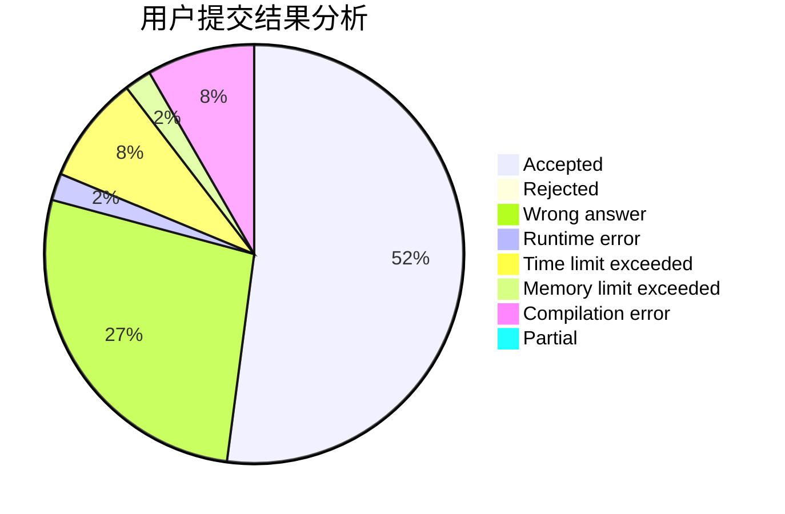
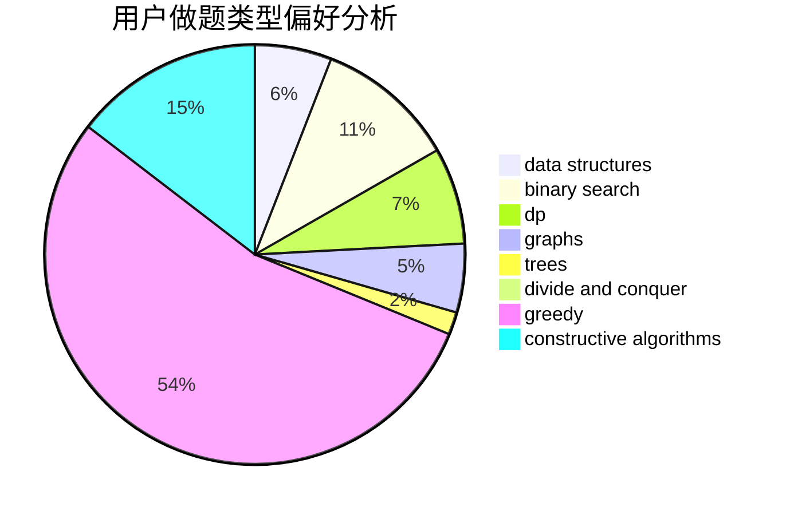
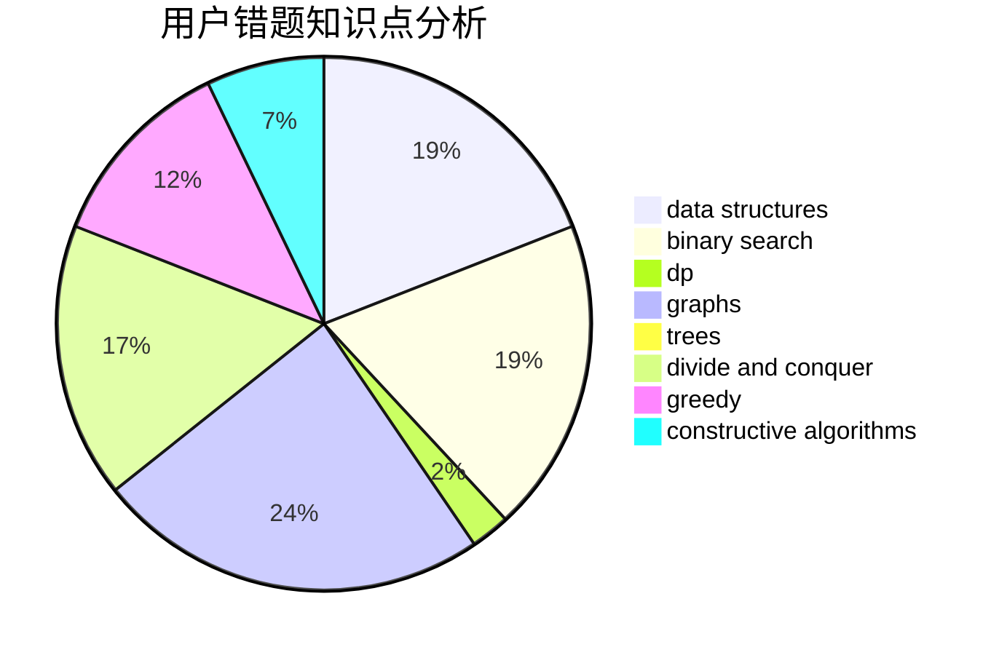

# Aima

<!-- tabs:start -->

#### **用户提交结果分析**

#### **用户做题类型偏好分析**

#### **用户错题知识点分析**

<!-- tabs:end -->
# 推荐题目
[1458B](https://codeforces.com/contest/1458/problem/B)		dp		  
[21D](https://codeforces.com/contest/21/problem/D)		bitmasks,
                        graph matchings,
                        graphs		  
[225D](https://codeforces.com/contest/225/problem/D)		bitmasks,
                        dfs and similar,
                        graphs,
                        implementation		  
[219D](https://codeforces.com/contest/219/problem/D)		dfs and similar,
                        dp,
                        graphs,
                        trees		  
[1510D](https://codeforces.com/contest/1510/problem/D)		dp,
                        math,
                        number theory		  
[220E](https://codeforces.com/contest/220/problem/E)		data structures,
                        two pointers		  
[225E](https://codeforces.com/contest/225/problem/E)		math,
                        number theory		  
[1281F](https://codeforces.com/contest/1281/problem/F)		dsu,graphs,sortings,trees		  
[1157C1](https://codeforces.com/contest/1157C/problem/1)		greedy		  
[224B](https://codeforces.com/contest/224/problem/B)		bitmasks,
                        implementation,
                        two pointers		  
