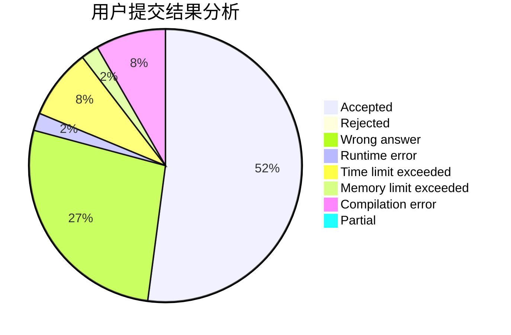
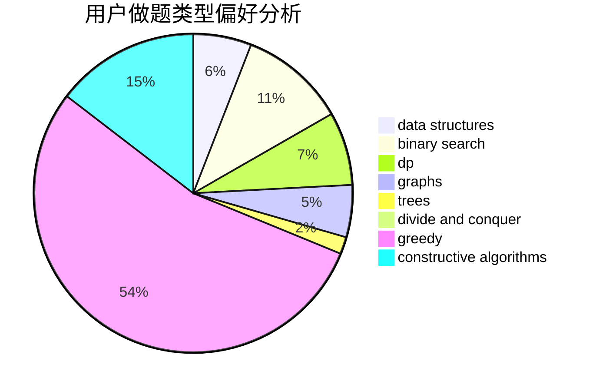
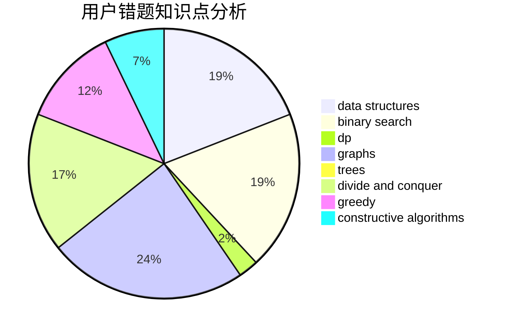

# Aima
<!-- tabs:start -->
#### **用户提交结果分析**

#### **用户做题类型偏好分析**

#### **用户错题知识点分析**

<!-- tabs:end -->
# 推荐题目
[Glass Half Spilled](http://codeforces.com/problemset/problem/1458/B)		dp		  
[Up and Down the Tree](http://codeforces.com/problemset/problem/1065/F)		dfs and similar,
                        dp,
                        trees		  
[Parallelepiped](http://codeforces.com/problemset/problem/224/A)		brute force,
                        geometry,
                        math		  
[Unsolvable](http://codeforces.com/problemset/problem/225/E)		math,
                        number theory		  
[Traveling Graph](http://codeforces.com/problemset/problem/21/D)		bitmasks,
                        graph matchings,
                        graphs		  
[Little Elephant and Inversions](http://codeforces.com/problemset/problem/220/E)		data structures,
                        two pointers		  
[Miss Punyverse](https://codeforces.com/contest/1281/problem/F)		dp,
                        greedy,
                        trees		  
[Snake](http://codeforces.com/problemset/problem/225/D)		bitmasks,
                        dfs and similar,
                        graphs,
                        implementation		  
[Choosing Capital for Treeland](http://codeforces.com/problemset/problem/219/D)		dfs and similar,
                        dp,
                        graphs,
                        trees		  
[Increasing Subsequence (easy version)](http://codeforces.com/problemset/problem/1157/C1)		greedy		  
<!-- tabs:start -->
#### **data structures**
[Glass Half Spilled](http://codeforces.com/problemset/problem/220/E)		data structures,
                        two pointers		  
[Up and Down the Tree](http://codeforces.com/problemset/problem/223/B)		data structures,
                        dp,
                        strings		  
[Parallelepiped](http://codeforces.com/problemset/problem/220/C)		data structures		  
[Unsolvable](http://codeforces.com/problemset/problem/1041/F)		data structures,
                        divide and conquer,
                        dp,
                        math		  
[Traveling Graph](http://codeforces.com/problemset/problem/1080/F)		data structures,
                        interactive,
                        sortings		  
[Little Elephant and Inversions](http://codeforces.com/problemset/problem/220/B)		constructive algorithms,
                        data structures		  
[Miss Punyverse](http://codeforces.com/problemset/problem/1364/A)		brute force,
                        data structures,
                        number theory,
                        two pointers		  
[Snake](http://codeforces.com/problemset/problem/1492/C)		binary search,
                        data structures,
                        dp,
                        greedy,
                        two pointers		  
[Choosing Capital for Treeland](http://codeforces.com/problemset/problem/1490/G)		binary search,
                        data structures,
                        math		  
[Increasing Subsequence (easy version)](http://codeforces.com/problemset/problem/1479/D)		binary search,
                        bitmasks,
                        brute force,
                        data structures,
                        probabilities,
                        trees		  
#### **binary search**
[Glass Half Spilled](http://codeforces.com/problemset/problem/21/C)		binary search,
                        dp,
                        sortings		  
[Up and Down the Tree](http://codeforces.com/problemset/problem/1158/A)		binary search,
                        constructive algorithms,
                        greedy,
                        implementation,
                        math,
                        sortings,
                        two pointers		  
[Parallelepiped](http://codeforces.com/problemset/problem/1492/C)		binary search,
                        data structures,
                        dp,
                        greedy,
                        two pointers		  
[Unsolvable](http://codeforces.com/problemset/problem/1463/D)		binary search,
                        constructive algorithms,
                        greedy,
                        two pointers		  
[Traveling Graph](http://codeforces.com/problemset/problem/1490/G)		binary search,
                        data structures,
                        math		  
[Little Elephant and Inversions](http://codeforces.com/problemset/problem/1479/D)		binary search,
                        bitmasks,
                        brute force,
                        data structures,
                        probabilities,
                        trees		  
[Miss Punyverse](http://codeforces.com/problemset/problem/1436/E)		binary search,
                        data structures,
                        two pointers		  
[Snake](http://codeforces.com/problemset/problem/1461/D)		binary search,
                        brute force,
                        data structures,
                        divide and conquer,
                        implementation,
                        sortings		  
[Choosing Capital for Treeland](http://codeforces.com/problemset/problem/1493/C)		binary search,
                        brute force,
                        constructive algorithms,
                        greedy,
                        strings		  
[Increasing Subsequence (easy version)](http://codeforces.com/problemset/problem/1487/D)		binary search,
                        brute force,
                        math,
                        number theory		  
#### **dp**
[Glass Half Spilled](http://codeforces.com/problemset/problem/1458/B)		dp		  
[Up and Down the Tree](http://codeforces.com/problemset/problem/1065/F)		dfs and similar,
                        dp,
                        trees		  
[Parallelepiped](https://codeforces.com/contest/1281/problem/F)		dp,
                        greedy,
                        trees		  
[Unsolvable](http://codeforces.com/problemset/problem/219/D)		dfs and similar,
                        dp,
                        graphs,
                        trees		  
[Traveling Graph](http://codeforces.com/problemset/problem/219/C)		brute force,
                        dp,
                        greedy		  
[Little Elephant and Inversions](http://codeforces.com/problemset/problem/225/C)		dp,
                        matrices		  
[Miss Punyverse](http://codeforces.com/problemset/problem/21/C)		binary search,
                        dp,
                        sortings		  
[Snake](http://codeforces.com/problemset/problem/223/B)		data structures,
                        dp,
                        strings		  
[Choosing Capital for Treeland](http://codeforces.com/problemset/problem/222/E)		dp,
                        matrices		  
[Increasing Subsequence (easy version)](http://codeforces.com/problemset/problem/1510/D)		dp,
                        math,
                        number theory		  
#### **graph**
[Glass Half Spilled](http://codeforces.com/problemset/problem/21/D)		bitmasks,
                        graph matchings,
                        graphs		  
[Up and Down the Tree](http://codeforces.com/problemset/problem/225/D)		bitmasks,
                        dfs and similar,
                        graphs,
                        implementation		  
[Parallelepiped](http://codeforces.com/problemset/problem/219/D)		dfs and similar,
                        dp,
                        graphs,
                        trees		  
[Unsolvable](http://codeforces.com/problemset/problem/1301/F)		dfs and similar,
                        graphs,
                        implementation,
                        shortest paths		  
[Traveling Graph](http://codeforces.com/problemset/problem/223/E)		flows,
                        geometry,
                        graphs		  
[Little Elephant and Inversions](http://codeforces.com/problemset/problem/1487/C)		brute force,
                        constructive algorithms,
                        dfs and similar,
                        graphs,
                        greedy,
                        implementation,
                        math		  
[Miss Punyverse](http://codeforces.com/problemset/problem/1437/C)		dp,
                        flows,
                        graph matchings,
                        greedy,
                        math,
                        sortings		  
[Snake](http://codeforces.com/problemset/problem/1470/D)		constructive algorithms,
                        dfs and similar,
                        graph matchings,
                        graphs,
                        greedy		  
[Choosing Capital for Treeland](http://codeforces.com/problemset/problem/1476/C)		dp,
                        graphs,
                        greedy		  
[Increasing Subsequence (easy version)](http://codeforces.com/problemset/problem/1304/D)		constructive algorithms,
                        graphs,
                        greedy,
                        two pointers		  
#### **trees**
[Glass Half Spilled](http://codeforces.com/problemset/problem/1065/F)		dfs and similar,
                        dp,
                        trees		  
[Up and Down the Tree](https://codeforces.com/contest/1281/problem/F)		dp,
                        greedy,
                        trees		  
[Parallelepiped](http://codeforces.com/problemset/problem/219/D)		dfs and similar,
                        dp,
                        graphs,
                        trees		  
[Unsolvable](http://codeforces.com/problemset/problem/1479/D)		binary search,
                        bitmasks,
                        brute force,
                        data structures,
                        probabilities,
                        trees		  
[Traveling Graph](http://codeforces.com/problemset/problem/1511/C)		brute force,
                        data structures,
                        implementation,
                        trees		  
[Little Elephant and Inversions](http://codeforces.com/problemset/problem/1499/F)		combinatorics,
                        dfs and similar,
                        dp,
                        trees		  
[Miss Punyverse](http://codeforces.com/problemset/problem/1491/E)		brute force,
                        dfs and similar,
                        divide and conquer,
                        number theory,
                        trees		  
[Snake](http://codeforces.com/problemset/problem/1466/D)		data structures,
                        greedy,
                        sortings,
                        trees		  
[Choosing Capital for Treeland](http://codeforces.com/problemset/problem/1495/D)		combinatorics,
                        dfs and similar,
                        graphs,
                        math,
                        shortest paths,
                        trees		  
[Increasing Subsequence (easy version)](http://codeforces.com/problemset/problem/1303/G)		data structures,
                        divide and conquer,
                        geometry,
                        trees		  
#### **divide and conquer**
[Glass Half Spilled](http://codeforces.com/problemset/problem/1041/F)		data structures,
                        divide and conquer,
                        dp,
                        math		  
[Up and Down the Tree](http://codeforces.com/problemset/problem/1461/D)		binary search,
                        brute force,
                        data structures,
                        divide and conquer,
                        implementation,
                        sortings		  
[Parallelepiped](http://codeforces.com/problemset/problem/1466/G)		combinatorics,
                        divide and conquer,
                        hashing,
                        math,
                        string suffix structures,
                        strings		  
[Unsolvable](http://codeforces.com/problemset/problem/1490/D)		dfs and similar,
                        divide and conquer,
                        implementation		  
[Traveling Graph](https://codeforces.com/contest/1483/problem/C)		data structures,
                        divide and conquer,
                        dp		  
[Little Elephant and Inversions](http://codeforces.com/problemset/problem/1491/E)		brute force,
                        dfs and similar,
                        divide and conquer,
                        number theory,
                        trees		  
[Miss Punyverse](http://codeforces.com/problemset/problem/1303/G)		data structures,
                        divide and conquer,
                        geometry,
                        trees		  
[Snake](http://codeforces.com/problemset/problem/1494/D)		constructive algorithms,
                        data structures,
                        dfs and similar,
                        divide and conquer,
                        dsu,
                        greedy,
                        sortings,
                        trees		  
[Choosing Capital for Treeland](http://codeforces.com/problemset/problem/1482/E)		data structures,
                        divide and conquer,
                        dp		  
[Increasing Subsequence (easy version)](http://codeforces.com/problemset/problem/566/C)		dfs and similar,
                        divide and conquer,
                        trees		  
#### **greedy**
[Glass Half Spilled](https://codeforces.com/contest/1281/problem/F)		dp,
                        greedy,
                        trees		  
[Up and Down the Tree](http://codeforces.com/problemset/problem/1157/C1)		greedy		  
[Parallelepiped](http://codeforces.com/problemset/problem/219/C)		brute force,
                        dp,
                        greedy		  
[Unsolvable](http://codeforces.com/problemset/problem/226/B)		greedy		  
[Traveling Graph](http://codeforces.com/problemset/problem/1369/C)		greedy,
                        math,
                        sortings,
                        two pointers		  
[Little Elephant and Inversions](http://codeforces.com/problemset/problem/226/D)		constructive algorithms,
                        greedy		  
[Miss Punyverse](http://codeforces.com/problemset/problem/1158/A)		binary search,
                        constructive algorithms,
                        greedy,
                        implementation,
                        math,
                        sortings,
                        two pointers		  
[Snake](http://codeforces.com/problemset/problem/1157/B)		greedy		  
[Choosing Capital for Treeland](http://codeforces.com/problemset/problem/1463/B)		bitmasks,
                        constructive algorithms,
                        greedy		  
[Increasing Subsequence (easy version)](http://codeforces.com/problemset/problem/1492/C)		binary search,
                        data structures,
                        dp,
                        greedy,
                        two pointers		  
#### **constructive algorithms**
[Glass Half Spilled](http://codeforces.com/problemset/problem/226/D)		constructive algorithms,
                        greedy		  
[Up and Down the Tree](http://codeforces.com/problemset/problem/220/B)		constructive algorithms,
                        data structures		  
[Parallelepiped](http://codeforces.com/problemset/problem/1158/A)		binary search,
                        constructive algorithms,
                        greedy,
                        implementation,
                        math,
                        sortings,
                        two pointers		  
[Unsolvable](http://codeforces.com/problemset/problem/1463/B)		bitmasks,
                        constructive algorithms,
                        greedy		  
[Traveling Graph](http://codeforces.com/problemset/problem/1493/A)		constructive algorithms,
                        greedy		  
[Little Elephant and Inversions](http://codeforces.com/problemset/problem/1463/D)		binary search,
                        constructive algorithms,
                        greedy,
                        two pointers		  
[Miss Punyverse](https://codeforces.com/contest/1456/problem/B)		bitmasks,
                        brute force,
                        constructive algorithms		  
[Snake](http://codeforces.com/problemset/problem/1492/D)		bitmasks,
                        constructive algorithms,
                        greedy,
                        math		  
[Choosing Capital for Treeland](https://codeforces.com/contest/1504/problem/D)		constructive algorithms,
                        games,
                        interactive		  
[Increasing Subsequence (easy version)](https://codeforces.com/contest/1483/problem/A)		brute force,
                        constructive algorithms,
                        greedy,
                        implementation		  
#### **sortings**
[Glass Half Spilled](http://codeforces.com/problemset/problem/21/C)		binary search,
                        dp,
                        sortings		  
[Up and Down the Tree](http://codeforces.com/problemset/problem/1369/C)		greedy,
                        math,
                        sortings,
                        two pointers		  
[Parallelepiped](http://codeforces.com/problemset/problem/1080/F)		data structures,
                        interactive,
                        sortings		  
[Unsolvable](http://codeforces.com/problemset/problem/1158/A)		binary search,
                        constructive algorithms,
                        greedy,
                        implementation,
                        math,
                        sortings,
                        two pointers		  
[Traveling Graph](https://codeforces.com/contest/1496/problem/C)		geometry,
                        greedy,
                        math,
                        sortings		  
[Little Elephant and Inversions](http://codeforces.com/problemset/problem/1495/A)		geometry,
                        greedy,
                        math,
                        sortings		  
[Miss Punyverse](http://codeforces.com/problemset/problem/1497/A)		brute force,
                        data structures,
                        greedy,
                        sortings		  
[Snake](http://codeforces.com/problemset/problem/1427/A)		math,
                        sortings		  
[Choosing Capital for Treeland](http://codeforces.com/problemset/problem/1461/D)		binary search,
                        brute force,
                        data structures,
                        divide and conquer,
                        implementation,
                        sortings		  
[Increasing Subsequence (easy version)](http://codeforces.com/problemset/problem/1437/C)		dp,
                        flows,
                        graph matchings,
                        greedy,
                        math,
                        sortings		  
<!-- tabs:end -->
