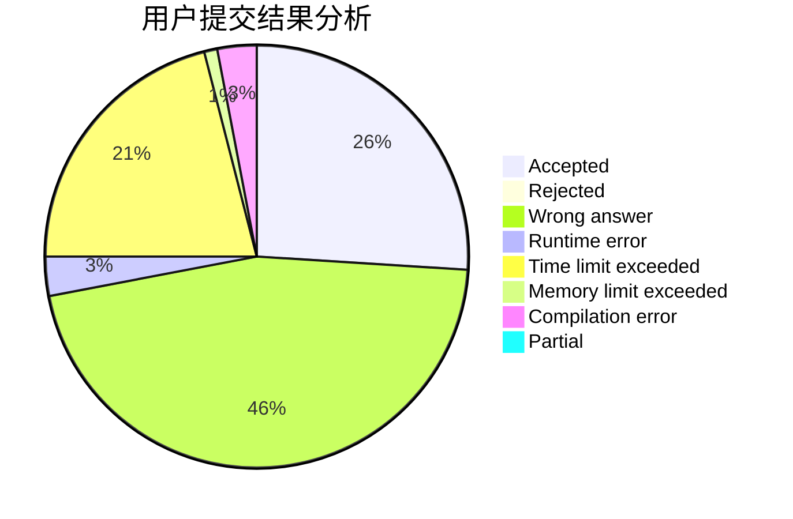
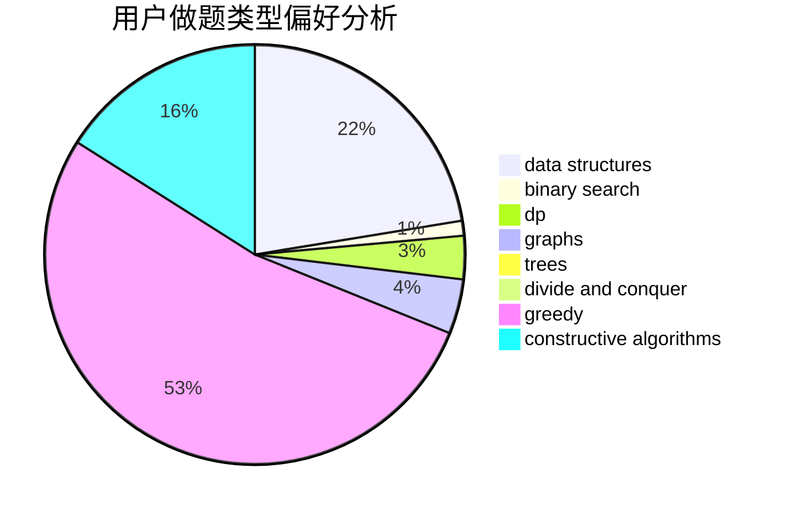
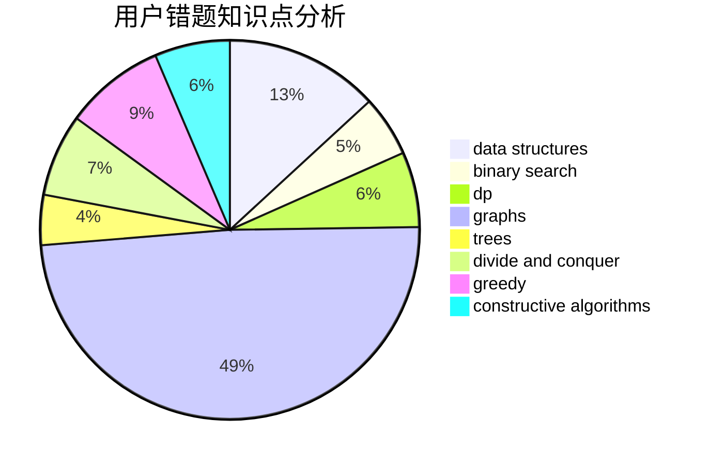

# Wallbreaker5th

<!-- tabs:start -->

#### **用户提交结果分析**

#### **用户做题类型偏好分析**

#### **用户错题知识点分析**

<!-- tabs:end -->
# 推荐题目
[1164M](https://codeforces.com/contest/1164/problem/M)		dsu,graphs,sortings,trees		  
[1336E2](https://codeforces.com/contest/1336E/problem/2)		bitmasks,
                        brute force,
                        combinatorics,
                        math		  
[1059B](https://codeforces.com/contest/1059/problem/B)		implementation		  
[1106B](https://codeforces.com/contest/1106/problem/B)		data structures,
                        implementation		  
[1157D](https://codeforces.com/contest/1157/problem/D)		constructive algorithms,
                        greedy,
                        math		  
[1285E](https://codeforces.com/contest/1285/problem/E)		brute force,
                        constructive algorithms,
                        data structures,
                        dp,
                        graphs,
                        sortings,
                        trees,
                        two pointers		  
[917D](https://codeforces.com/contest/917/problem/D)		dp,
                        math,
                        matrices,
                        trees		  
[1401D](https://codeforces.com/contest/1401/problem/D)		dfs and similar,
                        dp,
                        greedy,
                        implementation,
                        math,
                        number theory,
                        sortings,
                        trees		  
[1146E](https://codeforces.com/contest/1146/problem/E)		bitmasks,
                        data structures,
                        divide and conquer,
                        implementation		  
[735B](https://codeforces.com/contest/735/problem/B)		greedy,
                        number theory,
                        sortings		  
