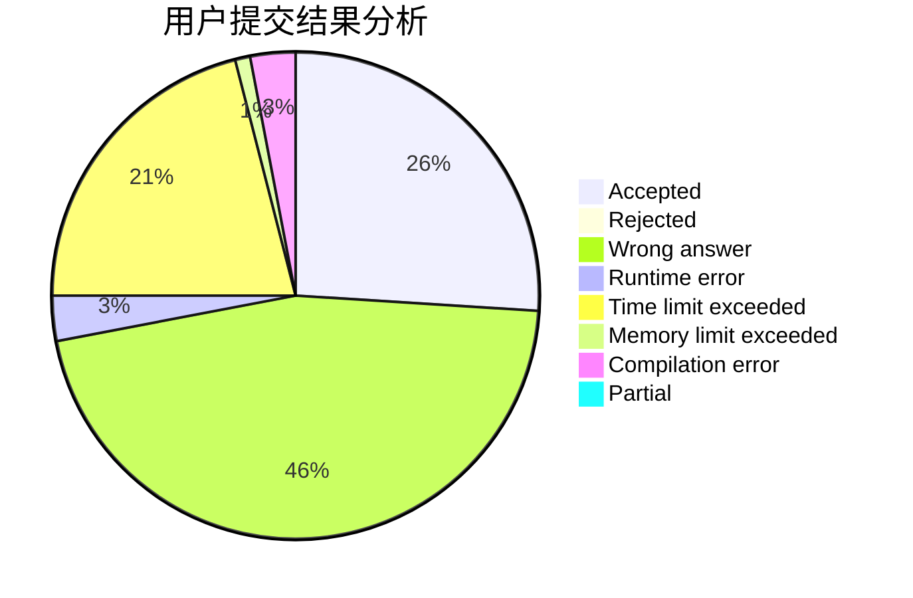
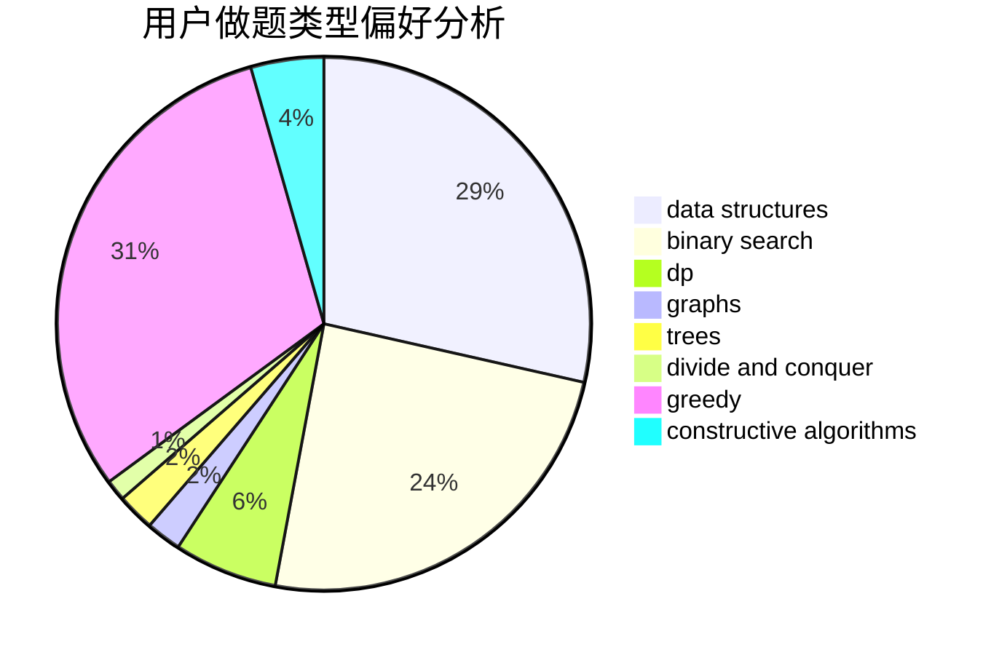
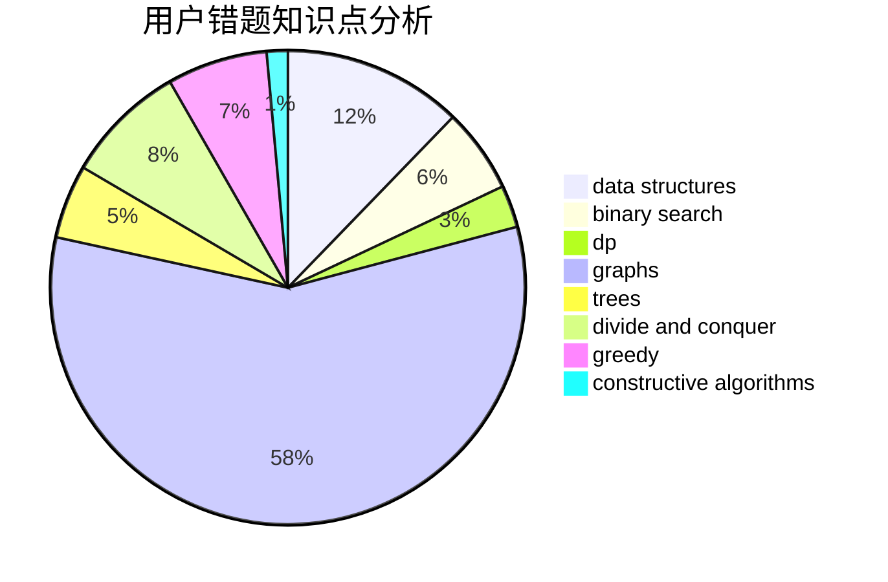

# Wallbreaker5th

<!-- tabs:start -->

#### **用户提交结果分析**

#### **用户做题类型偏好分析**

#### **用户错题知识点分析**

<!-- tabs:end -->
# 推荐题目
[1166D](https://codeforces.com/contest/1166/problem/D)		binary search,
                        brute force,
                        greedy,
                        math		  
[1344A](https://codeforces.com/contest/1344/problem/A)		math,
                        number theory,
                        sortings		  
[1059E](https://codeforces.com/contest/1059/problem/E)		binary search,
                        data structures,
                        dp,
                        greedy,
                        trees		  
[1106E](https://codeforces.com/contest/1106/problem/E)		data structures,
                        dp		  
[1159F](https://codeforces.com/contest/1159/problem/F)		dsu,graphs,sortings,trees		  
[1292F](https://codeforces.com/contest/1292/problem/F)		bitmasks,
                        combinatorics,
                        dp		  
[938B](https://codeforces.com/contest/938/problem/B)		brute force,
                        greedy		  
[1411G](https://codeforces.com/contest/1411/problem/G)		bitmasks,
                        games,
                        math,
                        matrices		  
[1148E](https://codeforces.com/contest/1148/problem/E)		constructive algorithms,
                        greedy,
                        math,
                        sortings,
                        two pointers		  
[756A](https://codeforces.com/contest/756/problem/A)		constructive algorithms,
                        dfs and similar		  
