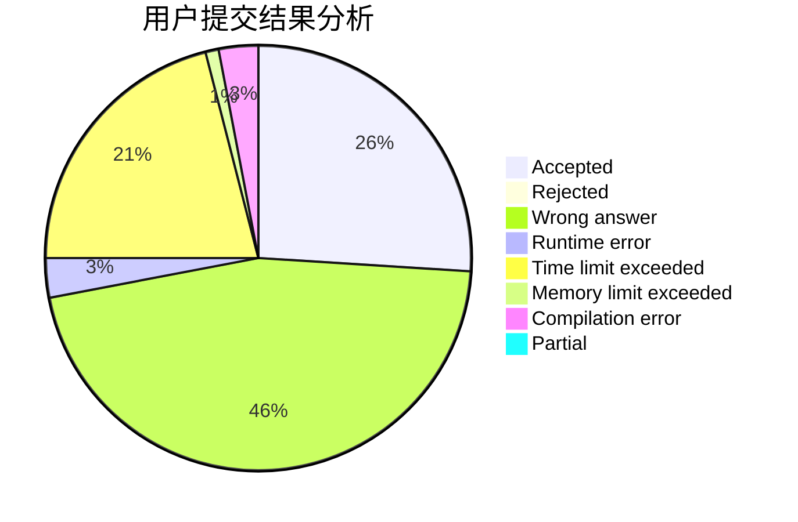
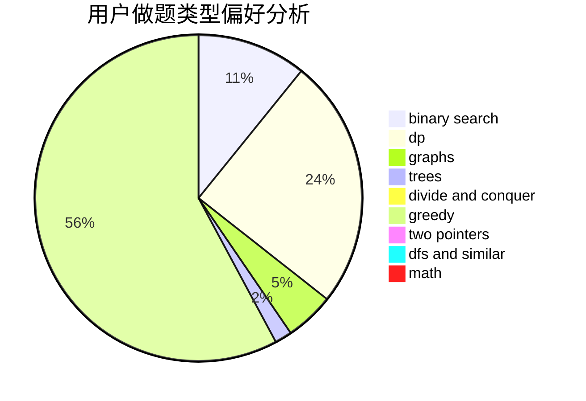

# Wallbreaker5th

<!-- tabs:start -->

#### **用户提交结果分析**

#### **用户做题类型偏好分析**

<!-- tabs:end -->
# 推荐题目
[1166D](https://codeforces.com/contest/1166/problem/D)
[1344A](https://codeforces.com/contest/1344/problem/A)
[1059E](https://codeforces.com/contest/1059/problem/E)
[1106E](https://codeforces.com/contest/1106/problem/E)
[1159F](https://codeforces.com/contest/1159/problem/F)
[1292F](https://codeforces.com/contest/1292/problem/F)
[938B](https://codeforces.com/contest/938/problem/B)
[1411G](https://codeforces.com/contest/1411/problem/G)
[1148E](https://codeforces.com/contest/1148/problem/E)
[756A](https://codeforces.com/contest/756/problem/A)
