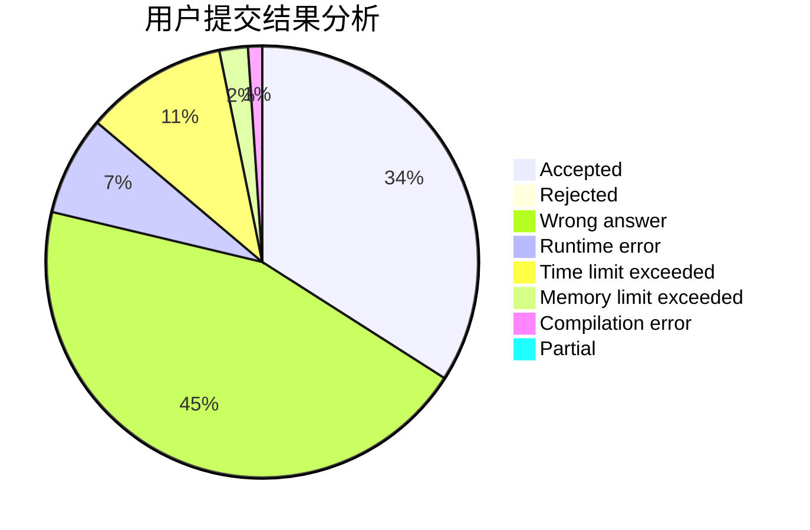
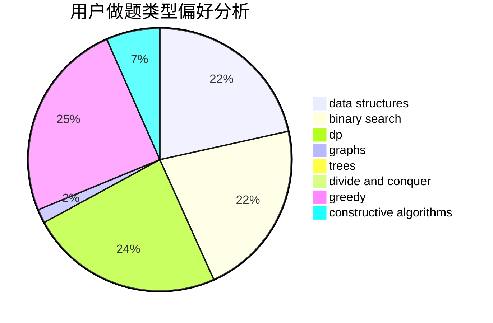

# WanRP

<!-- tabs:start -->

#### **用户提交结果分析**

#### **用户做题类型偏好分析**

#### **用户错题知识点分析**

<!-- tabs:end -->
# 推荐题目
[610B](https://codeforces.com/contest/610/problem/B)		constructive algorithms,
                        implementation		  
[165E](https://codeforces.com/contest/165/problem/E)		bitmasks,
                        brute force,
                        dfs and similar,
                        dp		  
[643D](https://codeforces.com/contest/643/problem/D)		nan		  
[528A](https://codeforces.com/contest/528/problem/A)		dsu,graphs,sortings,trees		  
[1157D](https://codeforces.com/contest/1157/problem/D)		constructive algorithms,
                        greedy,
                        math		  
[1209A](https://codeforces.com/contest/1209/problem/A)		greedy,
                        implementation,
                        math		  
[733B](https://codeforces.com/contest/733/problem/B)		math		  
[1096A](https://codeforces.com/contest/1096/problem/A)		greedy,
                        implementation,
                        math		  
[1221E](https://codeforces.com/contest/1221/problem/E)		games		  
[883B](https://codeforces.com/contest/883/problem/B)		constructive algorithms,
                        graphs,
                        greedy		  
