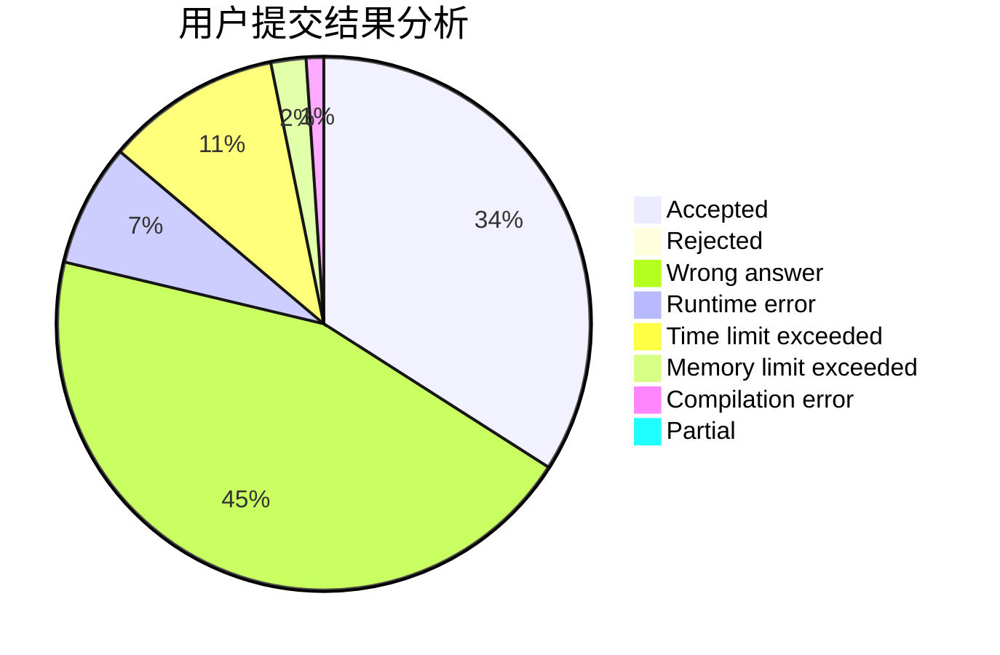
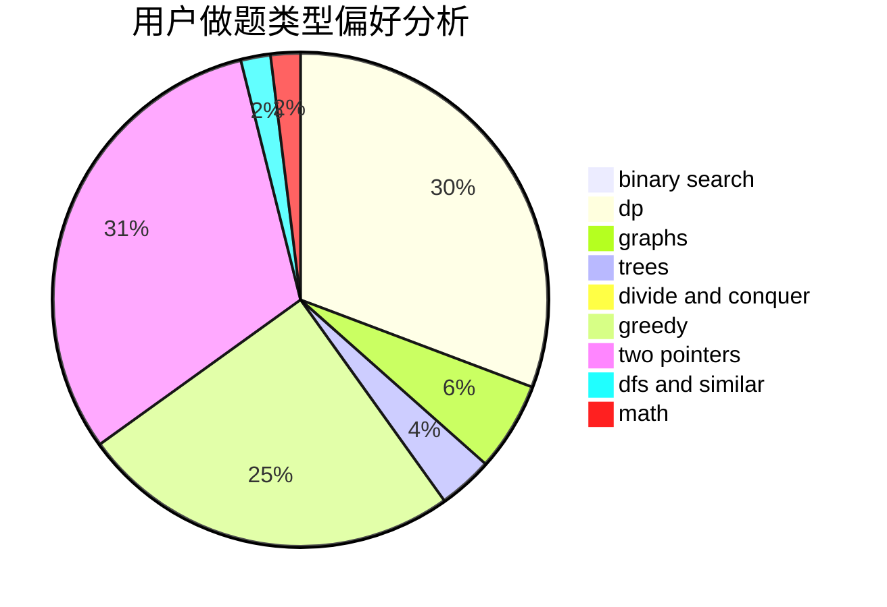

# WanRP

<!-- tabs:start -->

#### **用户提交结果分析**

#### **用户做题类型偏好分析**

<!-- tabs:end -->
# 推荐题目
[629D](https://codeforces.com/contest/629/problem/D)
[190E](https://codeforces.com/contest/190/problem/E)
[670B](https://codeforces.com/contest/670/problem/B)
[552A](https://codeforces.com/contest/552/problem/A)
[1159F](https://codeforces.com/contest/1159/problem/F)
[1214E](https://codeforces.com/contest/1214/problem/E)
[750G](https://codeforces.com/contest/750/problem/G)
[1096D](https://codeforces.com/contest/1096/problem/D)
[122A](https://codeforces.com/contest/122/problem/A)
[900A](https://codeforces.com/contest/900/problem/A)
