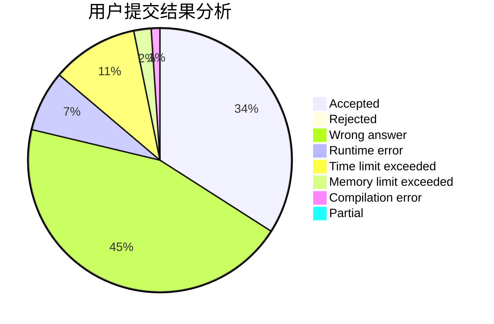
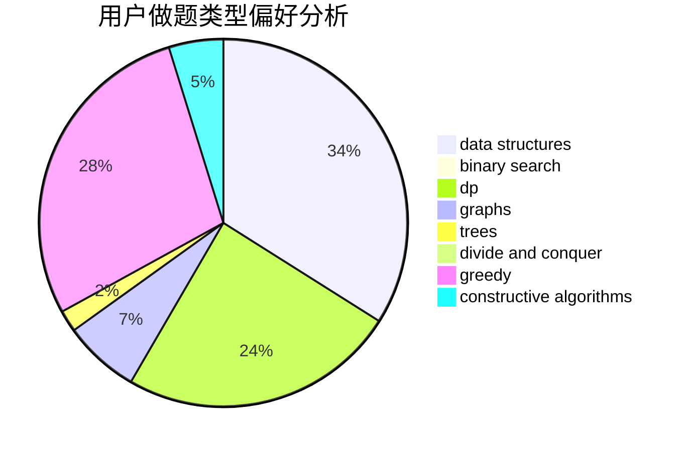

# WanRP

<!-- tabs:start -->

#### **用户提交结果分析**

#### **用户做题类型偏好分析**

#### **用户错题知识点分析**

<!-- tabs:end -->
# 推荐题目
[629D](https://codeforces.com/contest/629/problem/D)		data structures,
                        dp		  
[190E](https://codeforces.com/contest/190/problem/E)		data structures,
                        dsu,
                        graphs,
                        hashing,
                        sortings		  
[670B](https://codeforces.com/contest/670/problem/B)		implementation		  
[552A](https://codeforces.com/contest/552/problem/A)		implementation,
                        math		  
[1159F](https://codeforces.com/contest/1159/problem/F)		dsu,graphs,sortings,trees		  
[1214E](https://codeforces.com/contest/1214/problem/E)		constructive algorithms,
                        graphs,
                        math,
                        sortings,
                        trees		  
[750G](https://codeforces.com/contest/750/problem/G)		bitmasks,
                        brute force,
                        combinatorics,
                        dp		  
[1096D](https://codeforces.com/contest/1096/problem/D)		dp		  
[122A](https://codeforces.com/contest/122/problem/A)		brute force,
                        number theory		  
[900A](https://codeforces.com/contest/900/problem/A)		geometry,
                        implementation		  
