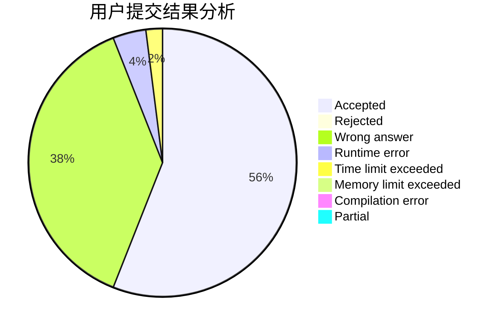
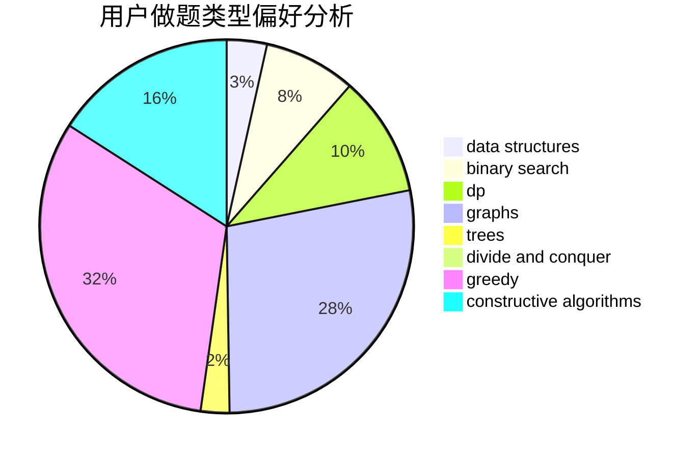
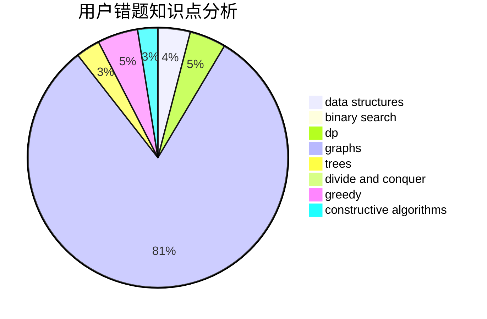

# WangHT

<!-- tabs:start -->

#### **用户提交结果分析**

#### **用户做题类型偏好分析**

#### **用户错题知识点分析**

<!-- tabs:end -->
# 推荐题目
[683A](https://codeforces.com/contest/683/problem/A)		*special problem,
                        geometry		  
[114D](https://codeforces.com/contest/114/problem/D)		dsu,graphs,sortings,trees		  
[724G](https://codeforces.com/contest/724/problem/G)		bitmasks,
                        graphs,
                        math,
                        number theory,
                        trees		  
[581D](https://codeforces.com/contest/581/problem/D)		bitmasks,
                        brute force,
                        constructive algorithms,
                        geometry,
                        implementation,
                        math		  
[365A](https://codeforces.com/contest/365/problem/A)		implementation		  
[1481C](https://codeforces.com/contest/1481/problem/C)		brute force,
                        constructive algorithms,
                        greedy		  
[312B](https://codeforces.com/contest/312/problem/B)		math,
                        probabilities		  
[714E](https://codeforces.com/contest/714/problem/E)		dsu,graphs,sortings,trees		  
[354C](https://codeforces.com/contest/354/problem/C)		brute force,
                        dp,
                        number theory		  
[1166F](https://codeforces.com/contest/1166/problem/F)		data structures,
                        dsu,
                        graphs,
                        hashing		  
