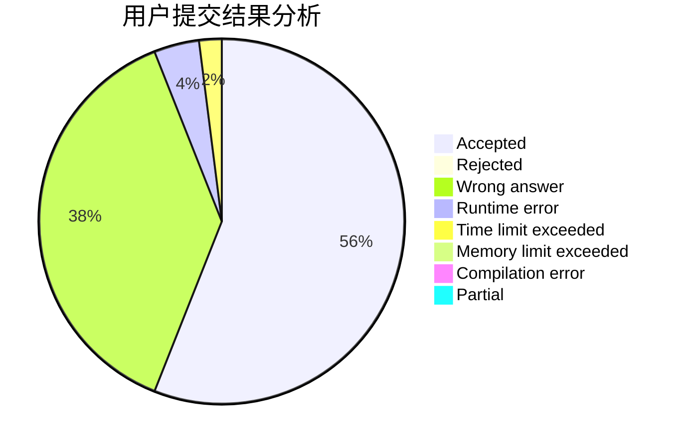
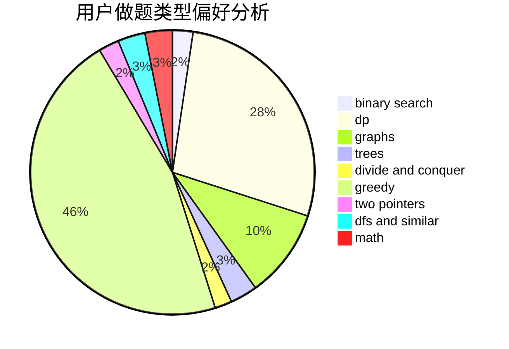

# WangHT

<!-- tabs:start -->

#### **用户提交结果分析**

#### **用户做题类型偏好分析**

<!-- tabs:end -->
# 推荐题目
[707B](https://codeforces.com/contest/707/problem/B)
[11521](https://codeforces.com/contest/1152/problem/1)
[742D](https://codeforces.com/contest/742/problem/D)
[602A](https://codeforces.com/contest/602/problem/A)
[393C](https://codeforces.com/contest/393/problem/C)
[1489E](https://codeforces.com/contest/1489/problem/E)
[337A](https://codeforces.com/contest/337/problem/A)
[733B](https://codeforces.com/contest/733/problem/B)
[380B](https://codeforces.com/contest/380/problem/B)
[116C](https://codeforces.com/contest/116/problem/C)
