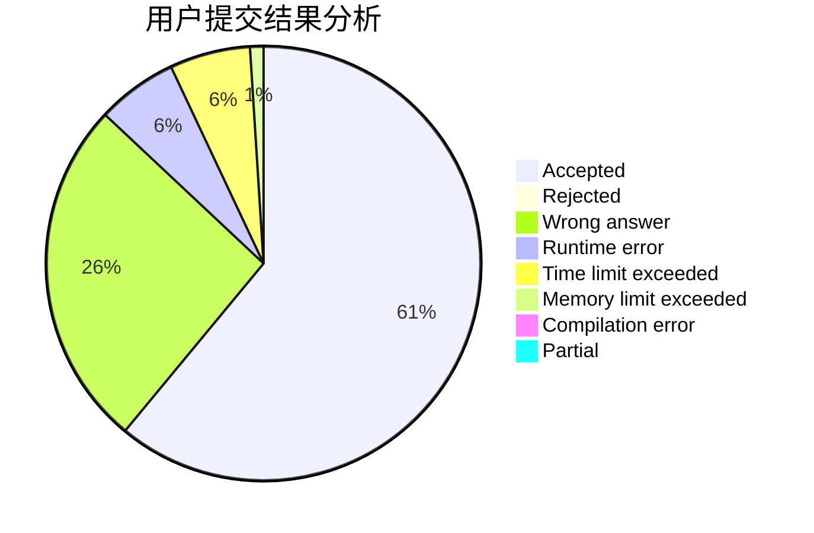
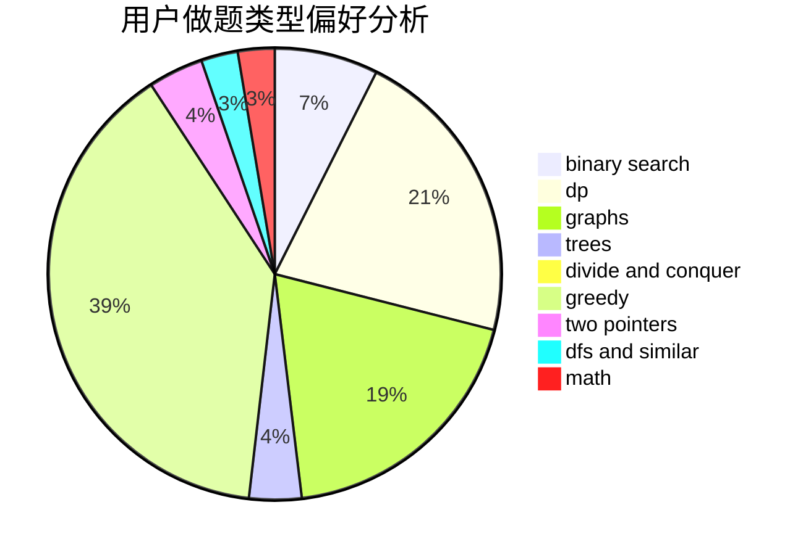

# Wankupi

<!-- tabs:start -->

#### **用户提交结果分析**

#### **用户做题类型偏好分析**

<!-- tabs:end -->
# 推荐题目
[579A](https://codeforces.com/contest/579/problem/A)
[708B](https://codeforces.com/contest/708/problem/B)
[1073D](https://codeforces.com/contest/1073/problem/D)
[228D](https://codeforces.com/contest/228/problem/D)
[744B](https://codeforces.com/contest/744/problem/B)
[1037B](https://codeforces.com/contest/1037/problem/B)
[898D](https://codeforces.com/contest/898/problem/D)
[810D](https://codeforces.com/contest/810/problem/D)
[305D](https://codeforces.com/contest/305/problem/D)
[346A](https://codeforces.com/contest/346/problem/A)
