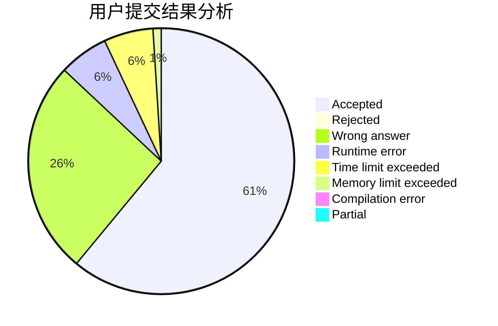
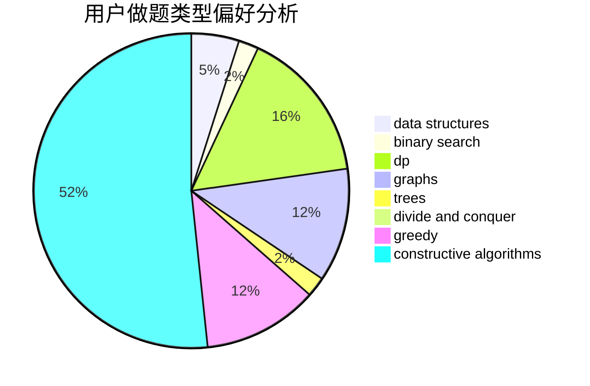

# Wankupi

<!-- tabs:start -->

#### **用户提交结果分析**

#### **用户做题类型偏好分析**

#### **用户错题知识点分析**

<!-- tabs:end -->
# 推荐题目
[579A](https://codeforces.com/contest/579/problem/A)		bitmasks		  
[708B](https://codeforces.com/contest/708/problem/B)		constructive algorithms,
                        greedy,
                        implementation,
                        math		  
[1073D](https://codeforces.com/contest/1073/problem/D)		binary search,
                        brute force,
                        data structures,
                        greedy		  
[228D](https://codeforces.com/contest/228/problem/D)		data structures		  
[744B](https://codeforces.com/contest/744/problem/B)		bitmasks,
                        divide and conquer,
                        interactive		  
[1037B](https://codeforces.com/contest/1037/problem/B)		greedy		  
[898D](https://codeforces.com/contest/898/problem/D)		greedy		  
[810D](https://codeforces.com/contest/810/problem/D)		dsu,graphs,sortings,trees		  
[305D](https://codeforces.com/contest/305/problem/D)		combinatorics,
                        math		  
[346A](https://codeforces.com/contest/346/problem/A)		games,
                        math,
                        number theory		  
