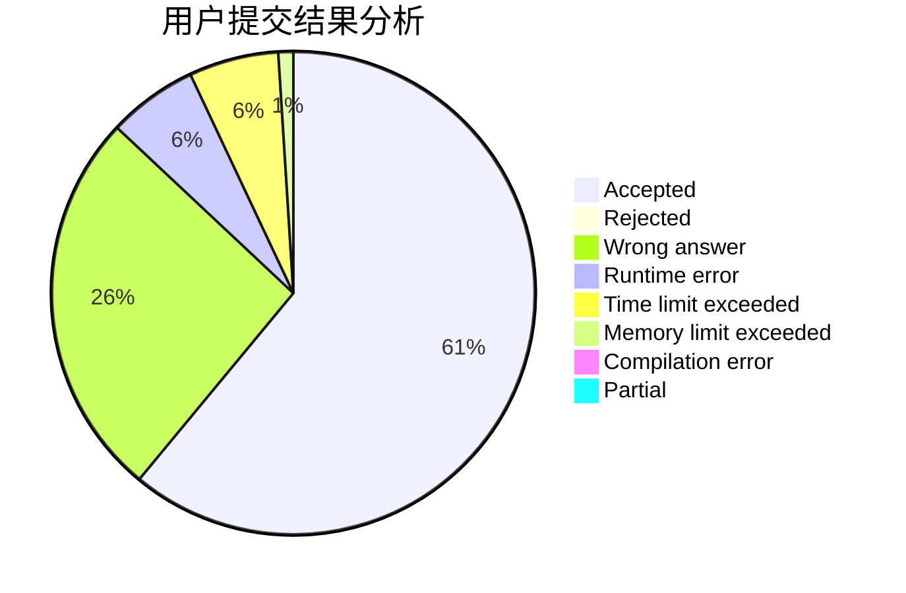
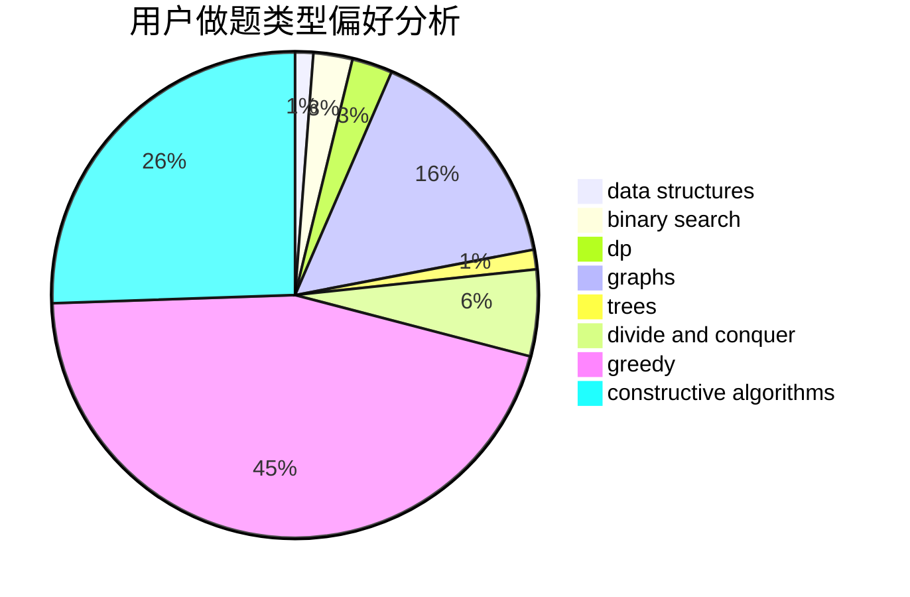

# Wankupi

<!-- tabs:start -->

#### **用户提交结果分析**

#### **用户做题类型偏好分析**

#### **用户错题知识点分析**

<!-- tabs:end -->
# 推荐题目
[553E](https://codeforces.com/contest/553/problem/E)		dp,
                        fft,
                        graphs,
                        math,
                        probabilities		  
[686B](https://codeforces.com/contest/686/problem/B)		constructive algorithms,
                        implementation,
                        sortings		  
[1073A](https://codeforces.com/contest/1073/problem/A)		implementation,
                        strings		  
[204D](https://codeforces.com/contest/204/problem/D)		dp		  
[725G](https://codeforces.com/contest/725/problem/G)		nan		  
[1036E](https://codeforces.com/contest/1036/problem/E)		fft,
                        geometry,
                        number theory		  
[877E](https://codeforces.com/contest/877/problem/E)		bitmasks,
                        data structures,
                        trees		  
[796C](https://codeforces.com/contest/796/problem/C)		constructive algorithms,
                        data structures,
                        dp,
                        trees		  
[291A](https://codeforces.com/contest/291/problem/A)		*special problem,
                        implementation,
                        sortings		  
[316G3](https://codeforces.com/contest/316G/problem/3)		string suffix structures		  
