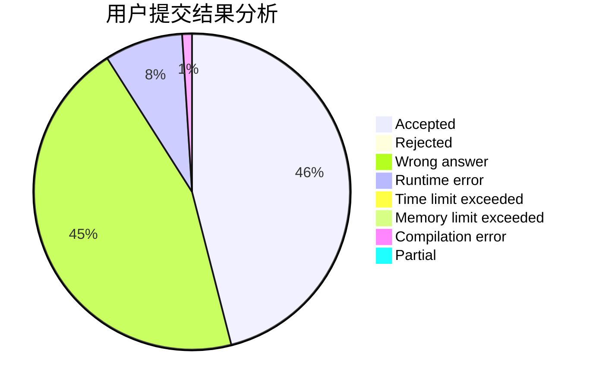
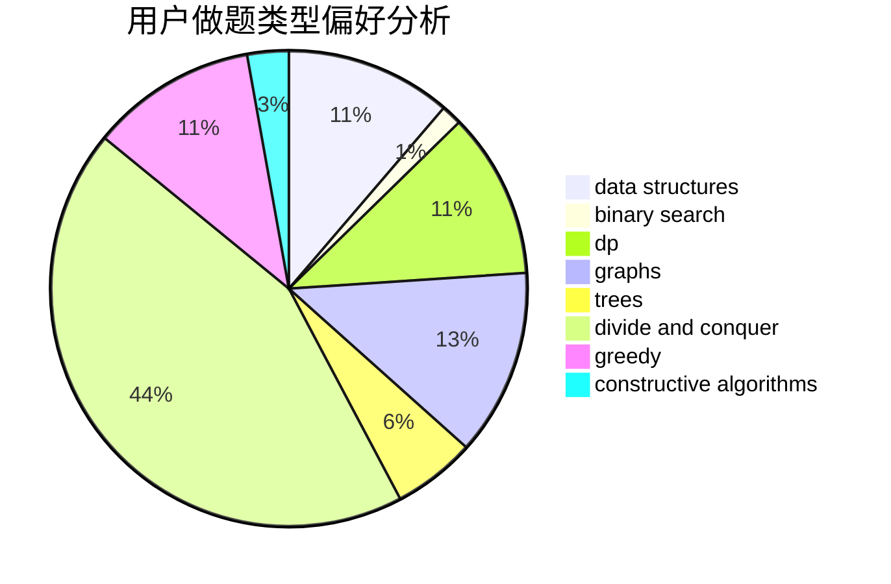
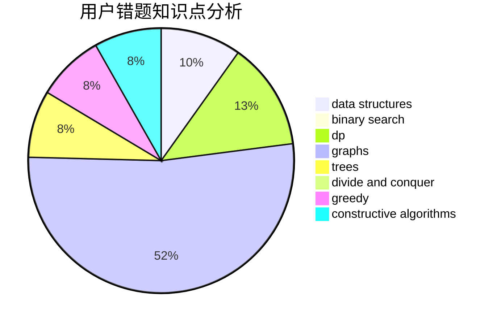

# WarYan

<!-- tabs:start -->

#### **用户提交结果分析**

#### **用户做题类型偏好分析**

#### **用户错题知识点分析**

<!-- tabs:end -->
# 推荐题目
[819B](https://codeforces.com/contest/819/problem/B)		data structures,
                        implementation,
                        math		  
[804C](https://codeforces.com/contest/804/problem/C)		constructive algorithms,
                        dfs and similar,
                        greedy		  
[1093F](https://codeforces.com/contest/1093/problem/F)		dp		  
[449D](https://codeforces.com/contest/449/problem/D)		bitmasks,
                        combinatorics,
                        dp		  
[542F](https://codeforces.com/contest/542/problem/F)		dp,
                        greedy		  
[466C](https://codeforces.com/contest/466/problem/C)		binary search,
                        brute force,
                        data structures,
                        dp,
                        two pointers		  
[1080A](https://codeforces.com/contest/1080/problem/A)		math		  
[26D](https://codeforces.com/contest/26/problem/D)		combinatorics,
                        math,
                        probabilities		  
[1164S](https://codeforces.com/contest/1164/problem/S)		dsu,graphs,sortings,trees		  
[557B](https://codeforces.com/contest/557/problem/B)		constructive algorithms,
                        implementation,
                        math,
                        sortings		  
