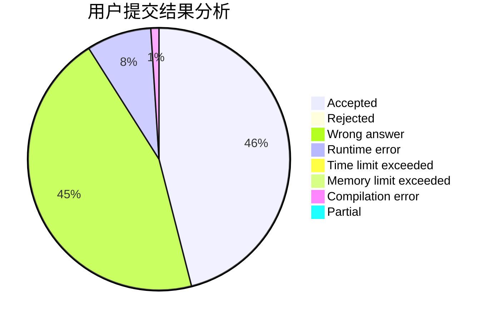
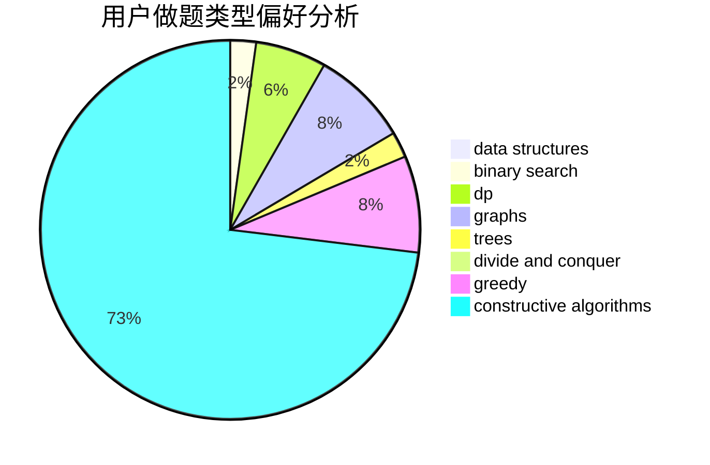
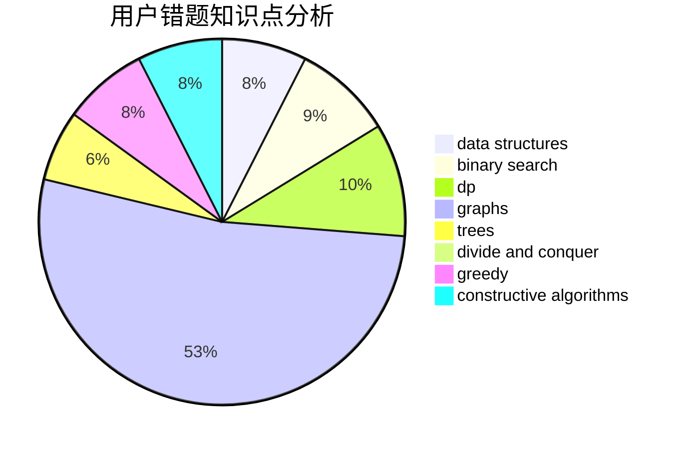

# WarYan

<!-- tabs:start -->

#### **用户提交结果分析**

#### **用户做题类型偏好分析**

#### **用户错题知识点分析**

<!-- tabs:end -->
# 推荐题目
[803D](https://codeforces.com/contest/803/problem/D)		binary search,
                        greedy		  
[789A](https://codeforces.com/contest/789/problem/A)		implementation,
                        math		  
[1093C](https://codeforces.com/contest/1093/problem/C)		greedy		  
[426B](https://codeforces.com/contest/426/problem/B)		implementation		  
[515E](https://codeforces.com/contest/515/problem/E)		data structures		  
[446B](https://codeforces.com/contest/446/problem/B)		brute force,
                        data structures,
                        greedy		  
[107B](https://codeforces.com/contest/107/problem/B)		combinatorics,
                        dp,
                        math,
                        probabilities		  
[253A](https://codeforces.com/contest/253/problem/A)		greedy		  
[1163C1](https://codeforces.com/contest/1163C/problem/1)		brute force,
                        geometry		  
[534F](https://codeforces.com/contest/534/problem/F)		bitmasks,
                        dp,
                        hashing,
                        meet-in-the-middle		  
