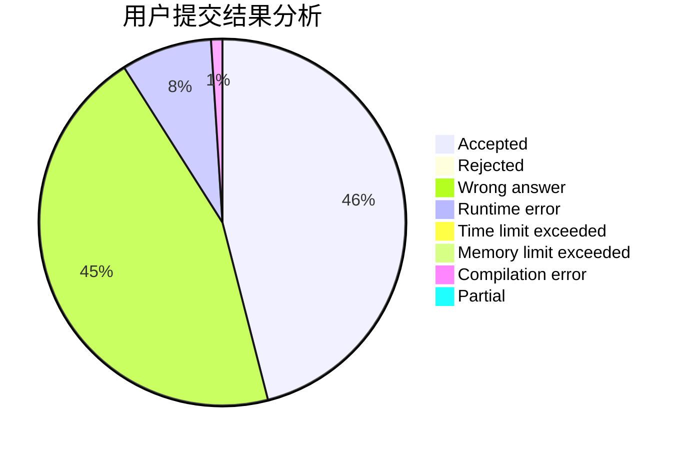
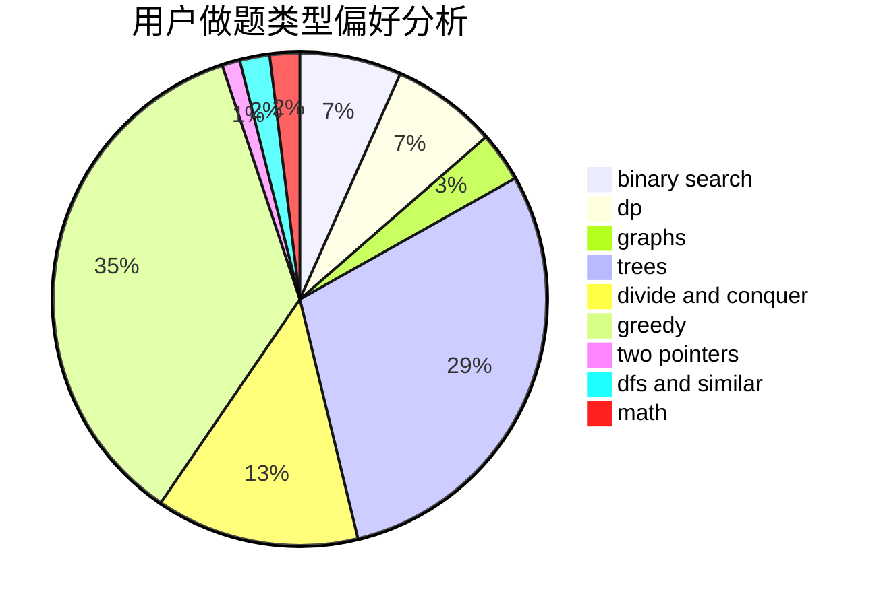

# WarYan

<!-- tabs:start -->

#### **用户提交结果分析**

#### **用户做题类型偏好分析**

<!-- tabs:end -->
# 推荐题目
[819B](https://codeforces.com/contest/819/problem/B)
[804C](https://codeforces.com/contest/804/problem/C)
[1093F](https://codeforces.com/contest/1093/problem/F)
[449D](https://codeforces.com/contest/449/problem/D)
[542F](https://codeforces.com/contest/542/problem/F)
[466C](https://codeforces.com/contest/466/problem/C)
[1080A](https://codeforces.com/contest/1080/problem/A)
[26D](https://codeforces.com/contest/26/problem/D)
[1164S](https://codeforces.com/contest/1164/problem/S)
[557B](https://codeforces.com/contest/557/problem/B)
