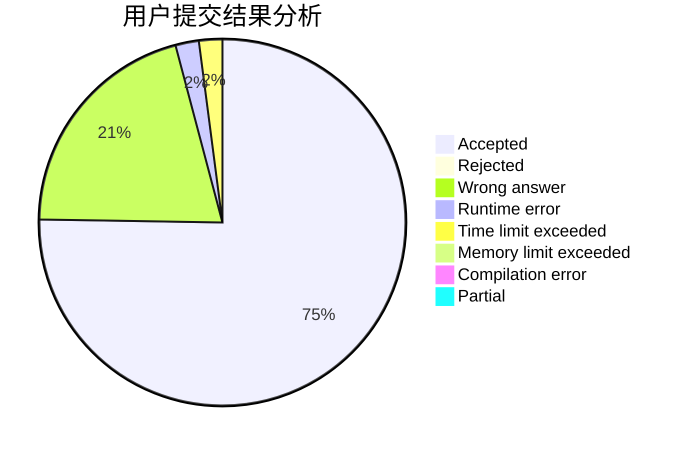
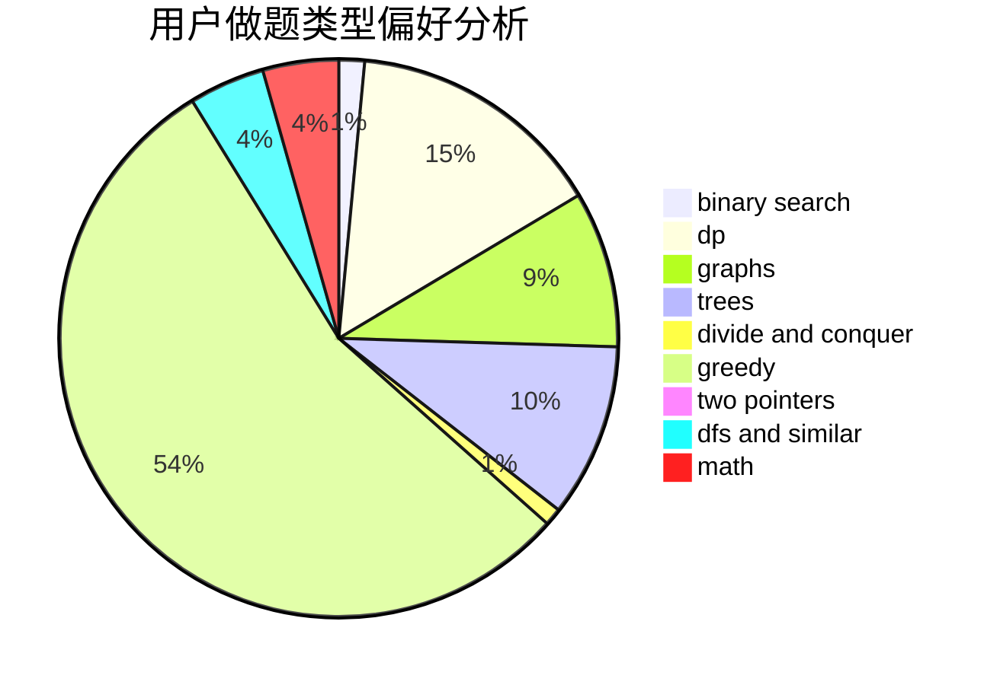

# Warriors_Cat

<!-- tabs:start -->

#### **用户提交结果分析**

#### **用户做题类型偏好分析**

<!-- tabs:end -->
# 推荐题目
[453B](https://codeforces.com/contest/453/problem/B)
[13681](https://codeforces.com/contest/1368/problem/1)
[1100A](https://codeforces.com/contest/1100/problem/A)
[614D](https://codeforces.com/contest/614/problem/D)
[12272](https://codeforces.com/contest/1227/problem/2)
[1290F](https://codeforces.com/contest/1290/problem/F)
[1070K](https://codeforces.com/contest/1070/problem/K)
[545E](https://codeforces.com/contest/545/problem/E)
[662E](https://codeforces.com/contest/662/problem/E)
[1140D](https://codeforces.com/contest/1140/problem/D)
