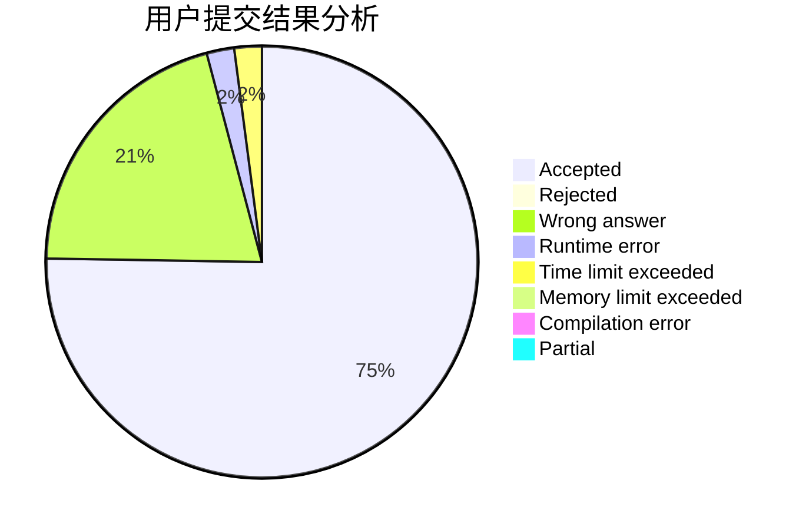
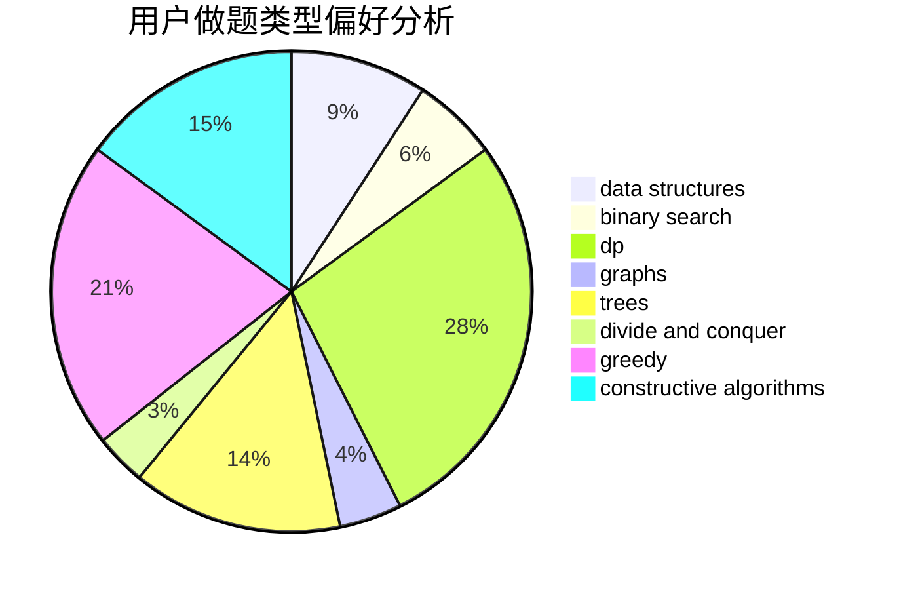

# Warriors_Cat

<!-- tabs:start -->

#### **用户提交结果分析**

#### **用户做题类型偏好分析**

#### **用户错题知识点分析**

<!-- tabs:end -->
# 推荐题目
[453B](https://codeforces.com/contest/453/problem/B)		bitmasks,
                        brute force,
                        dp		  
[13681](https://codeforces.com/contest/1368/problem/1)		dsu,graphs,sortings,trees		  
[1100A](https://codeforces.com/contest/1100/problem/A)		implementation		  
[614D](https://codeforces.com/contest/614/problem/D)		dsu,graphs,sortings,trees		  
[12272](https://codeforces.com/contest/1227/problem/2)		dsu,graphs,sortings,trees		  
[1290F](https://codeforces.com/contest/1290/problem/F)		dp		  
[1070K](https://codeforces.com/contest/1070/problem/K)		implementation		  
[545E](https://codeforces.com/contest/545/problem/E)		graphs,
                        greedy,
                        shortest paths		  
[662E](https://codeforces.com/contest/662/problem/E)		brute force,
                        dp,
                        greedy		  
[1140D](https://codeforces.com/contest/1140/problem/D)		dp,
                        greedy,
                        math		  
