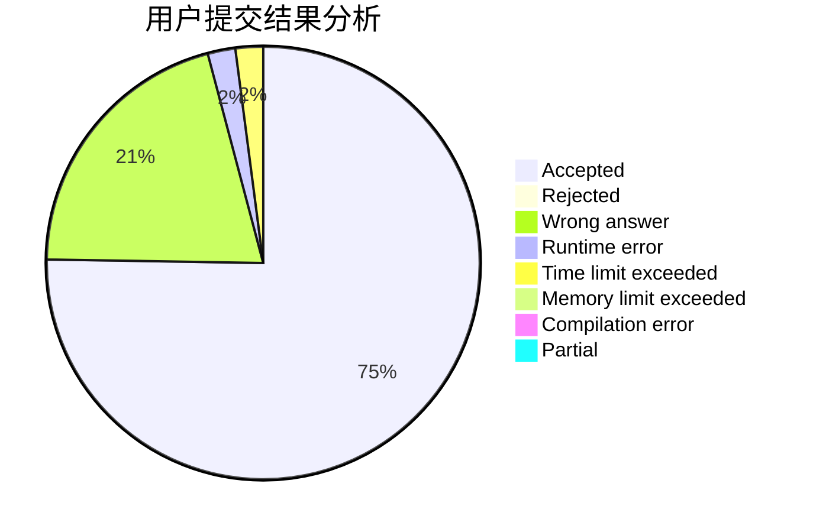
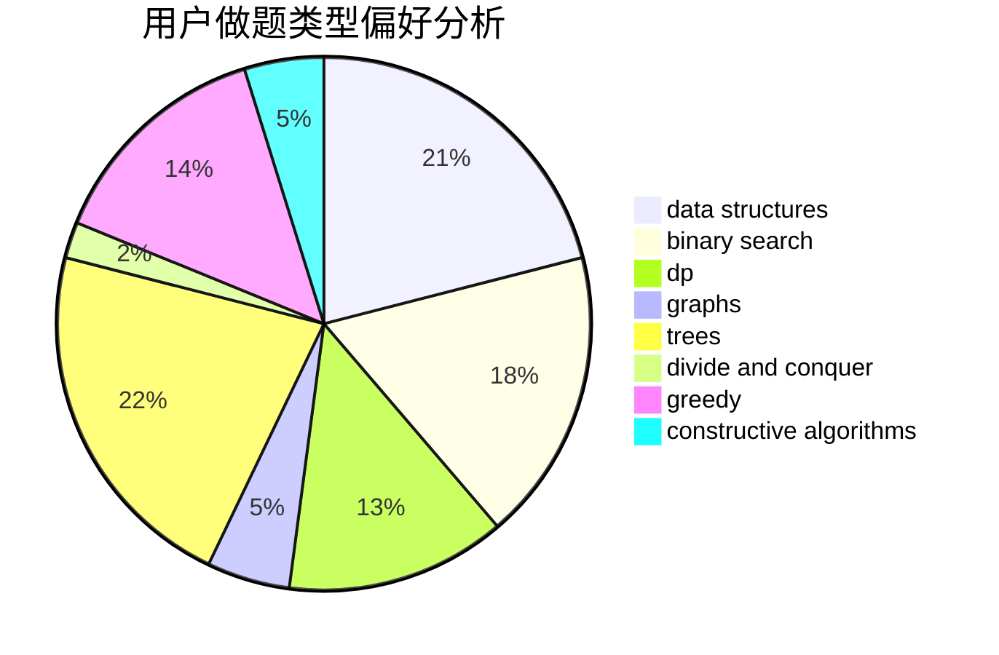

# Warriors_Cat

<!-- tabs:start -->

#### **用户提交结果分析**

#### **用户做题类型偏好分析**

#### **用户错题知识点分析**

<!-- tabs:end -->
# 推荐题目
[431D](https://codeforces.com/contest/431/problem/D)		binary search,
                        bitmasks,
                        combinatorics,
                        dp,
                        math		  
[135B](https://codeforces.com/contest/135/problem/B)		brute force,
                        geometry,
                        math		  
[10C](https://codeforces.com/contest/10/problem/C)		number theory		  
[597C](https://codeforces.com/contest/597/problem/C)		data structures,
                        dp		  
[1219C](https://codeforces.com/contest/1219/problem/C)		implementation,
                        strings		  
[1283F](https://codeforces.com/contest/1283/problem/F)		constructive algorithms,
                        greedy,
                        trees		  
[1070H](https://codeforces.com/contest/1070/problem/H)		brute force,
                        implementation		  
[520A](https://codeforces.com/contest/520/problem/A)		implementation,
                        strings		  
[632B](https://codeforces.com/contest/632/problem/B)		brute force,
                        constructive algorithms		  
[1138F](https://codeforces.com/contest/1138/problem/F)		dsu,graphs,sortings,trees		  
