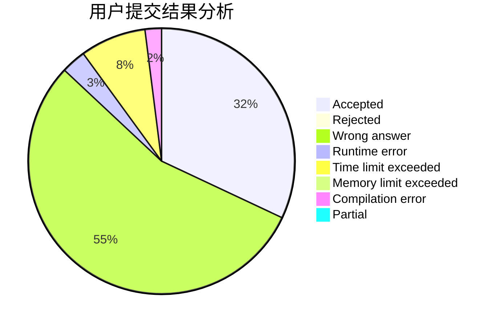
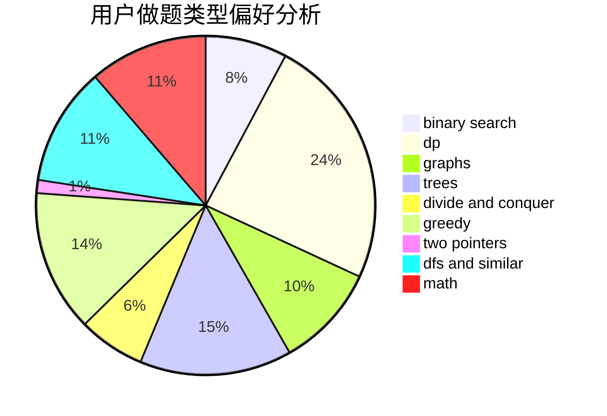

# Weierstrass

<!-- tabs:start -->

#### **用户提交结果分析**

#### **用户做题类型偏好分析**

<!-- tabs:end -->
# 推荐题目
[911D](https://codeforces.com/contest/911/problem/D)
[98E](https://codeforces.com/contest/98/problem/E)
[227A](https://codeforces.com/contest/227/problem/A)
[631D](https://codeforces.com/contest/631/problem/D)
[376A](https://codeforces.com/contest/376/problem/A)
[744C](https://codeforces.com/contest/744/problem/C)
[967B](https://codeforces.com/contest/967/problem/B)
[1183E](https://codeforces.com/contest/1183/problem/E)
[1054C](https://codeforces.com/contest/1054/problem/C)
[476C](https://codeforces.com/contest/476/problem/C)
