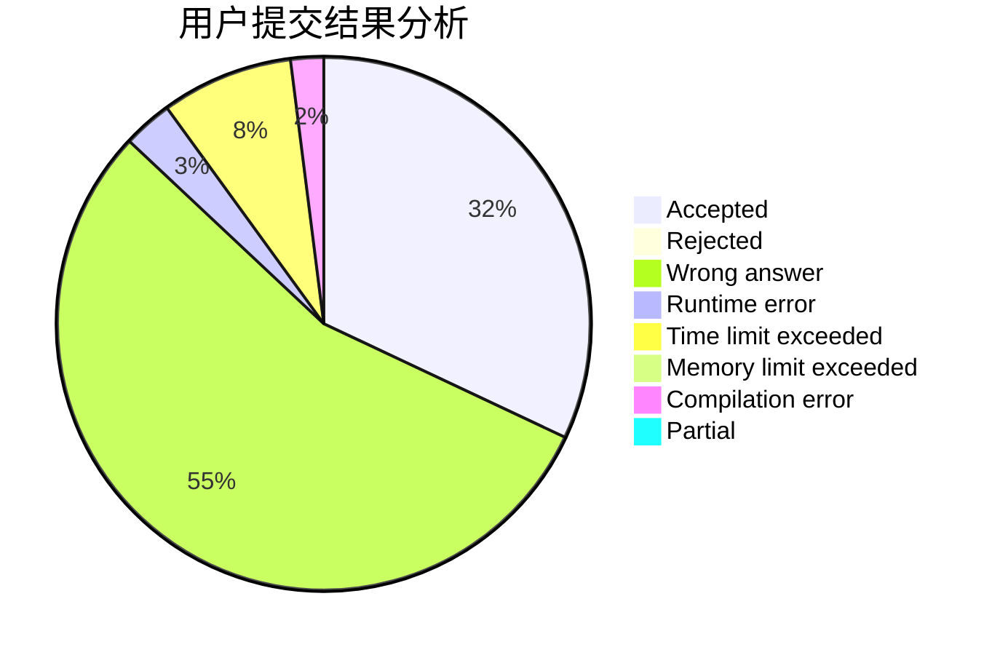
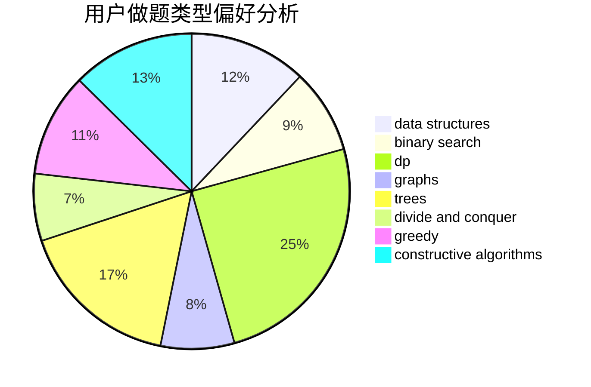
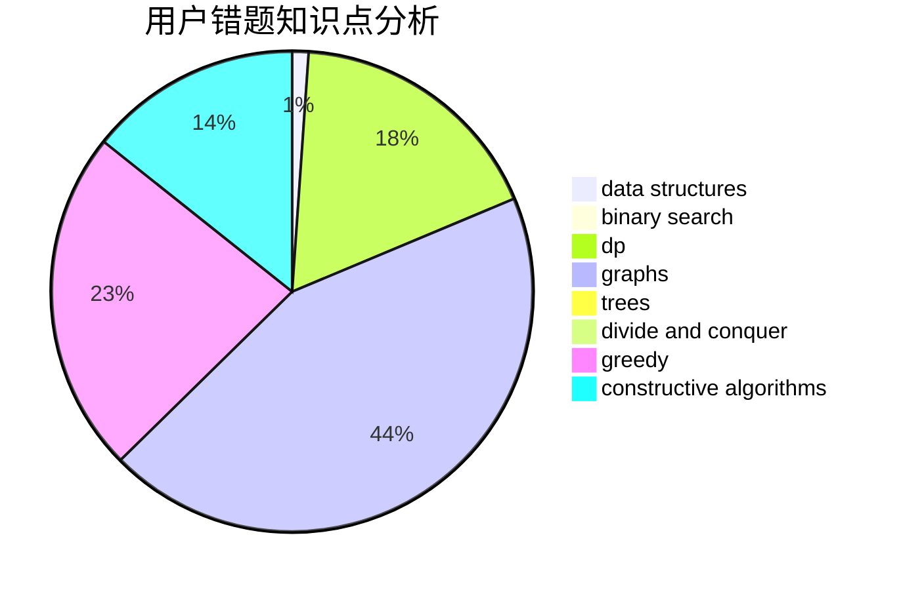

# Weierstrass

<!-- tabs:start -->

#### **用户提交结果分析**

#### **用户做题类型偏好分析**

#### **用户错题知识点分析**

<!-- tabs:end -->
# 推荐题目
[911D](https://codeforces.com/contest/911/problem/D)		brute force,
                        math		  
[98E](https://codeforces.com/contest/98/problem/E)		dp,
                        games,
                        math,
                        probabilities		  
[227A](https://codeforces.com/contest/227/problem/A)		geometry		  
[631D](https://codeforces.com/contest/631/problem/D)		data structures,
                        hashing,
                        implementation,
                        string suffix structures,
                        strings		  
[376A](https://codeforces.com/contest/376/problem/A)		implementation,
                        math		  
[744C](https://codeforces.com/contest/744/problem/C)		bitmasks,
                        brute force,
                        dp		  
[967B](https://codeforces.com/contest/967/problem/B)		math,
                        sortings		  
[1183E](https://codeforces.com/contest/1183/problem/E)		dp,
                        graphs,
                        implementation,
                        shortest paths		  
[1054C](https://codeforces.com/contest/1054/problem/C)		constructive algorithms,
                        implementation		  
[476C](https://codeforces.com/contest/476/problem/C)		math		  
