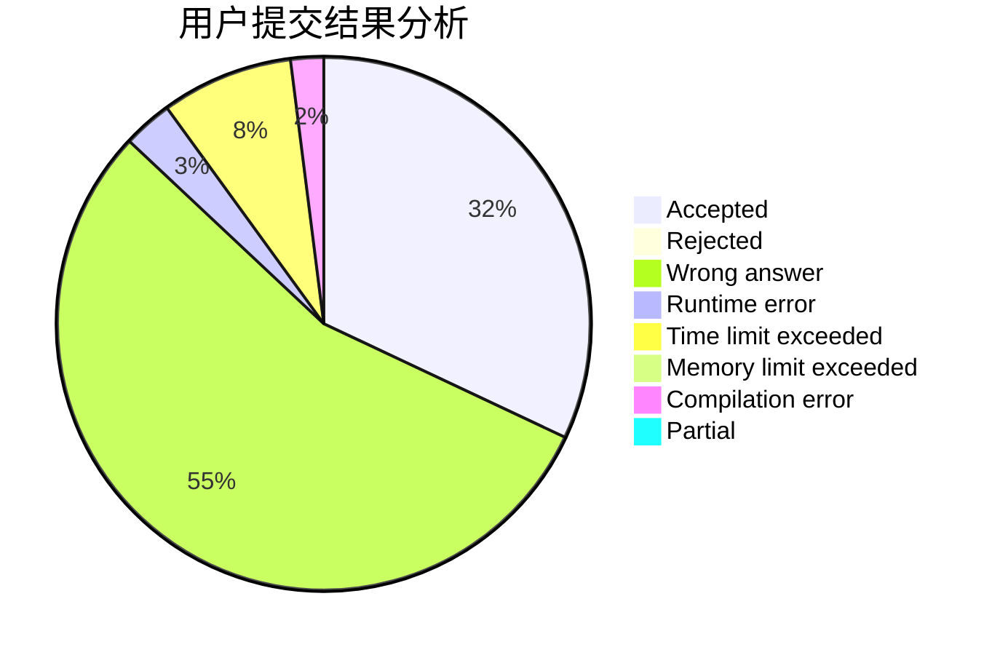
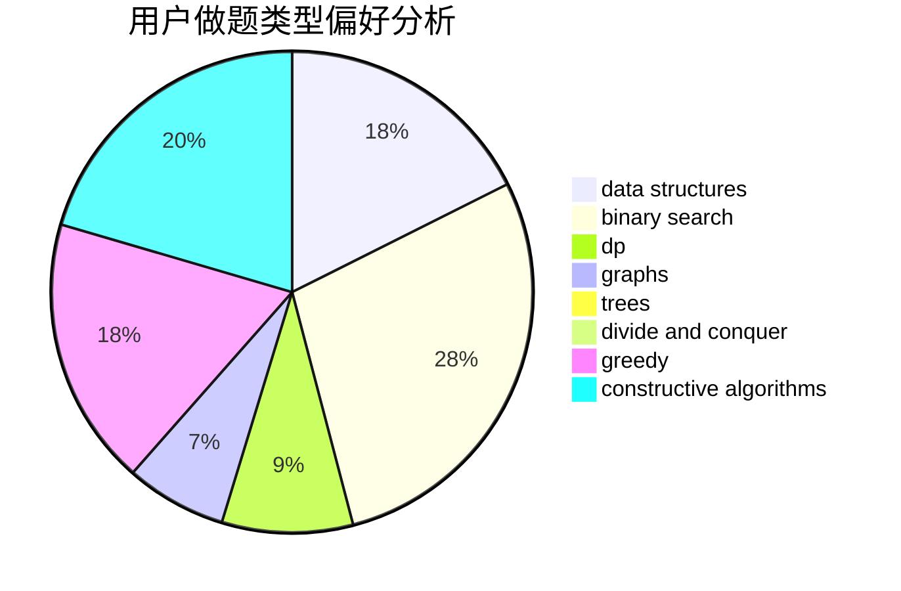
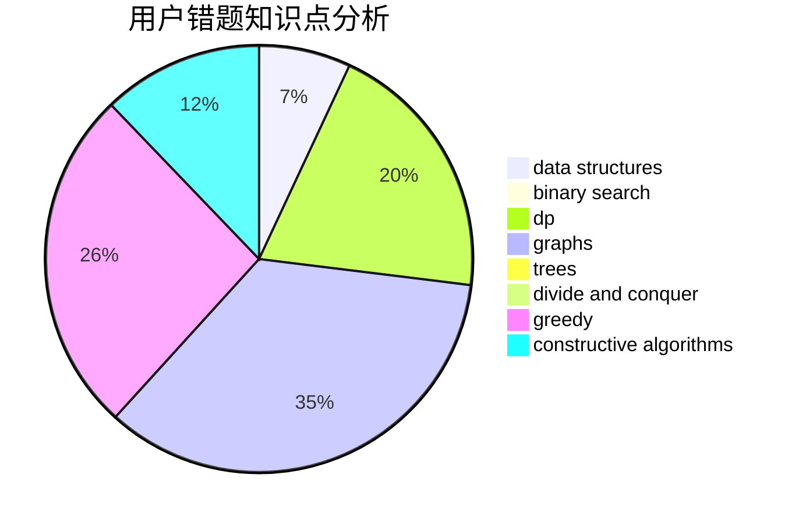

# Weierstrass

<!-- tabs:start -->

#### **用户提交结果分析**

#### **用户做题类型偏好分析**

#### **用户错题知识点分析**

<!-- tabs:end -->
# 推荐题目
[893D](https://codeforces.com/contest/893/problem/D)		data structures,
                        dp,
                        greedy,
                        implementation		  
[976A](https://codeforces.com/contest/976/problem/A)		implementation		  
[203B](https://codeforces.com/contest/203/problem/B)		brute force,
                        implementation		  
[612B](https://codeforces.com/contest/612/problem/B)		implementation,
                        math		  
[349B](https://codeforces.com/contest/349/problem/B)		data structures,
                        dp,
                        greedy,
                        implementation		  
[727A](https://codeforces.com/contest/727/problem/A)		brute force,
                        dfs and similar,
                        math		  
[94C](https://codeforces.com/contest/94/problem/C)		dsu,graphs,sortings,trees		  
[1180D](https://codeforces.com/contest/1180/problem/D)		dsu,graphs,sortings,trees		  
[1053E](https://codeforces.com/contest/1053/problem/E)		constructive algorithms,
                        trees		  
[455B](https://codeforces.com/contest/455/problem/B)		dfs and similar,
                        dp,
                        games,
                        implementation,
                        strings,
                        trees		  
