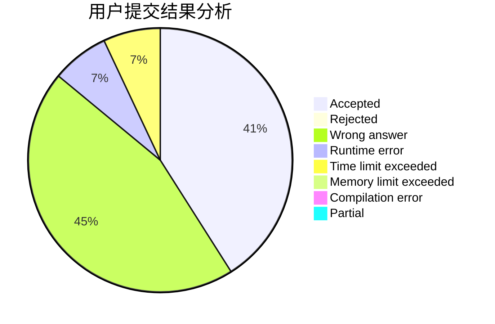
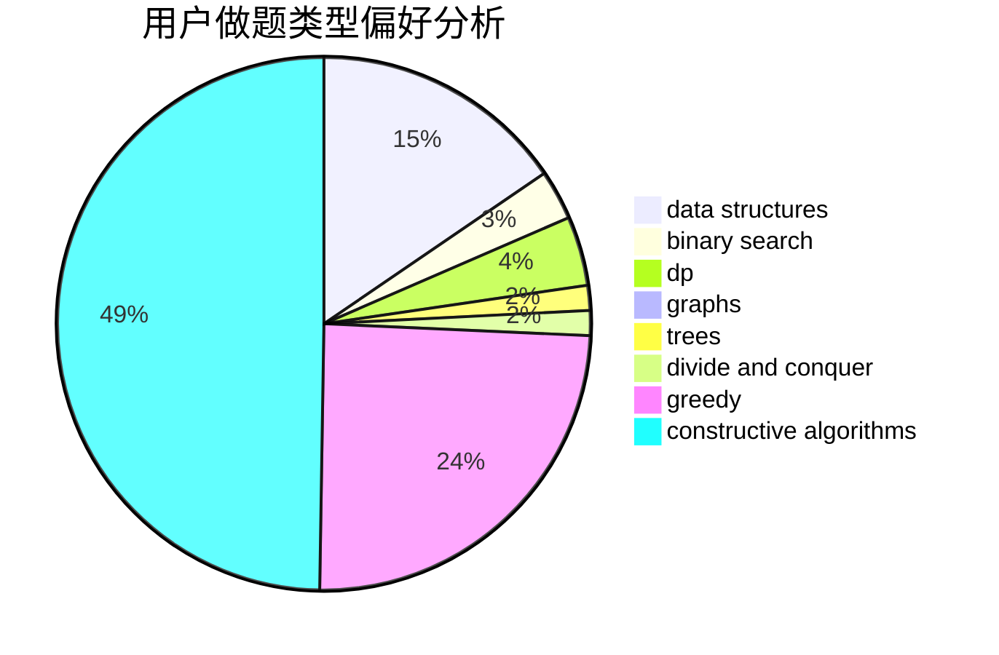
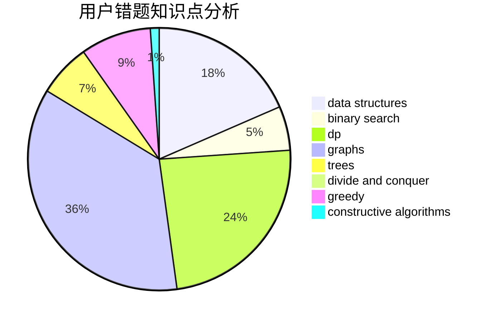

# Wenyi

<!-- tabs:start -->

#### **用户提交结果分析**

#### **用户做题类型偏好分析**

#### **用户错题知识点分析**

<!-- tabs:end -->
# 推荐题目
[542E](https://codeforces.com/contest/542/problem/E)		graphs,
                        shortest paths		  
[436B](https://codeforces.com/contest/436/problem/B)		implementation,
                        math		  
[713A](https://codeforces.com/contest/713/problem/A)		data structures,
                        implementation		  
[396C](https://codeforces.com/contest/396/problem/C)		data structures,
                        graphs,
                        trees		  
[1115G2](https://codeforces.com/contest/1115G/problem/2)		*special problem		  
[103D](https://codeforces.com/contest/103/problem/D)		brute force,
                        data structures,
                        sortings		  
[1099E](https://codeforces.com/contest/1099/problem/E)		dsu,graphs,sortings,trees		  
[749C](https://codeforces.com/contest/749/problem/C)		greedy,
                        implementation,
                        two pointers		  
[696C](https://codeforces.com/contest/696/problem/C)		combinatorics,
                        dp,
                        implementation,
                        math,
                        matrices		  
[1434D](https://codeforces.com/contest/1434/problem/D)		dsu,graphs,sortings,trees		  
