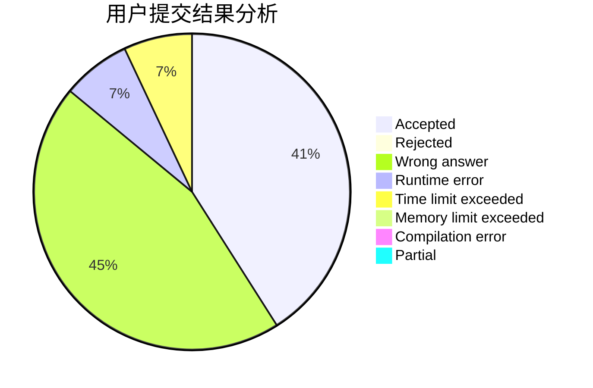
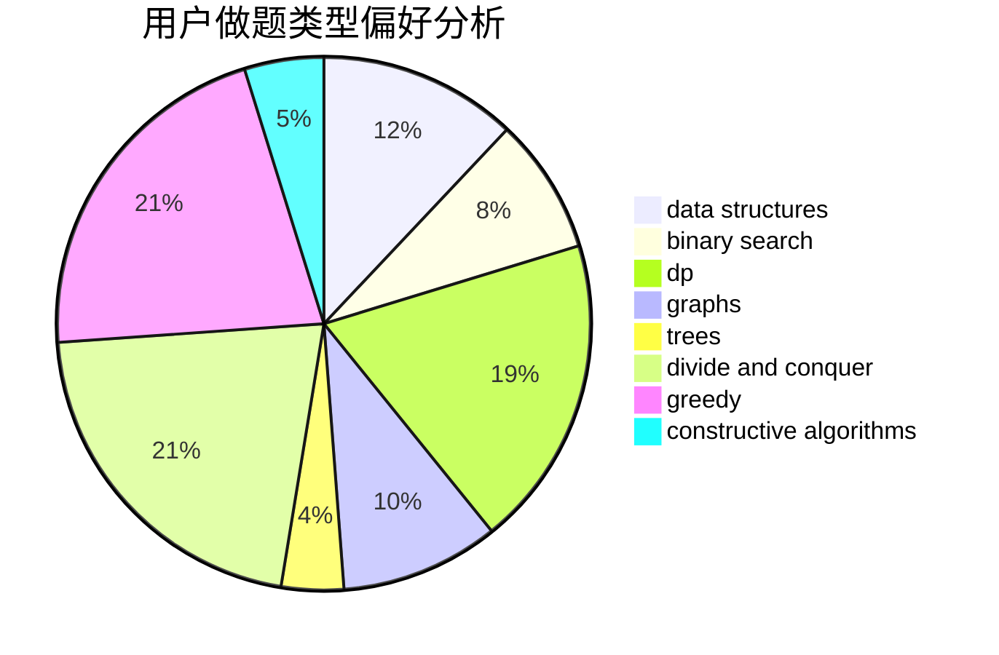
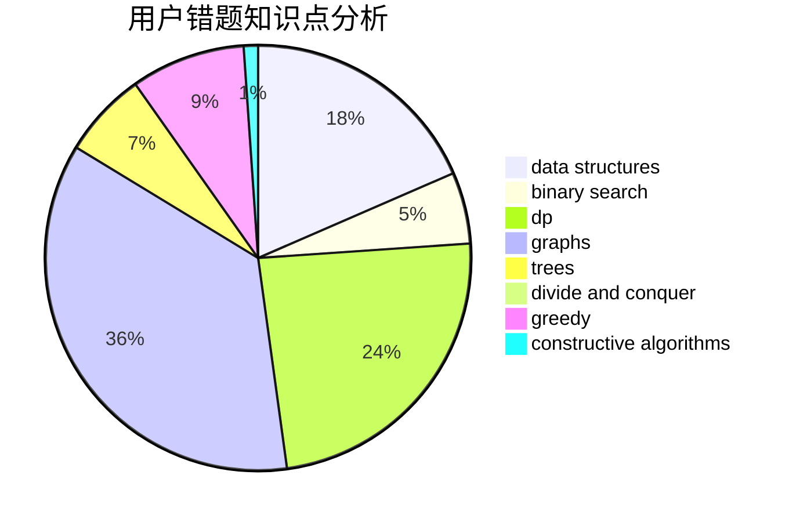

# Wenyi

<!-- tabs:start -->

#### **用户提交结果分析**

#### **用户做题类型偏好分析**

#### **用户错题知识点分析**

<!-- tabs:end -->
# 推荐题目
[567A](https://codeforces.com/contest/567/problem/A)		greedy,
                        implementation		  
[456B](https://codeforces.com/contest/456/problem/B)		math,
                        number theory		  
[732B](https://codeforces.com/contest/732/problem/B)		dp,
                        greedy		  
[424B](https://codeforces.com/contest/424/problem/B)		binary search,
                        greedy,
                        implementation,
                        sortings		  
[11162](https://codeforces.com/contest/1116/problem/2)		dsu,graphs,sortings,trees		  
[1040B](https://codeforces.com/contest/1040/problem/B)		dp,
                        greedy,
                        math		  
[109B](https://codeforces.com/contest/109/problem/B)		brute force,
                        probabilities		  
[768C](https://codeforces.com/contest/768/problem/C)		brute force,
                        dp,
                        implementation,
                        sortings		  
[713A](https://codeforces.com/contest/713/problem/A)		data structures,
                        implementation		  
[1444D](https://codeforces.com/contest/1444/problem/D)		constructive algorithms,
                        dp,
                        geometry		  
