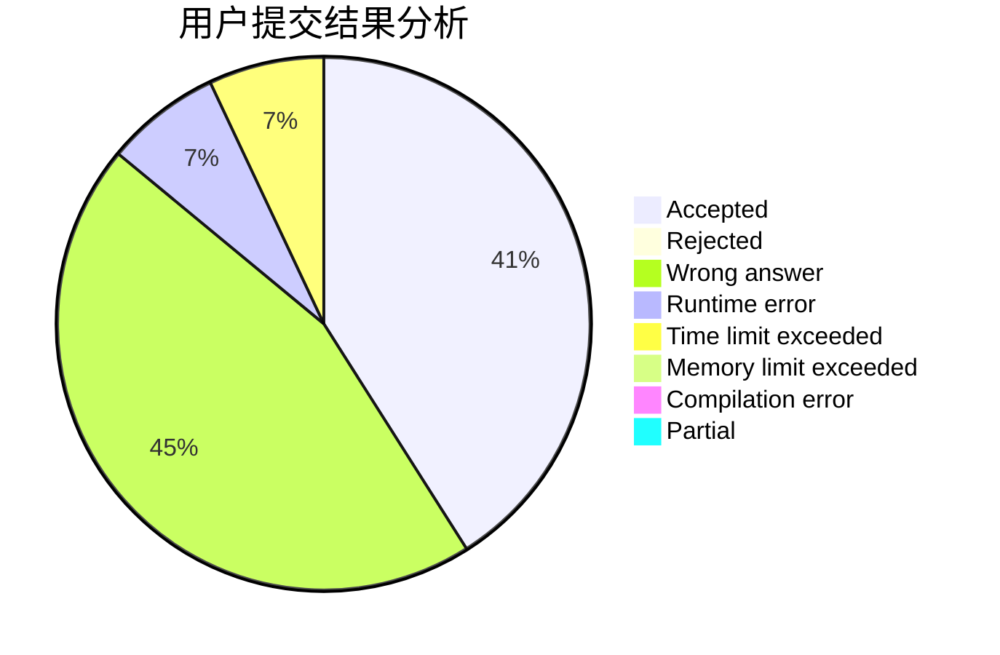
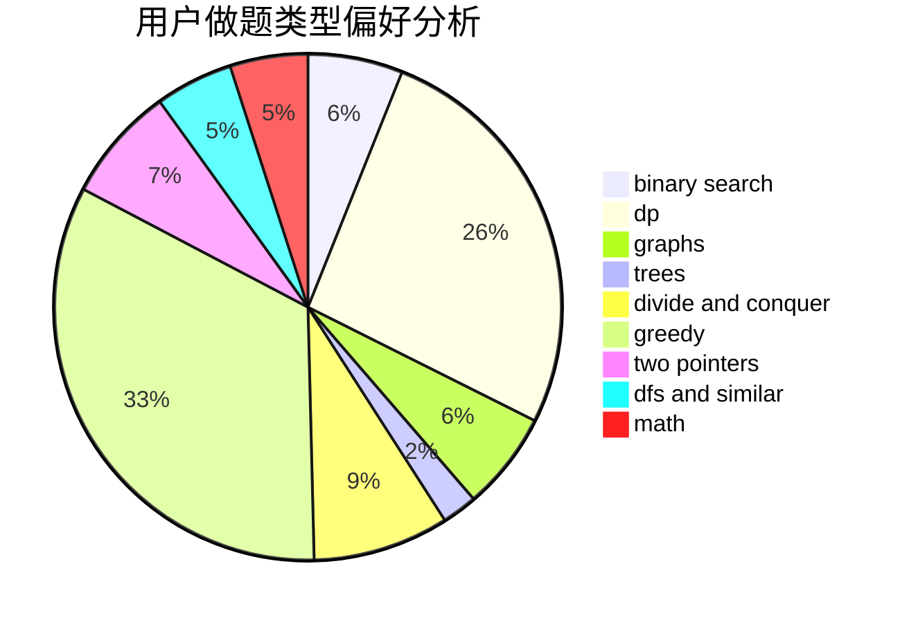

# Wenyi

<!-- tabs:start -->

#### **用户提交结果分析**

#### **用户做题类型偏好分析**

<!-- tabs:end -->
# 推荐题目
[567A](https://codeforces.com/contest/567/problem/A)
[456B](https://codeforces.com/contest/456/problem/B)
[732B](https://codeforces.com/contest/732/problem/B)
[424B](https://codeforces.com/contest/424/problem/B)
[11162](https://codeforces.com/contest/1116/problem/2)
[1040B](https://codeforces.com/contest/1040/problem/B)
[109B](https://codeforces.com/contest/109/problem/B)
[768C](https://codeforces.com/contest/768/problem/C)
[713A](https://codeforces.com/contest/713/problem/A)
[1444D](https://codeforces.com/contest/1444/problem/D)
