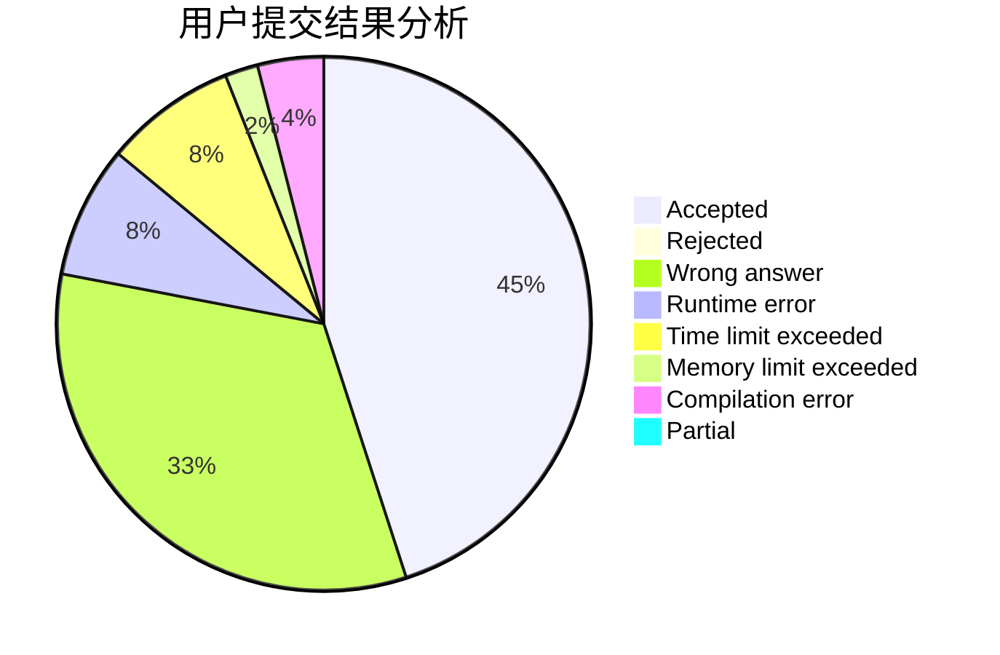
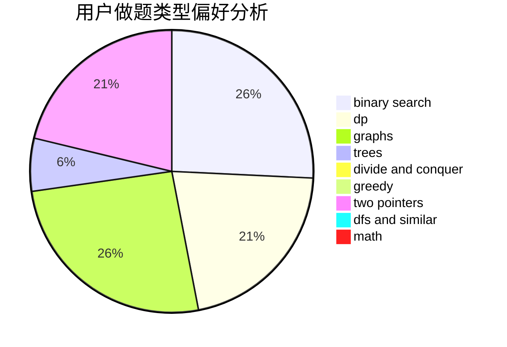

# Werner_Yin

<!-- tabs:start -->

#### **用户提交结果分析**

#### **用户做题类型偏好分析**

<!-- tabs:end -->
# 推荐题目
[1145C](https://codeforces.com/contest/1145/problem/C)
[1099E](https://codeforces.com/contest/1099/problem/E)
[63C](https://codeforces.com/contest/63/problem/C)
[593A](https://codeforces.com/contest/593/problem/A)
[1199A](https://codeforces.com/contest/1199/problem/A)
[1470E](https://codeforces.com/contest/1470/problem/E)
[1490C](https://codeforces.com/contest/1490/problem/C)
[1497B](https://codeforces.com/contest/1497/problem/B)
[1491C](https://codeforces.com/contest/1491/problem/C)
[1484C](https://codeforces.com/contest/1484/problem/C)
