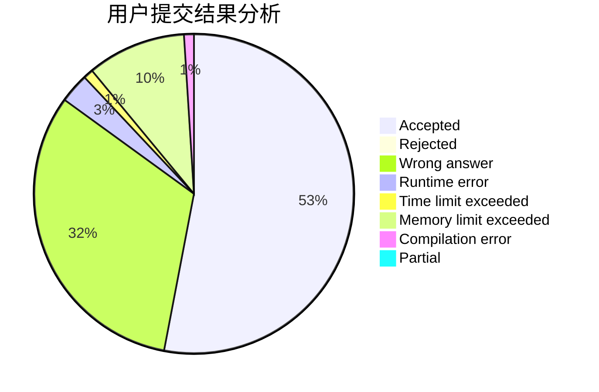
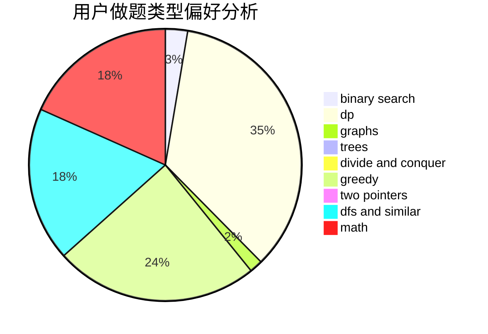

# AkaiLemon

<!-- tabs:start -->

#### **用户提交结果分析**

#### **用户做题类型偏好分析**

<!-- tabs:end -->
# 推荐题目
[246A](https://codeforces.com/contest/246/problem/A)
[1220F](https://codeforces.com/contest/1220/problem/F)
[246D](https://codeforces.com/contest/246/problem/D)
[246B](https://codeforces.com/contest/246/problem/B)
[1210D](https://codeforces.com/contest/1210/problem/D)
[246C](https://codeforces.com/contest/246/problem/C)
[1389E](https://codeforces.com/contest/1389/problem/E)
[11E](https://codeforces.com/contest/11/problem/E)
[1096D](https://codeforces.com/contest/1096/problem/D)
[1131A](https://codeforces.com/contest/1131/problem/A)
