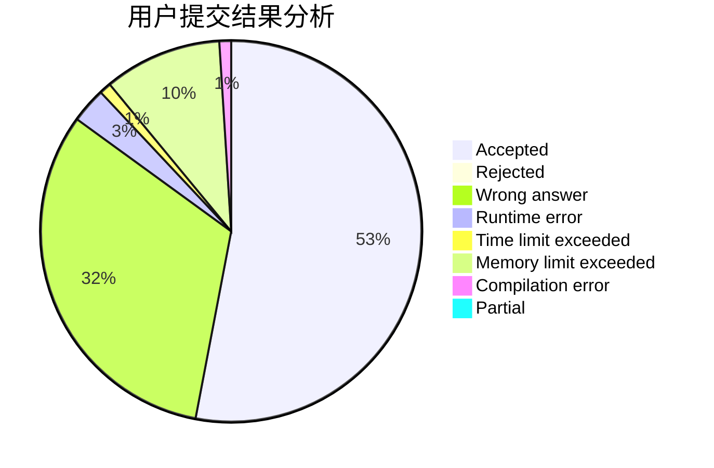
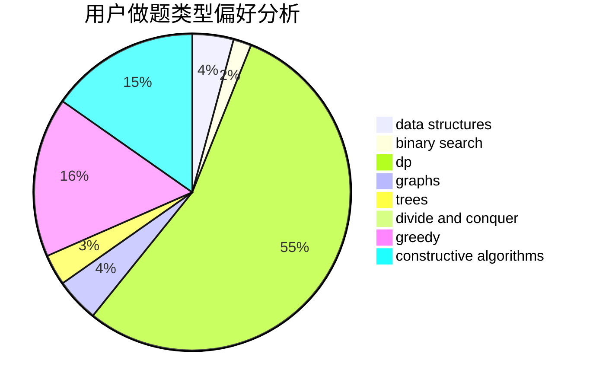
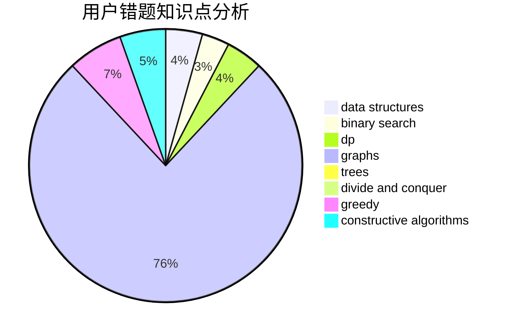

# AkaiLemon

<!-- tabs:start -->

#### **用户提交结果分析**

#### **用户做题类型偏好分析**

#### **用户错题知识点分析**

<!-- tabs:end -->
# 推荐题目
[246A](https://codeforces.com/contest/246/problem/A)		constructive algorithms,
                        greedy,
                        sortings		  
[1220F](https://codeforces.com/contest/1220/problem/F)		binary search,
                        data structures		  
[246D](https://codeforces.com/contest/246/problem/D)		brute force,
                        dfs and similar,
                        graphs		  
[246B](https://codeforces.com/contest/246/problem/B)		greedy,
                        math		  
[1210D](https://codeforces.com/contest/1210/problem/D)		graphs		  
[246C](https://codeforces.com/contest/246/problem/C)		brute force,
                        constructive algorithms,
                        greedy		  
[1389E](https://codeforces.com/contest/1389/problem/E)		math,
                        number theory		  
[11E](https://codeforces.com/contest/11/problem/E)		binary search,
                        dp,
                        greedy		  
[1096D](https://codeforces.com/contest/1096/problem/D)		dp		  
[1131A](https://codeforces.com/contest/1131/problem/A)		math		  
