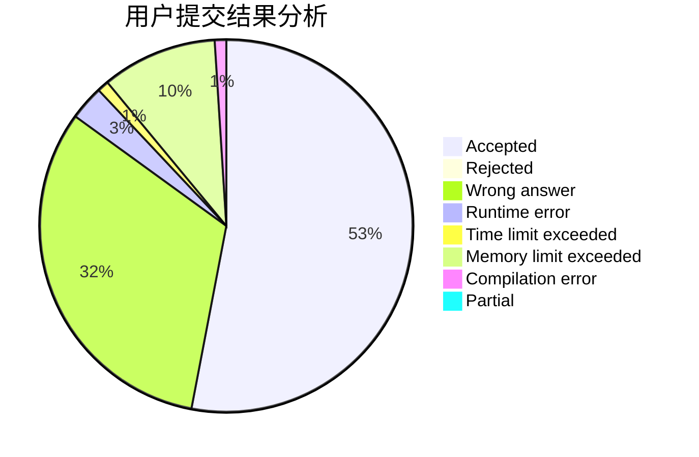
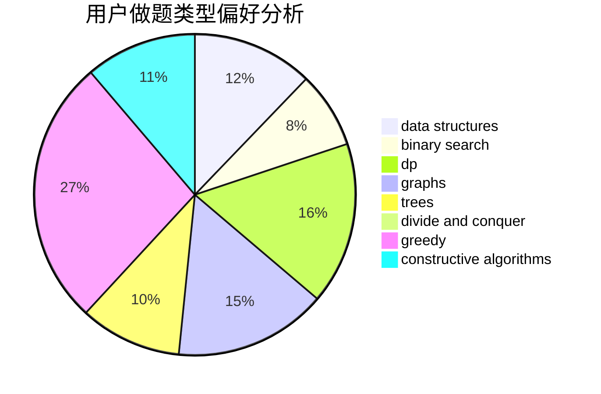
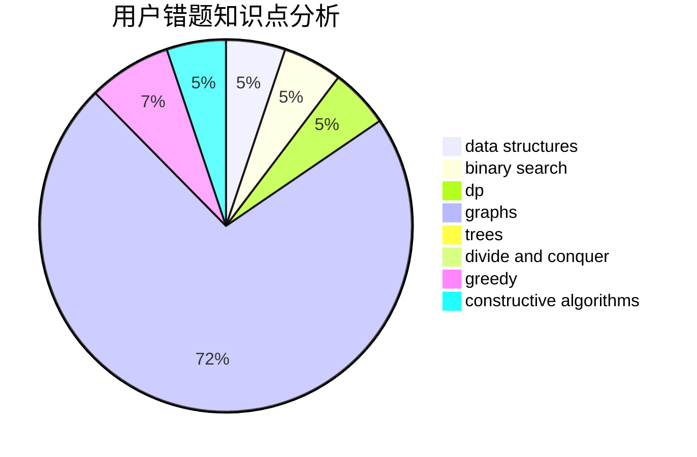

# AkaiLemon

<!-- tabs:start -->

#### **用户提交结果分析**

#### **用户做题类型偏好分析**

#### **用户错题知识点分析**

<!-- tabs:end -->
# 推荐题目
[226E](https://codeforces.com/contest/226/problem/E)		data structures,
                        trees		  
[1215B](https://codeforces.com/contest/1215/problem/B)		combinatorics,
                        dp,
                        implementation		  
[228D](https://codeforces.com/contest/228/problem/D)		data structures		  
[227A](https://codeforces.com/contest/227/problem/A)		geometry		  
[1206C](https://codeforces.com/contest/1206/problem/C)		dsu,graphs,sortings,trees		  
[228B](https://codeforces.com/contest/228/problem/B)		brute force,
                        implementation		  
[1380B](https://codeforces.com/contest/1380/problem/B)		greedy		  
[1196D1](https://codeforces.com/contest/1196D/problem/1)		implementation		  
[1096A](https://codeforces.com/contest/1096/problem/A)		greedy,
                        implementation,
                        math		  
[1129A2](https://codeforces.com/contest/1129A/problem/2)		brute force,
                        greedy		  
