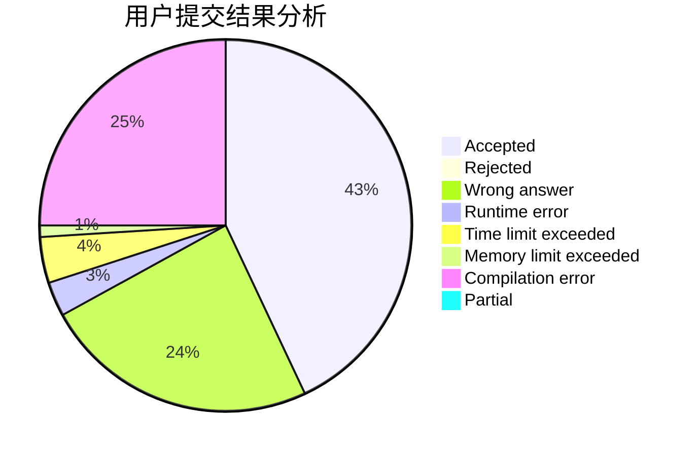
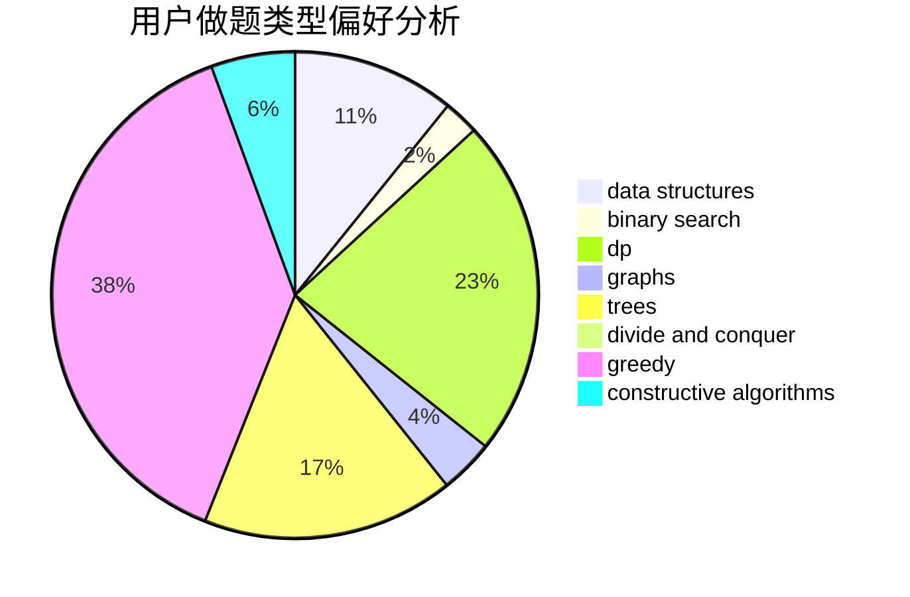
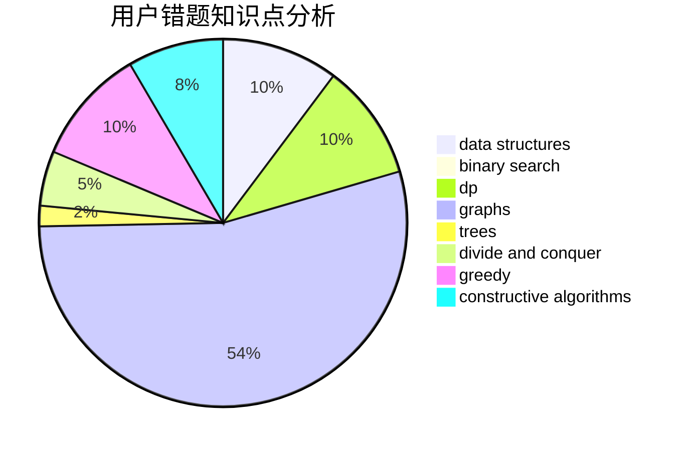

# Whisdangist

<!-- tabs:start -->

#### **用户提交结果分析**

#### **用户做题类型偏好分析**

#### **用户错题知识点分析**

<!-- tabs:end -->
# 推荐题目
[257D](https://codeforces.com/contest/257/problem/D)		greedy,
                        math		  
[273E](https://codeforces.com/contest/273/problem/E)		dp,
                        games		  
[508C](https://codeforces.com/contest/508/problem/C)		constructive algorithms,
                        greedy		  
[1179D](https://codeforces.com/contest/1179/problem/D)		data structures,
                        dp,
                        trees		  
[920A](https://codeforces.com/contest/920/problem/A)		implementation		  
[271A](https://codeforces.com/contest/271/problem/A)		brute force		  
[452A](https://codeforces.com/contest/452/problem/A)		brute force,
                        implementation,
                        strings		  
[611H](https://codeforces.com/contest/611/problem/H)		constructive algorithms,
                        flows,
                        graphs		  
[917C](https://codeforces.com/contest/917/problem/C)		combinatorics,
                        dp,
                        matrices		  
[798A](https://codeforces.com/contest/798/problem/A)		brute force,
                        constructive algorithms,
                        strings		  
