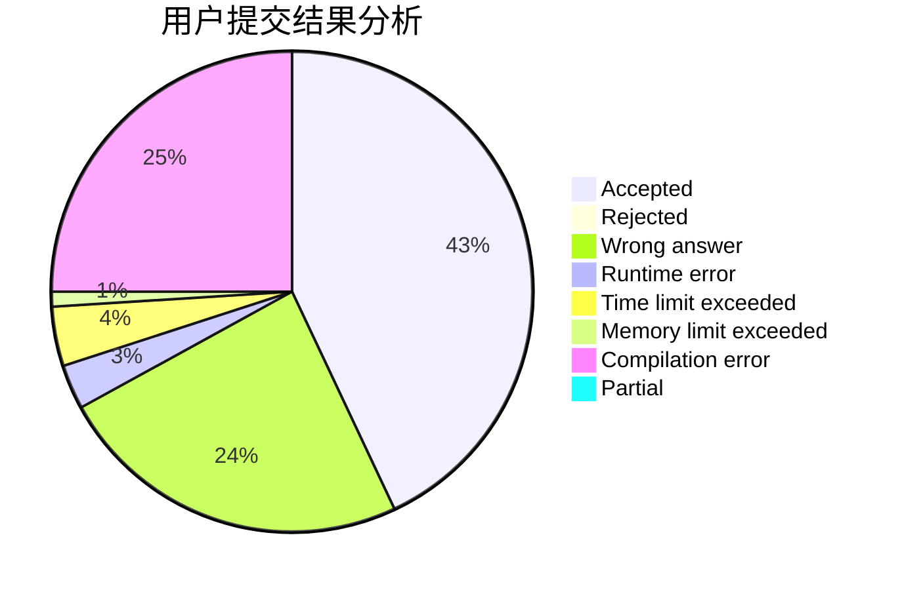
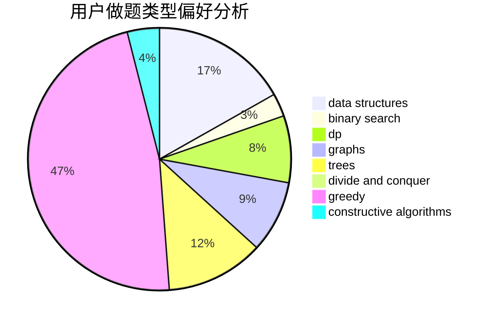
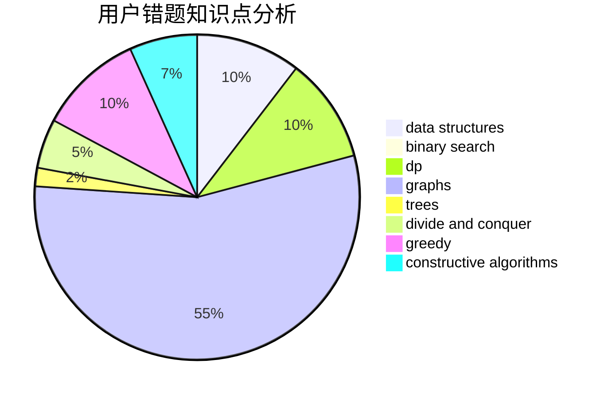

# Whisdangist

<!-- tabs:start -->

#### **用户提交结果分析**

#### **用户做题类型偏好分析**

#### **用户错题知识点分析**

<!-- tabs:end -->
# 推荐题目
[274D](https://codeforces.com/contest/274/problem/D)		dfs and similar,
                        graphs,
                        greedy,
                        sortings		  
[289D](https://codeforces.com/contest/289/problem/D)		dsu,graphs,sortings,trees		  
[528C](https://codeforces.com/contest/528/problem/C)		dsu,graphs,sortings,trees		  
[1182C](https://codeforces.com/contest/1182/problem/C)		data structures,
                        greedy,
                        strings		  
[940A](https://codeforces.com/contest/940/problem/A)		brute force,
                        greedy,
                        sortings		  
[287C](https://codeforces.com/contest/287/problem/C)		dsu,graphs,sortings,trees		  
[474A](https://codeforces.com/contest/474/problem/A)		implementation		  
[631A](https://codeforces.com/contest/631/problem/A)		brute force,
                        implementation		  
[938A](https://codeforces.com/contest/938/problem/A)		implementation		  
[812A](https://codeforces.com/contest/812/problem/A)		implementation		  
