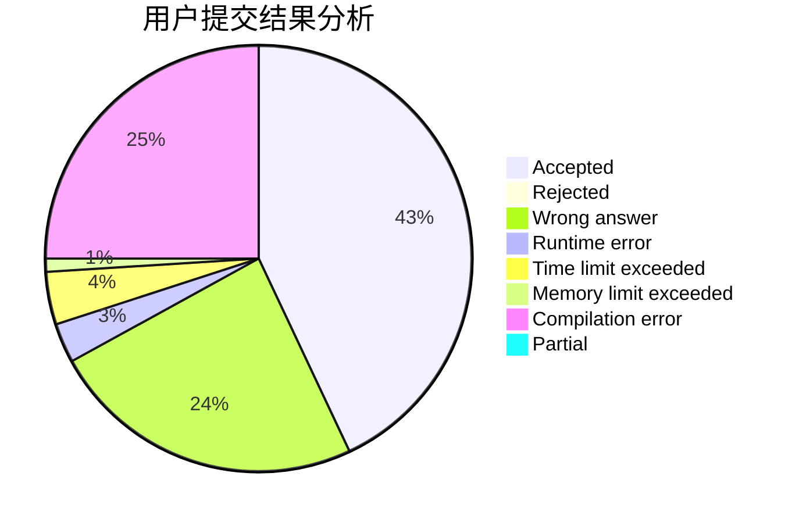
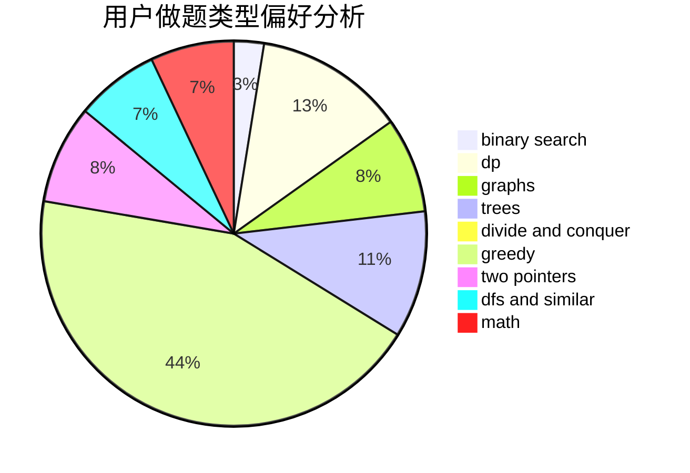

# Whisdangist

<!-- tabs:start -->

#### **用户提交结果分析**

#### **用户做题类型偏好分析**

<!-- tabs:end -->
# 推荐题目
[274D](https://codeforces.com/contest/274/problem/D)
[289D](https://codeforces.com/contest/289/problem/D)
[528C](https://codeforces.com/contest/528/problem/C)
[1182C](https://codeforces.com/contest/1182/problem/C)
[940A](https://codeforces.com/contest/940/problem/A)
[287C](https://codeforces.com/contest/287/problem/C)
[474A](https://codeforces.com/contest/474/problem/A)
[631A](https://codeforces.com/contest/631/problem/A)
[938A](https://codeforces.com/contest/938/problem/A)
[812A](https://codeforces.com/contest/812/problem/A)
