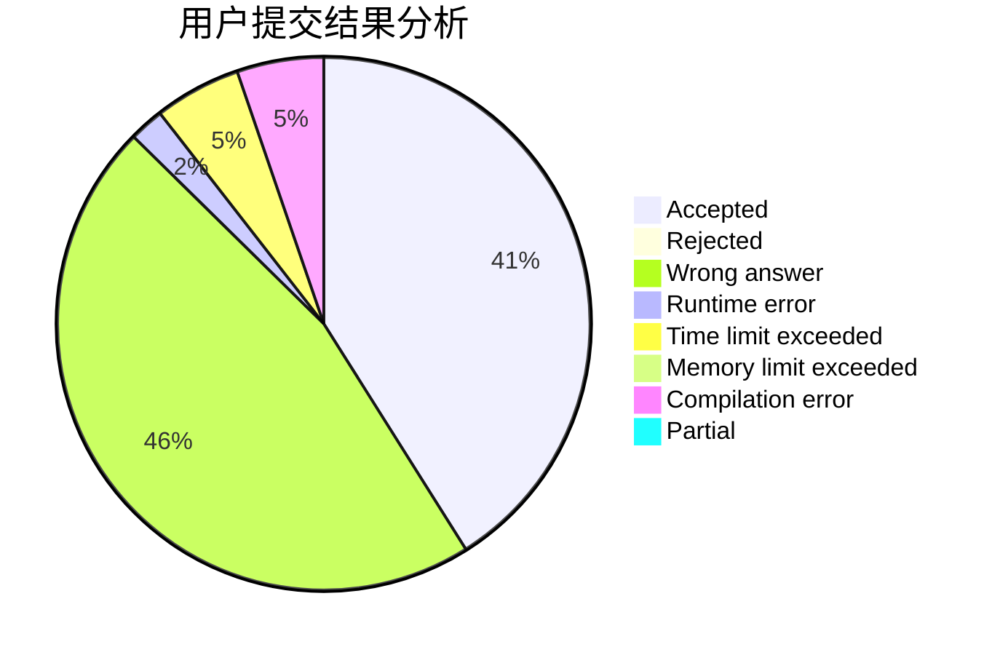
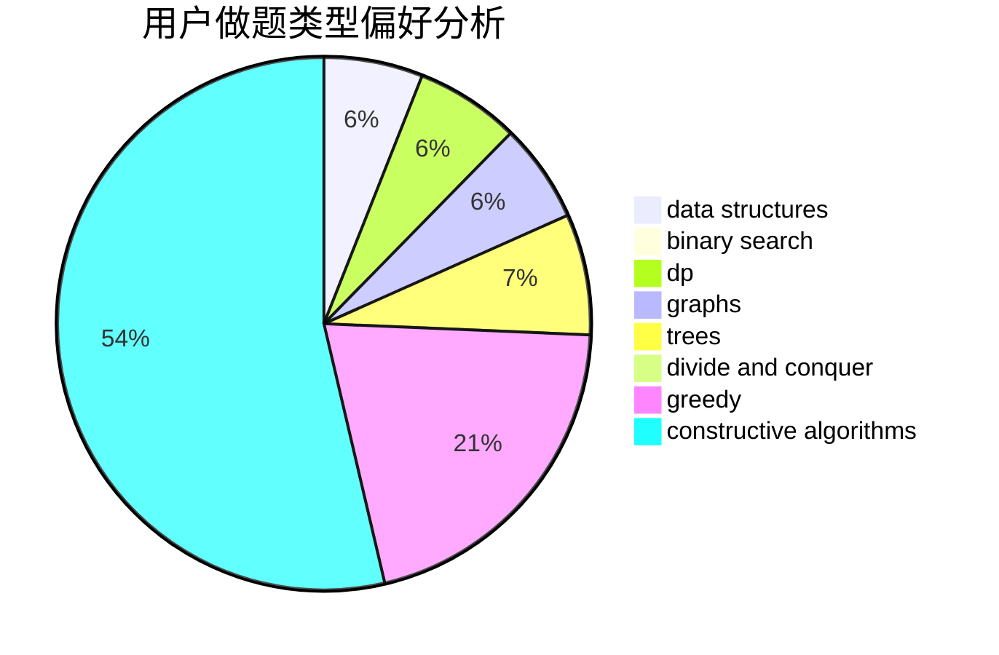
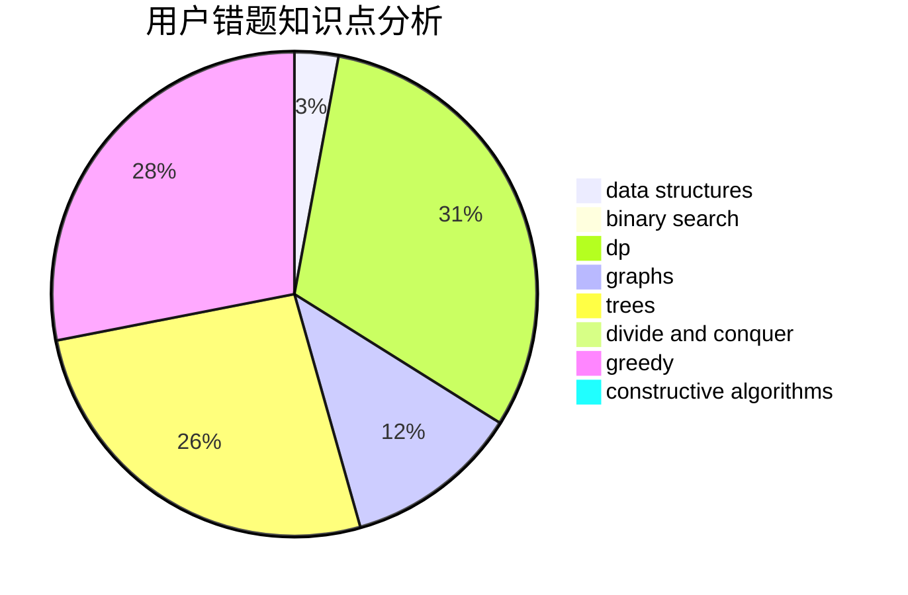

# WhiteCmile

<!-- tabs:start -->

#### **用户提交结果分析**

#### **用户做题类型偏好分析**

#### **用户错题知识点分析**

<!-- tabs:end -->
# 推荐题目
[467A](https://codeforces.com/contest/467/problem/A)		implementation		  
[1510D](https://codeforces.com/contest/1510/problem/D)		dp,
                        math,
                        number theory		  
[1078E](https://codeforces.com/contest/1078/problem/E)		constructive algorithms		  
[863F](https://codeforces.com/contest/863/problem/F)		flows		  
[868E](https://codeforces.com/contest/868/problem/E)		dp,
                        graphs,
                        trees		  
[993E](https://codeforces.com/contest/993/problem/E)		chinese remainder theorem,
                        fft,
                        math		  
[604B](https://codeforces.com/contest/604/problem/B)		binary search,
                        greedy		  
[981E](https://codeforces.com/contest/981/problem/E)		bitmasks,
                        data structures,
                        divide and conquer,
                        dp		  
[835A](https://codeforces.com/contest/835/problem/A)		math		  
[825C](https://codeforces.com/contest/825/problem/C)		greedy,
                        implementation		  
