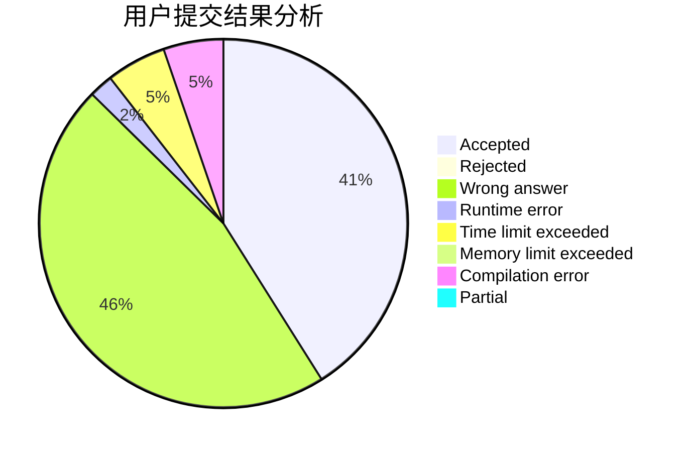
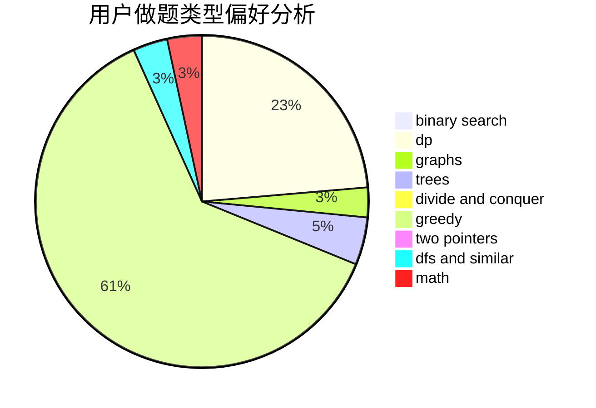

# WhiteCmile

<!-- tabs:start -->

#### **用户提交结果分析**

#### **用户做题类型偏好分析**

<!-- tabs:end -->
# 推荐题目
[467A](https://codeforces.com/contest/467/problem/A)
[1510D](https://codeforces.com/contest/1510/problem/D)
[1078E](https://codeforces.com/contest/1078/problem/E)
[863F](https://codeforces.com/contest/863/problem/F)
[868E](https://codeforces.com/contest/868/problem/E)
[993E](https://codeforces.com/contest/993/problem/E)
[604B](https://codeforces.com/contest/604/problem/B)
[981E](https://codeforces.com/contest/981/problem/E)
[835A](https://codeforces.com/contest/835/problem/A)
[825C](https://codeforces.com/contest/825/problem/C)
