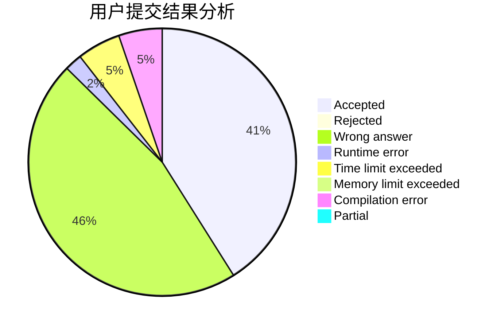
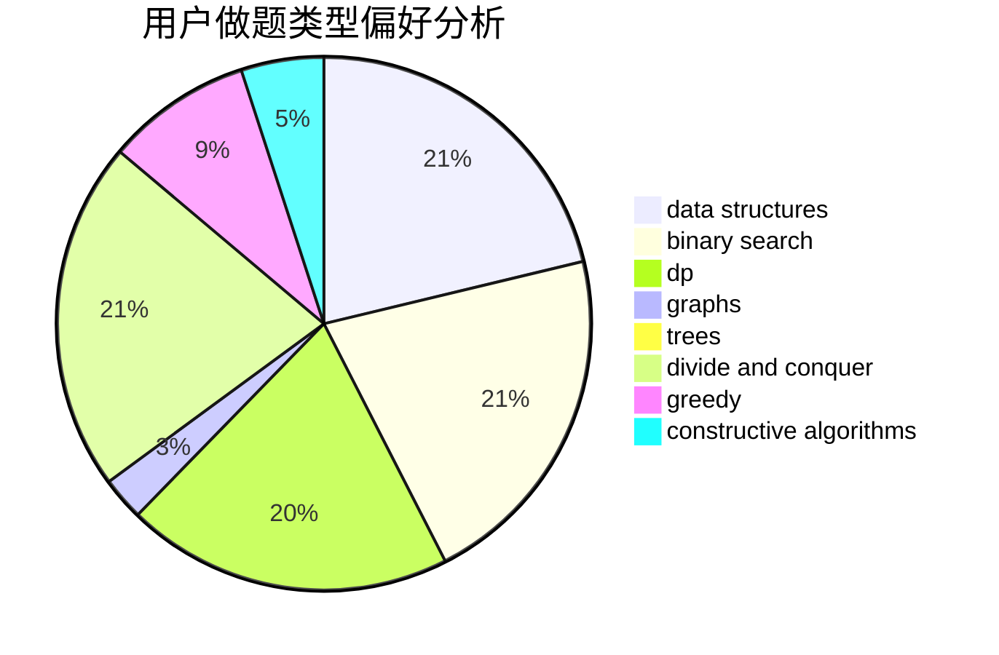
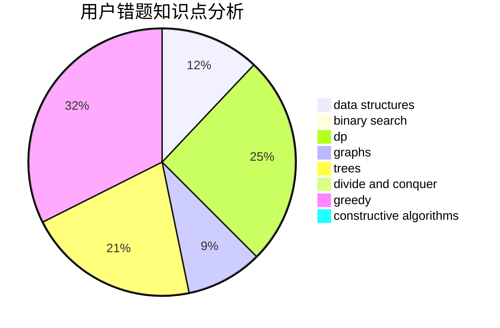

# WhiteCmile

<!-- tabs:start -->

#### **用户提交结果分析**

#### **用户做题类型偏好分析**

#### **用户错题知识点分析**

<!-- tabs:end -->
# 推荐题目
[446E](https://codeforces.com/contest/446/problem/E)		math,
                        matrices		  
[14C](https://codeforces.com/contest/14/problem/C)		brute force,
                        constructive algorithms,
                        geometry,
                        implementation,
                        math		  
[1078B](https://codeforces.com/contest/1078/problem/B)		dsu,graphs,sortings,trees		  
[845E](https://codeforces.com/contest/845/problem/E)		binary search,
                        data structures		  
[84A](https://codeforces.com/contest/84/problem/A)		math,
                        number theory		  
[979E](https://codeforces.com/contest/979/problem/E)		dp		  
[584B](https://codeforces.com/contest/584/problem/B)		combinatorics		  
[95A](https://codeforces.com/contest/95/problem/A)		implementation,
                        strings		  
[815E](https://codeforces.com/contest/815/problem/E)		binary search,
                        constructive algorithms,
                        implementation		  
[808D](https://codeforces.com/contest/808/problem/D)		binary search,
                        data structures,
                        implementation		  
